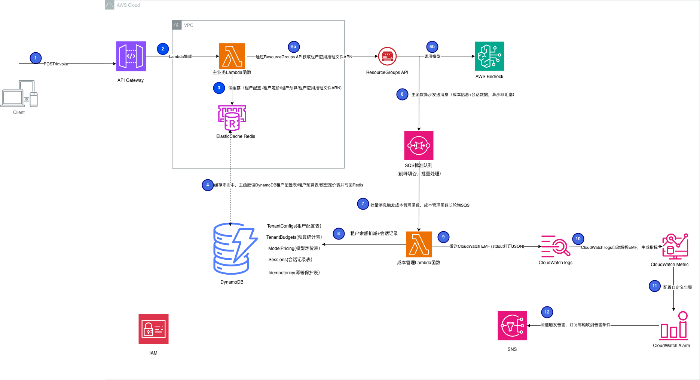

# Amazon Bedrock 多租户模型调用成本CostGuard系统

基于AWS Bedrock的多租户AI应用成本追踪和管理系统，支持实时成本监控、预算控制和告警通知。

## 生产环境运行中

**架构**：Lambda (VPC + Redis) → SQS → Cost Management Lambda → DynamoDB + CloudWatch 
**性能**：支持100,000+ TPS，2-4秒响应时间 
**可靠性**：消息持久化99.9%+，死信队列保护 
**成本**：1000万次Bedrock调用/月仅需$30-42（追踪层）  

## 系统架构图

## **核心优势**：

- **超高吞吐**：SQS标准队列无限吞吐量
- **削峰填谷**：缓冲流量突刺，保护下游
- **批量处理**：10条消息/批次，降低成本
- **自动扩展**：Lambda并发=100，根据队列深度自动扩展
- **消息可靠**：4天持久化 + 死信队列
- **缓存加速**：Redis <1ms响应，DynamoDB 5-10ms
- **成本极低**：1000万次Bedrock调用/月仅需$30-42（追踪层成本，不含Bedrock调用）

**SQS最佳实践** ：

- 长轮询（20秒）- 减少空轮询
- 批量处理（10条/批）- 降低Lambda调用
- 幂等性保护（5分钟窗口）- 防止重复处理
- 部分失败处理 - 只重试失败消息
- 死信队列（3次重试）- 防止消息丢失
- 可见性超时（300秒）- 防止重复消费

## 核心功能

- **多租户成本追踪**：按租户/应用/模型维度追踪
- **实时预算监控**：Redis缓存预算，毫秒级检查
- **自定义告警规则**：成本/Token超限告警
- **EMF指标发布**：CloudWatch自定义指标
- **SQS异步处理**：高吞吐量消息队列
- **批量处理**：降低Lambda调用成本

## 监控告警

- **成本告警**：租户超过预算阈值
- **Token告警**：Token使用超限
- **队列告警**：SQS队列深度监控
- **Lambda告警**：执行时长/错误率

## 技术栈

- **计算**: AWS Lambda
- **API**: Amazon API Gateway
- **AI**: Amazon Bedrock
- **消息队列**: Amazon SQS
- **缓存**: Amazon ElastiCache (Redis)
- **存储**: Amazon DynamoDB
- **监控**: Amazon CloudWatch
- **通知**: Amazon SNS

