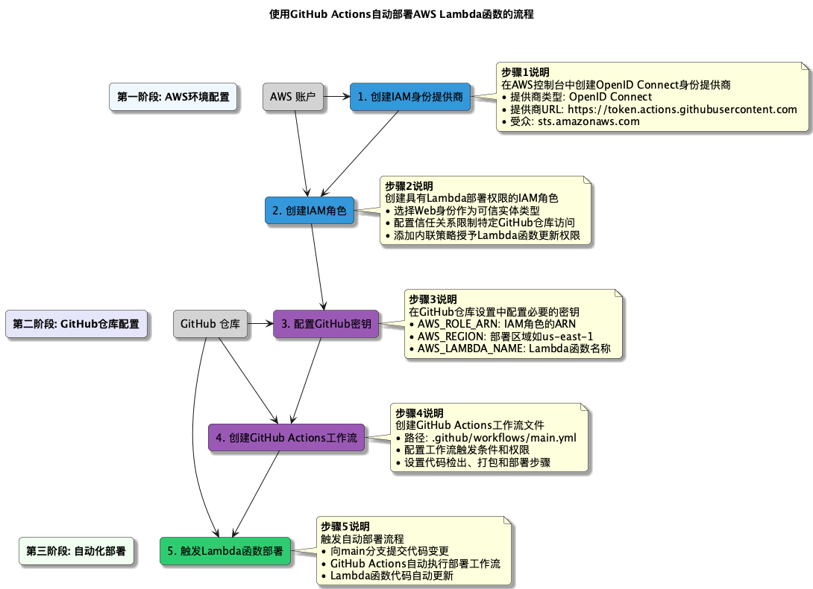

# 使用 GitHub Actions 构建 AWS Lambda 函数的安全部署流水线

本项目实现了一个安全的 AWS Lambda 函数部署流水线，使用 GitHub Actions 和 OpenID Connect (OIDC) 身份验证，增强部署过程的安全性和可追溯性。

## 架构概览



## 功能特点

- **基于 OIDC 的安全认证**：无需存储长期 AWS 访问凭证
- **全面的安全扫描**：代码分析、依赖项漏洞检查、密钥扫描
- **部署审批流程**：生产环境部署需要人工审批
- **自动化版本控制**：每次部署自动发布新版本
- **完整的可追溯性**：部署与特定代码提交关联
- **部署通知**：通过 Slack 发送部署状态通知

## 设置指南

### 1. AWS 配置

#### 创建 IAM 身份提供商

1. 登录 AWS 控制台，进入 IAM 服务
2. 选择"身份提供商" > "添加提供商"
3. 选择"OpenID Connect"
4. 提供商 URL: `https://token.actions.githubusercontent.com`
5. 受众: `sts.amazonaws.com`

#### 创建 IAM 角色

1. 在 IAM 控制台创建新角色
2. 选择"Web 身份"作为信任实体类型
3. 选择刚创建的身份提供商
4. 添加条件：`token.actions.githubusercontent.com:sub` = `repo:your-org/your-repo:*`
5. 添加以下内联策略：

```json
{
  "Version": "2012-10-17",
  "Statement": [
    {
      "Effect": "Allow",
      "Action": [
        "lambda:CreateFunction",
        "lambda:UpdateFunctionCode",
        "lambda:UpdateFunctionConfiguration",
        "lambda:GetFunction",
        "lambda:PublishVersion",
        "lambda:CreateAlias",
        "lambda:UpdateAlias",
        "lambda:TagResource"
      ],
      "Resource": "arn:aws:lambda:<region>:<account-id>:function:<function-name>"
    },
    {
      "Effect": "Allow",
      "Action": [
        "iam:PassRole"
      ],
      "Resource": "arn:aws:iam::<account-id>:role/lambda-execution-role",
      "Condition": {
        "StringEquals": {
          "iam:PassedToService": "lambda.amazonaws.com"
        }
      }
    },
    {
      "Effect": "Allow",
      "Action": [
        "s3:PutObject"
      ],
      "Resource": "arn:aws:s3:::<deployment-logs-bucket>/*",
      "Condition": {
        "StringEquals": {
          "s3:RequestObjectTag/GitHubRepo": "your-org/your-repo"
        }
      }
    }
  ]
}
```

### 2. GitHub 仓库配置

#### 设置 GitHub Secrets

在仓库的 Settings > Secrets and variables > Actions 中添加以下 secrets：

- `AWS_ROLE_ARN`: IAM 角色的 ARN
- `AWS_REGION`: 部署区域，如 `us-east-1`
- `AWS_LAMBDA_NAME`: Lambda 函数名称
- `LAMBDA_EXECUTION_ROLE_ARN`: Lambda 执行角色的 ARN
- `DEPLOYMENT_LOGS_BUCKET`: (可选) 存储部署日志的 S3 存储桶名称
- `SNYK_TOKEN`: (可选) Snyk API 令牌，用于依赖项漏洞扫描
- `SLACK_WEBHOOK_URL`: (可选) Slack Webhook URL，用于部署通知

#### 配置环境审批

1. 在仓库的 Settings > Environments 中创建 `production` 环境
2. 启用 "Required reviewers" 并添加审批者
3. (可选) 添加环境特定的保护规则和变量

### 3. 工作流文件

将 `.github/workflows/lambda-deploy.yml` 文件添加到您的仓库中。该文件已包含在本项目中。

## 使用方法

1. **开发流程**：
   - 在功能分支上开发和测试代码
   - 创建 Pull Request 到 `main` 分支
   - 安全扫描会自动运行，但不会部署

2. **部署流程**：
   - 当 PR 合并到 `main` 分支时，完整的部署流程将被触发
   - 安全扫描通过后，需要审批者批准部署
   - 批准后，Lambda 函数将被更新并发布新版本
   - 部署结果将通过 Slack 通知（如已配置）

## 安全最佳实践

- **最小权限原则**：IAM 角色仅具有必要的权限
- **短期凭证**：使用 OIDC 临时令牌而非长期访问密钥
- **代码安全扫描**：自动检测代码漏洞和不安全依赖
- **部署审批**：生产环境变更需要人工审批
- **可追溯性**：每次部署都与特定代码提交关联
- **版本控制**：自动发布版本，支持快速回滚

## 故障排除

- **权限错误**：检查 IAM 角色权限和信任关系配置
- **构建失败**：查看工作流日志，确保所有依赖项正确安装
- **扫描警告**：解决代码扫描和依赖项检查中发现的问题
- **部署失败**：验证 Lambda 函数配置和资源限制

## 进一步改进

- 添加自动化测试覆盖率检查
- 实现蓝绿部署或金丝雀发布
- 集成更多安全扫描工具
- 添加性能基准测试
- 实现自动回滚机制

## 参考资料

- [AWS Lambda 文档](https://docs.aws.amazon.com/lambda/)
- [GitHub Actions 文档](https://docs.github.com/en/actions)
- [AWS IAM 最佳实践](https://docs.aws.amazon.com/IAM/latest/UserGuide/best-practices.html)
- [OpenID Connect 文档](https://openid.net/connect/) 