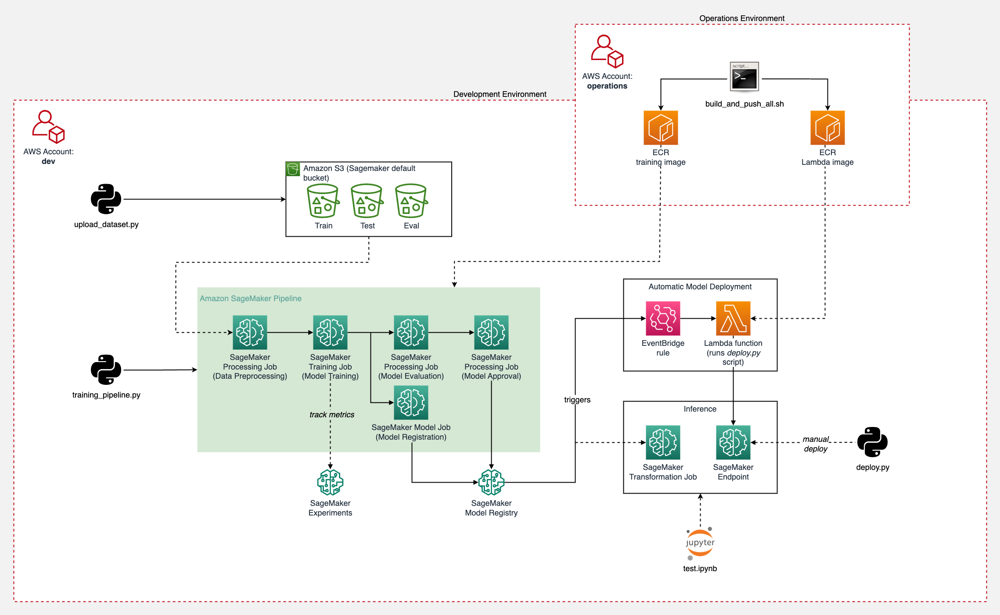
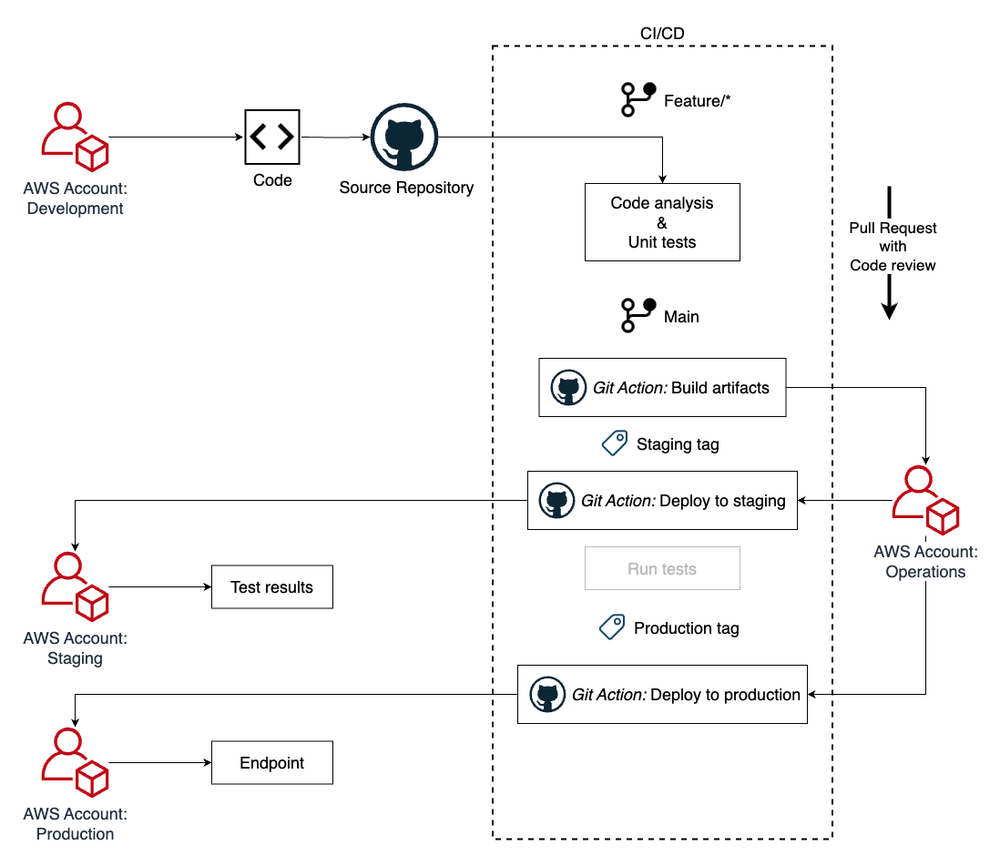

### MLOps Project

- 基于`Terraform`以及`GitHub Actions`使用`AWS SageMaker`进行自动化的多环境机器学习流水线部署项目模版

- 方案架构示意图：



### 项目结构

- `Development` : 项目开发阶段，代码更新会进行部署及测试

- `Staging`: 项目测试阶段，在功能代码部署更新到生产环境之前进行验证

- `Production`: 项目部署阶段，测试通过后，将功能代码部署到生产环境

- `Operations Account` ： 用于运行CI/CD流水线的运维管理负责账号

### 信息设置

#### 1. 认证设置

##### 1.1 配置文件

- 创建需要的`AWS`云账号
- 使用`profiles`配置位于`~/.aws/config`的`AWS config-file`，如下所示：

```
[default]
aws_access_key_id=foo
aws_secret_access_key=bar
region=us-west-2

[profile dev]
...

[profile staging]
...

[profile prod]
...

[profile operations]
...
```
##### 1.2 更新 AccountID
- 更新项目的如下文件里的Account ID
```
.
├── .github
│   └── workflows
│       └── on_tag.yml              #1
├── terraform
│   ├── main
│   │   └── environment
│   │       ├── dev.tfvars          #2
│   │       ├── staging.tfvars      #3
│   │       └── prod.tfvars         #4
│   └── operations
│        └── environment
│            └── operations.tfvars  #5
├── training_pipeline
│   └── profiles.conf               #6
└── ...
```
#### 1.3 更新用于GitHub Actions的 repository 

- 更新`terraform/modules/openid_github_provider/`目录下的`main.tf`的repository 

```
data "aws_iam_policy_document" "assume_policy" {
  statement {
    ...
    condition {
      test     = "StringLike"
      variable = "token.actions.githubusercontent.com:sub"
      values   = ["repo:<your repo>:*"] 
    }
    ...
  }
}
```

### 基础设置资源设置

#### 2.1 配置 `Terraform backend`

- 在 `operations account` 通过运行`terraform` 命令创建`terraform backend`

```
terraform init
terraform apply --var-file="../operations/environment/operations.tfvars"
```
- terraform backend创建成功以后，更新`modules`里的`backend references`

```
.
└── terraform
    ├── main
    │   └── backend.tf
    └── operations
        └── backend.tf
```
#### 2.2 配置 `operations artifacts`

- 在`terraform/operations`目录下使用`operations account`运行命令

```
terraform init
terraform apply -var-file="environments/operations.tfvars"
```
#### 2.3 配置 Terraform workspaces

- 在 `terraform/main`目录下运行命令，使用`Terraform workspaces`用以区分不同的环境(dev, staging, prod)
```
terraform workspace new dev
terraform workspace new staging
terraform workspace new prod
```
#### 2.4 开发环境部署

- 激活开发环境并且构建部署在开发环境的`artifacts`
```
terraform workspace select dev
terraform init
terraform apply -var-file="environment/dev.tfvars" -var="enable_profile=true"
```

### 利用`GitHub Actions`构建`CI/CD Pipeline`

- 完整的`CI/CD pipeline`示意图如下：



### CI/CD 处理流程

- 提交`Pull-Request(PR)`到`main-branch`并且进行`review`

- 一旦`PR`获得`approve`，`feature-branch`就可以`merge`到`main-branch`

- 触发`Git Actions`并且在`staging-environment`自动化构建`artifacts`

- `staging-tag`被添加到`commit`，触发部署
```
git tag staging <commit-id>
git push origin staging
```
- 在`staging-environment`上进行测试，当测试通过以后，可以添加`production-tag` 并部署到生产

```
git tag prod <commit-id>
git push origin prod
```
