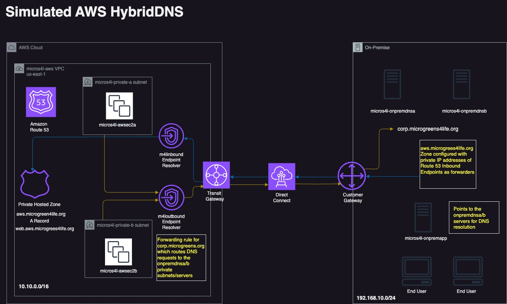
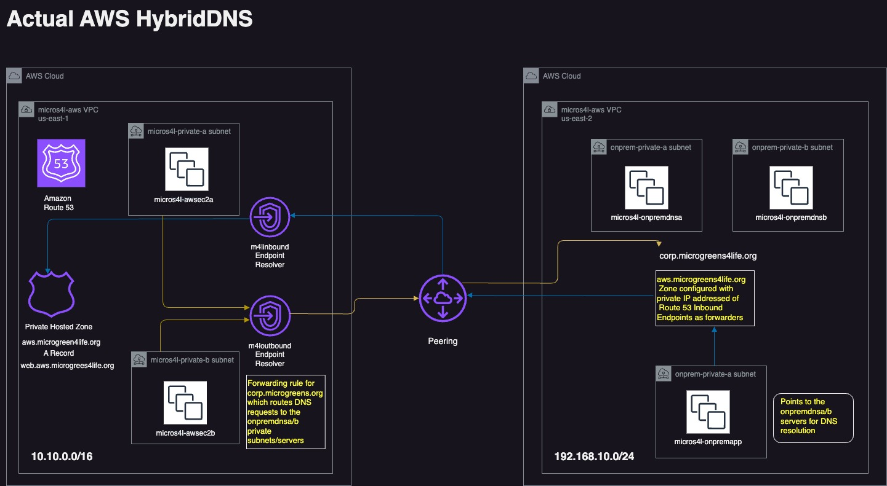

### 概述
本实践手册旨在演示如何在AWS区域（该区域仅托管私有子网）与本地私有企业数据中心之间，实施一种AWS混合DNS设计与架构。此设计的目的是模拟一种通过AWS Direct Connect (DX)实现的到本地环境的混合云DNS连接设置。然而，在本次实际部署中，我们将通过一系列Route 53服务和Linux Bind DNS服务器组件，在一个已建立的跨区域AWS VPC对等连接上提供私有DNS解析功能，具体细节如下所述。

### 前提条件

- GitHub 账户
- AWS 账户
- 完成AWS配置与凭证[设置](https://docs.aws.amazon.com/cli/latest/userguide/cli-configure-files.html)
- [安装](https://developer.hashicorp.com/terraform/tutorials/aws-get-started/install-cli) Terraform

### 架构图



### 架构详解
**模拟本地环境 (us-east-2区域):**
- **VPC**: `micros4l-onprem`，地址前缀为 `192.168.10.0/24`，包含两个私有子网。
- **DNS服务器**: 部署两台t2.micro EC2实例 (`micros4l-onpremdnsa/b`)，分别位于不同的可用区。它们将配置Bind服务，并托管 `corp.microgreens4life.org` 这个zone。同时，为了能够解析AWS端的域名，这些服务器上还会配置一个指向AWS Inbound Endpoint IP地址的转发器，用于将对 `web.aws.microgreens4life.org` 的请求转发给AWS Route 53解析器。
- **测试应用服务器**: 部署一台基础的t2.micro EC2实例 (`micros4l-onpremapp`)，用于从“本地”环境测试到AWS (us-east-1)的DNS解析。

**AWS云端环境 (us-east-1区域):**
- **VPC**: `micros4l-aws`，地址前缀为 `10.10.0.0/16`，包含两个私有子网。请注意，两个环境的私有IP空间不能重叠，这是VPC对等连接和其模拟的Direct Connect (DX)连接的要求。
- **测试实例**: 部署两台基础的t2.micro EC2实例 (`micros4l-awsec2a/b`)，用于测试从云端到模拟企业本地数据中心的DNS解析。
- **Route 53服务**:
    - **私有托管区 (Private Hosted Zone)**: 配置 `aws.microgreens4life.org`，并包含一条指向Web服务器的A记录 `web.aws.microgreens4life.org`。
    - **Inbound & Outbound Endpoints**: 部署Route 53的入站和出站终端节点，每个终端节点都关联到`us-east-1`的两个私有子网。出站终端节点将配置一条转发规则，将对 `corp.microgreens4life.org` 域的请求，转发到位于“本地”环境(us-east-2)的 `micros4l-onpremdnsa/b` Bind服务器进行解析。

**连接性说明:**
所有实例都将配置为允许通过Systems Manager进行连接。这是访问这些私有实例的唯一方式，因为它们都没有公网IP，也没有创建互联网网关（Internet Gateway）——这是一个完全隔离的私有环境。

### 应用场景
这种混合DNS架构是支撑多种关键企业用例的基础模式：

-   **企业数据中心扩展**：适用于那些需要将本地数据中心扩展到AWS以获取更多计算或存储能力，同时要求在两个环境中的内部应用能够无缝进行DNS解析的公司。
-   **混合云灾难恢复 (DR)**：在AWS中建立灾备站点时，混合DNS对于在故障切换事件中将流量重定向到AWS环境至关重要，且无需更改应用程序的端点配置。
-   **分阶段的云迁移**：在长期的迁移过程中，应用程序和服务将同时存在于本地和AWS环境中。此架构允许遗留的本地系统解析新的云原生服务，反之亦然。
-   **对私有云服务的安全访问**：使企业能够从其公司网络内部解析托管在AWS中的内部私有服务（例如，内部仪表盘、数据库），而无需将这些服务暴露于公共互联网。

### 操作步骤
1.  导航到 `/global/iam` 目录并运行 `terraform plan/apply`:
    ```bash
    cd aws-terraform-hybrid-dns/global/iam
    terraform plan
    terraform apply
    ```
    此模块部署的资源:
    *   `roles.tf`: 所有EC2实例将使用的IAM实例配置文件、角色和策略附件。
    *   `s3.tf`: 用于存储Terraform状态文件的S3存储桶。请在此更新您的存储桶名称，因为它必须是全局唯一的。

2.  导航到 `/us-east-2` 目录并运行 `terraform plan/apply`:
    ```bash
    cd aws-terraform-hybrid-dns/us-east-2
    terraform plan
    terraform apply
    ```
    此模块部署的资源:
    *   `ec2.tf`: 模拟本地Linux Bind/DNS服务器的 `micros4l-onpremdnsa/b` 和Linux应用服务器 `micros4l-onpremapp`。
    *   `vpc.tf`: VPC (192.168.10.0/24), 2个私有子网, 1个私有路由表, 安全组及规则, 以及用于SSM连接的VPC终端节点。

3.  捕获 `/us-east-2` 模块部署的输出，并将其保存在一个临时文本文件中，供下一步使用。例如:
    ```
    onprem-private-rt_id = "rtb-0fae5266503453da8"
    onpremdnsa_ip = "192.168.10.11"
    onpremdnsb_ip = "192.168.10.236"
    onpremvpc_id = "vpc-0ab74c12320891aa3"
    ```

4.  导航到 `/us-east-1` 目录并运行 `terraform plan/apply`:
    ```bash
    cd ../us-east-1
    terraform plan
    terraform apply
    ```
    此模块部署的资源:
    *   `ec2.tf`: `micros4l-awsec2a/b` AWS实例。
    *   `route53.tf`: Route 53私有托管区、A记录、入站终端节点、以及针对 `corp.microgreens4life.org` 域的出站终端节点及其转发规则。
    *   `vpc.tf`: VPC (10.10.0.0/16), 2个私有子网, 私有路由表, 跨区域VPC对等连接, 安全组及规则, 以及SSM VPC终端节点。

5.  捕获 `/us-east-1` 模块部署的输出，并保存在临时文件中。注意，您只需要每个终端节点的 `ip` 地址。例如:
    ```
    aws_route53_resolver_inbound_endpoint_ips = toset([
      {
     "ip" = "10.10.0.90"     <---- INBOUND_ENDPOINT_IP1
     "ip_id" = "rni-2bc122c23384d09af"
     "subnet_id" = "subnet-0e6a97614d0833b47"
      },
      {
     "ip" = "10.10.10.221"     <---- INBOUND_ENDPOINT_IP2
     "ip_id" = "rni-75c2ecfc30094b3a9"
     "subnet_id" = "subnet-0dce015d7ba12e0de"
      },
    ])
    ```

6.  在 `awszone.forward` 文件中，将 `forwarders` 的值 `INBOUND_ENDPOINT_IP1` 和 `INBOUND_ENDPOINT_IP2` 替换为上一步输出的终端节点IP地址。

7.  从AWS控制台，导航到 us-east-2 区域的EC2实例，选择 `micros4l-onpremdnsa` 并通过 Session Manager 连接。输入 `sudo -i`，然后用您选择的编辑器（如vi或nano）打开 `/etc/named.conf` 文件。滚动到文件末尾，粘贴您更新后的 `awszone.forward` 文件内容，保存并退出。运行以下命令重启bind服务：
    ```bash
    systemctl restart named 
    systemctl status named 
    ```
    使用 `dig` 或 `nslookup` 测试您的本地DNS服务器现在是否能解析AWS Route 53的私有zone/域名。您应该能看到它解析到 `us-east-1` AWS VPC的 `10.10.x.x` 私有IP地址空间。
    ```bash
    sh-4.2$ dig web.aws.microgreens4life.org @127.0.0.1 +short
    10.10.0.172
    10.10.10.31
    ```

8.  导航到 us-east-2 的 `micros4l-onpremapp` 实例并连接。输入 `sudo -i`，编辑 `/etc/sysconfig/network-scripts/ifcfg-eth0` 文件。在文件末尾粘贴以下内容，并将 `THE_PRIVATE_IP_OF_ONPREM_DNS_A/B` 替换为第3步输出的实际私有IP地址：
    ```
    DNS1=THE_PRIVATE_IP_OF_ONPREM_DNS_A
    DNS2=THE_PRIVATE_IP_OF_ONPREM_DNS_B
    ```
    重启网络服务: `systemctl restart network`。然后从 `micros4l-onpremapp` 实例测试对AWS Route 53托管子域的解析：
    ```bash
    ping web.aws.microgreens4life.org
    dig web.aws.microgreens4life.org +short
    ```

9.  回到 us-east-1 的EC2实例，在 `micros4l-awsec2a/b` 上启动一个Systems Manager会话，并测试对本地托管子域的DNS解析：
    ```bash
    ping app.corp.microgreens4life.org
    dig app.corp.microgreens4life.org +short
    ```

10. 清理资源！在 `us-east-1` 和 `us-east-2` 的每个区域/模块中运行 `terraform destroy`：
    ```bash
    terraform destroy
    # 根据提示输入变量值
    var.accepter_route_table_id: <Enter>
    var.accepter_vpc_id: <Enter>
    var.onpremdnsa_priv_ip: <输入onpremdnsa_ip>
    var.onpremdnsb_priv_ip: <输入onpremdnsb_ip>
    ```
