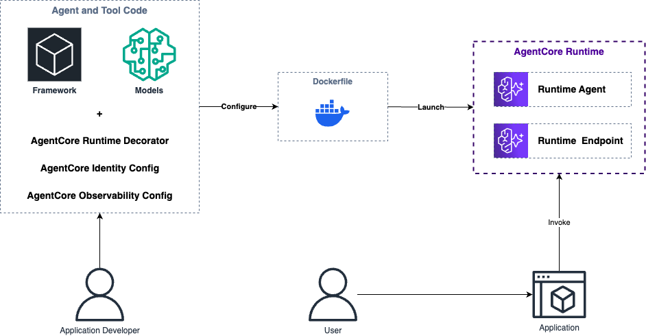
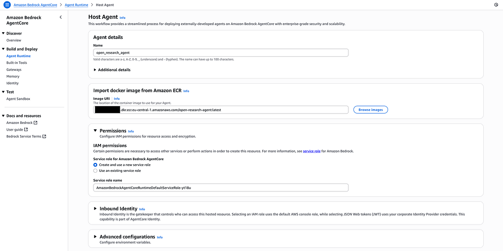
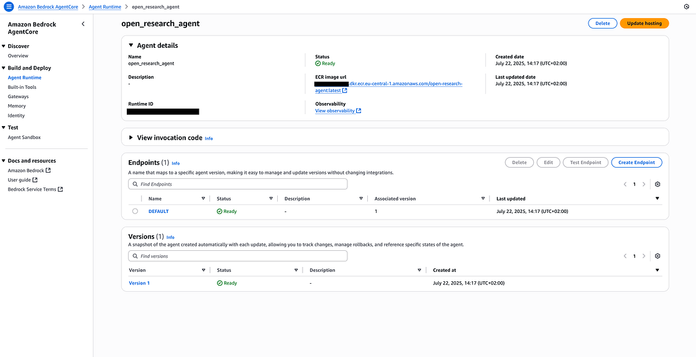

# Bedrock AgentCore 部署实践项目

---

## 1. 项目概述

本项目是一个完整的、可直接部署的示例，旨在演示如何将一个基于 Python 和 LangGraph 的 AI 代理，通过容器化技术部署到 **AWS Bedrock AgentCore**。它为您提供了一个从本地开发到生产环境部署的完整蓝图，解决了 AI 代理在生产环境中面临的**安全**、**扩展**和**可观测性**等核心挑战。

通过本项目，您将掌握将任何 AI 代理框架（如 LangChain, LlamaIndex 等）与 Bedrock AgentCore 集成的核心方法。

### 1.1. 关于本示例中的AI代理

本项目中封装的AI代理是一个**深度研究代理 (Deep Research Agent)**。该代理的核心能力是模拟人类专家的研究过程，对一个给定的主题进行深入、全面的分析，并最终生成一份结构化的研究报告。

其工作流程大致如下：
1.  **任务分解**: 将复杂的研究课题分解为一系列可执行的子问题。
2.  **信息检索**: (在完整实现中) 它会利用外部工具（如搜索引擎）来查找与每个子问题相关的信息。
3.  **综合分析**: 对收集到的信息进行提炼、总结和批判性分析。
4.  **报告生成**: 将分析结果整合成一份条理清晰的综合报告。

在本示例中，我们使用了一个该代理的**模拟版本**，以专注于展示**部署流程**。但其接口和流式响应方式与一个真实的、功能完备的研究代理完全一致。

---

## 2. 架构解析



Bedrock AgentCore 的核心思想是将 AI 代理视为一个标准的、可托管的云原生应用。它通过一个标准化的容器接口，将代理的业务逻辑与底层的 AWS 基础设施解耦。

### 2.1. 部署流程

1.  **开发与封装**: 您在本地使用偏好的 AI 框架（本项目使用 LangGraph）开发代理的核心逻辑。然后，使用 `bedrock-agentcore` SDK 提供的 `BedrockAgentCoreApp` 作为入口，将您的代理逻辑封装成一个标准的 ASGI 应用。
2.  **容器化**: 您将整个应用（包括所有依赖）打包成一个 Docker 镜像。`Dockerfile` 定义了如何构建这个镜像。
3.  **推送与注册**: 将构建好的 Docker 镜像推送到 Amazon ECR (弹性容器镜像服务)。
4.  **部署到 AgentCore**: 在 Bedrock AgentCore 服务中，您创建一个新的“代理运行时”，并指定您上传的 ECR 镜像 URI。AgentCore 会自动在一个安全的 MicroVM 环境中拉取并运行您的容器。
5.  **调用**: 一旦部署成功，AgentCore 会为您生成一个标准的 API 端点 (Endpoint)。您的最终用户或应用，可以通过调用这个端点与您的 AI 代理进行安全、可扩展的交互。

### 2.2. 核心优势

*   **框架中立**: 您可以继续使用您最熟悉的 AI 框架。
*   **简化运维**: 无需管理服务器，AgentCore 负责自动扩展、安全和监控。
*   **企业级集成**: 天然与 AWS IAM（身份与权限管理）、CloudWatch（日志与监控）等服务集成。

---

## 3. 使用指南

请遵循以下步骤，将本项目部署到您自己的 AWS 环境中。

### 步骤 1: 环境准备

*   确保您已安装 `uv` (一个现代的 Python 包管理器) 和 `Docker`。
*   配置好您的 AWS CLI，并确保有权限访问 Bedrock, ECR, IAM 等服务。

### 步骤 2: 克隆与安装

1.  克隆本项目到您的本地机器。
2.  在项目根目录下，创建一个虚拟环境并激活：
    ```bash
    uv venv
    source .venv/bin/activate
    ```
3.  安装所有依赖：
    ```bash
    uv pip install -r pyproject.toml
    ```
4.  配置环境变量：
    *   复制 `.env.example` 为 `.env`。
    *   在 `.env` 文件中填入您的 AWS 账户信息和希望使用的 AWS 区域。

### 步骤 3: 构建并推送 Docker 镜像

1.  设置环境变量，用于后续的命令：
    ```bash
    export AWS_REGION=<您的AWS区域>
    export AWS_ACCOUNT_ID=$(aws sts get-caller-identity --query Account --output text)
    ```
2.  创建一个 ECR 仓库来存放您的镜像：
    ```bash
    aws ecr create-repository --repository-name bedrock-agent-example --region $AWS_REGION
    ```
3.  登录到 ECR：
    ```bash
    aws ecr get-login-password --region $AWS_REGION | docker login --username AWS --password-stdin $AWS_ACCOUNT_ID.dkr.ecr.$AWS_REGION.amazonaws.com
    ```
4.  构建并推送镜像：
    ```bash
    docker buildx build --platform linux/arm64 -t $AWS_ACCOUNT_ID.dkr.ecr.$AWS_REGION.amazonaws.com/bedrock-agent-example:latest --push .
    ```

### 步骤 4: 部署到 Bedrock AgentCore

1.  登录到 AWS 管理控制台，进入 **Amazon Bedrock** 服务。
2.  在左侧导航栏，找到 **AgentCore** 部分，点击 **Agent Runtime**，然后选择 **Host Agent**。
3.  在表单中：
    *   **Name**: 为您的代理指定一个名称，例如 `my-research-agent`。
    *   **Image URI**: 填入您上一步推送的 ECR 镜像的完整 URI。
    *   **IAM Permissions**: 创建一个新的服务角色，或选择一个已有且权限足够的角色。

    

4.  点击 **Host Agent** 并等待部署完成（通常需要1-2分钟）。

    

### 步骤 5: 测试已部署的代理

1.  部署成功后，从 AgentCore 控制台复制新创建的 **AgentCore ID**。
2.  在您的 `.env` 文件中，填入 `AGENTCORE_ID` 和 `AWS_ACCOUNT_ID`。
3.  运行项目提供的测试脚本：
    ```bash
    python scripts/invoke_agent.py
    ```
4.  现在，您可以在命令行中与您部署在云端的 AI 代理进行实时交互了。

---

## 4. 项目结构说明

*   `src/agent/main.py`: AI 代理的核心业务逻辑，使用 `BedrockAgentCoreApp` 封装。
*   `Dockerfile`: 用于构建生产环境 Docker 镜像的配置文件。
*   `pyproject.toml`: 定义项目元数据和 Python 依赖。
*   `.env.example`: 环境变量的模板文件。
*   `scripts/invoke_agent.py`: 用于与已部署的代理进行交互的客户端测试脚本。
*   `README.md`: (本文件) 项目的说明文档。
