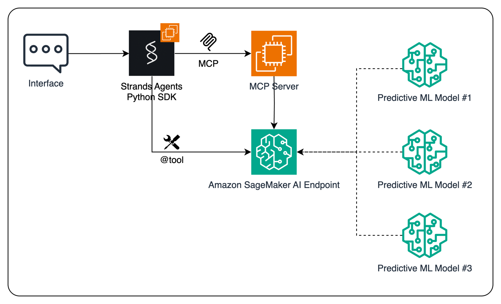

# **通过Amazon SageMaker与模型上下文协议（MCP）增强AI Agent的预测能力**

## **摘要**

随着机器学习（ML）技术从实验阶段走向企业运营的核心，其在销售预测、客户分群和流失预测等领域的应用已日益成熟。与此同时，生成式AI（Generative AI）作为一股革命性力量，正在重塑客户体验。本文旨在探讨如何将传统预测性ML模型的精准性与生成式AI Agent的自主交互能力相结合，创造出更智能、更高效的企业级AI应用。

本文将详细介绍一种在 **Amazon SageMaker** 平台上，通过集成**预测性ML模型**与**模型上下文协议（Model Context Protocol, MCP）**来扩展AI Agent能力的工作流。本技术实践方案将演示如何使用开源的 **Strands Agents SDK** 快速构建AI Agent，并使其能够通过两种方式（直接调用SageMaker终端节点或通过MCP协议）与托管在SageMaker上的ML模型工具进行交互，从而做出数据驱动的业务决策。本文提供的架构旨在为开发者构建结合了对话式AI与强大预测分析能力的可扩展、智能AI应用提供一个安全、模块化的基础。

---

## **1. 业务场景与技术挑战**

### **1.1. 业务场景**

在现代企业中，数据驱动的决策至关重要。例如，一个零售企业的运营团队需要根据历史销售数据、季节性因素和市场趋势，来预测未来某一产品的需求量。这个预测结果将直接影响库存管理、生产计划和营销策略的制定。

### **1.2. 技术挑战**

*   **技术融合的复杂性**：传统的预测性ML模型（如XGBoost, ARIMA）在处理结构化、时间序列数据方面表现出色，但它们通常缺乏与用户自然交互的能力。而基于大语言模型（LLM）的AI Agent擅长理解用户意图、进行多轮对话和自主规划，但在特定领域的数值预测上能力有限。如何**将两者的优势无缝结合**，是一个核心挑战。
*   **工具的动态发现与安全调用**：当AI Agent需要使用外部工具（如一个ML模型）时，如何动态地发现可用工具、理解其功能和参数，并以一种安全、解耦的方式进行调用，是构建可扩展Agentic应用的关键。直接在Agent代码中硬编码工具调用逻辑，会增加系统的耦合度和维护成本。
*   **开发效率与可扩展性**：开发者需要一个能够快速构建、测试和部署集成式AI Agent的框架，同时保证该架构在生产环境中具有良好的可扩展性和安全性。

---

## **2. 核心技术组件介绍**

在深入解决方案之前，首先介绍本方案中涉及的关键技术组件。

*   **Amazon SageMaker**
    Amazon SageMaker 是一个完全托管的机器学习服务。它为数据科学家和开发者提供了在一个集成环境中构建、训练和部署ML模型的全套工具。其提供的弹性、可扩展的终端节点（Endpoint）服务，使得将训练好的模型部署为实时或批量推理的API变得非常简便。

*   **AI Agent**
    AI Agent是一种由大语言模型（LLM）驱动的应用程序。它以LLM为核心“大脑”，能够自主地观察环境、制定计划并执行任务，整个过程仅需最少的人工干预。通过集成推理、记忆和工具使用能力，AI Agent能够解决复杂的多步骤问题。

*   **模型上下文协议 (Model Context Protocol, MCP)**
    MCP是一个开放协议，旨在标准化应用程序向LLM提供上下文信息的方式。在Agentic架构中，MCP允许AI Agent动态地发现外部工具（如ML模型），并安全地与之交互，从而实现了Agent逻辑与工具逻辑的解耦。

*   **Strands Agents SDK**
    Strands Agents是一个开源的软件开发工具包（SDK），它采用模型驱动的方法来构建和运行AI Agent。开发者仅需通过一个提示（Prompt）和一系列工具列表，即可在数行代码内快速构建从简单助手到复杂自主工作流的各类AI Agent。

---

## **3. 解决方案与架构设计**

### **3.1. 解决方案概述**

本解决方案的核心思想是：将部署在Amazon SageMaker上的预测性ML模型作为“工具”，供AI Agent在需要时调用，以增强其数据驱动的决策能力。用户通过前端应用与AI Agent交互，当Agent识别到需要进行数据预测的意图时（例如，用户提问“预测2025年下半年的销售额”），它将调用相应的SageMaker ML模型来获取预测结果，并将结果反馈给用户或用于驱动后续的自动化任务。

### **3.2. 系统架构**

下图展示了本解决方案的详细流程。



**架构流程解析：**

1.  **用户交互**：用户通过聊天助手等界面发起请求。
2.  **Agent处理**：使用Strands Agents SDK构建的AI Agent接收并理解用户输入。
3.  **工具调用决策**：Agent内置的LLM判断出需要调用外部预测模型来完成任务。
4.  **两种调用路径**：
    *   **直接调用**：通过Strands Agents SDK的 `@tool` 装饰器，将SageMaker终端节点封装为Agent的一个自定义工具，实现直接调用。此方法简单快捷，无需额外基础设施。
    *   **通过MCP调用**：Agent与一个MCP服务器通信。MCP服务器负责暴露SageMaker模型作为工具，并处理对SageMaker终端节点的实际调用。此方法实现了Agent与工具的解耦，提升了系统的安全性和可扩展性，是生产环境的推荐方案。
5.  **获取预测结果**：SageMaker终端节点执行模型推理，并返回预测结果。
6.  **结果整合与响应**：AI Agent接收预测结果，并将其整合到对用户的最终响应中，或基于该结果触发下一步行动（如更新BI报表、调用ERP系统等）。

---

## **4. 核心实现步骤**

本节将演示如何实现一个完整的端到端工作流，扮演一名数据科学家的角色，构建一个能够预测产品需求的AI Agent。

### **4.1. 训练并部署预测模型**

首先，我们使用Amazon SageMaker训练一个时间序列预测模型。为简化演示，我们假设已完成数据准备和特征工程，并使用SageMaker内置的XGBoost容器训练了一个回归模型。

**1. 训练模型**
```python
# 从sagemaker库导入XGBoost估算器
from sagemaker.xgboost.estimator import XGBoost

# 初始化XGBoost估算器
xgb_estimator = XGBoost(...)
# 使用已上传到S3的训练和验证数据集来拟合模型
xgb_estimator.fit({'train': train_s3_path, 'validation': val_s3_path})
```

**2. 部署模型为SageMaker终端节点**
将训练好的模型部署为一个实时推理的API终端节点。
```python
# 导入JSON序列化和反序列化工具
from sagemaker.serializers import JSONSerializer
from sagemaker.deserializers import JSONDeserializer

# 部署模型，并指定实例数量、类型以及数据的序列化方式
predictor = xgb_estimator.deploy(
    initial_instance_count=1,
    instance_type=instance_type,
    serializer=JSONSerializer(),
    deserializer=JSONDeserializer()
)
```

### **4.2. 方案一：直接将SageMaker终端节点作为工具**

**1. 编写终端节点调用函数**
创建一个Python函数来调用部署好的SageMaker终端节点。函数的文档字符串（docstring）至关重要，因为它将作为LLM选择和使用该工具的依据。
```python
import boto3
import json
import numpy as np

# 定义终端节点名称和AWS区域
ENDPOINT_NAME = "serverless-xgboost"
REGION = boto3.session.Session().region_name

def invoke_endpoint(payload: list):
    """
    使用部署在Amazon SageMaker终端节点上的模型生成预测。
    
    Args:
        payload (list): 一个包含输入数据的列表的列表，用于生成预测。
        
    Returns:
        predictions (np.array): 一个包含预测结果的NumPy数组。
    """
    # 初始化SageMaker运行时客户端
    sagemaker_runtime = boto3.client("sagemaker-runtime", region_name=REGION)
    # 调用终端节点
    response = sagemaker_runtime.invoke_endpoint(
        EndpointName=ENDPOINT_NAME,
        Body=json.dumps(payload),
        ContentType="application/json",
        Accept="application/json"
    )
    # 解析返回结果
    predictions = json.loads(response['Body'].read().decode("utf-8"))
    return np.array(predictions)
```

**2. 将函数转换为Agent工具**
使用Strands Agents SDK的 `@tool` 装饰器，轻松将上述函数转换为AI Agent可用的工具。
```python
# 从strands库导入tool装饰器
from strands import tool

@tool()
def generate_prediction_with_sagemaker(payload: list):
    """
    使用部署在Amazon SageMaker终端节点上的模型生成预测。
    
    Args:
        payload (list): 一个包含输入数据的列表的列表，用于生成预测。
        
    Returns:
        predictions (np.array): 一个包含预测结果的NumPy数组。
    """
    # ... 函数实现同上 ...
    sagemaker_runtime = boto3.client("sagemaker-runtime", region_name=REGION)
    response = sagemaker_runtime.invoke_endpoint(
        EndpointName=ENDPOINT_NAME,
        Body=json.dumps(payload),
        ContentType="application/json",
        Accept="application/json"
    )
    predictions = json.loads(response['Body'].read().decode("utf-8"))
    return np.array(predictions)
```

**3. 创建并调用Agent**
在创建Agent时，将刚刚定义的工具传入。
```python
# 从strands库导入Agent
from strands import Agent

# 创建Agent实例，指定使用的LLM模型和工具列表
agent = Agent(
    model="us.amazon.nova-pro-v1:0", 
    tools=[generate_prediction_with_sagemaker]
)

# 向Agent发起请求
agent(
    "使用以下输入调用终端节点：\n\n"
    f"<input>{test_sample}</input>\n\n"
    "请以JSON格式提供输出 {'predictions':<predictions>}"
)
```
执行后，Agent的思考过程和输出如下，它正确地识别并调用了工具：
```text
<thinking> 为了完成用户的请求，我需要使用提供的输入数据调用Amazon SageMaker终端节点。
输入是一个列表的列表，这正是'generate_prediction_with_sagemaker'工具所要求的格式。
我将使用这个工具来获取预测结果。 </thinking> 

Tool #1: generate_prediction_with_sagemaker 
来自Amazon SageMaker终端节点的预测结果如下: 
```json 
{  "predictions": [89.8525238, 52.51485062, 58.35247421, 62.79786301, 85.51475525] } 
```

### **4.3. 方案二：通过MCP服务器连接终端节点**

此方案通过引入MCP服务器实现Agent与工具的解耦。

**1. 实现MCP服务器**
使用 `FastMCP` 框架创建一个简单的MCP服务器，该服务器包装了对SageMaker终端节点的调用。
```python
# 从mcp.server.fastmcp导入FastMCP
from mcp.server.fastmcp import FastMCP
import os

# 初始化FastMCP应用
mcp = FastMCP("SageMaker App")
# 从环境变量获取SageMaker终端节点名称
ENDPOINT_NAME = os.environ["SAGEMAKER_ENDPOINT_NAME"]

@mcp.tool()
async def invoke_endpoint(payload: list):
    """ 使用部署在Amazon SageMaker终端节点上的模型生成预测... """
    # ... 此处是调用SageMaker终端节点的逻辑 ...
    
if __name__ == "__main__":
    # 以stdio模式运行MCP服务器
    mcp.run(transport="stdio")
```

**2. Agent通过MCP客户端与工具交互**
Agent通过MCP客户端连接到服务器，动态获取工具列表，然后进行调用。
```python
from mcp import StdioServerParameters
from mcp.client.stdio import stdio_client
from strands.tools.mcp import MCPClient
from strands import Agent

# 为stdio连接创建服务器参数
server_params = StdioServerParameters(
    command="python3",
    args=["server.py"],  # 启动服务器的脚本
    env={"SAGEMAKER_ENDPOINT_NAME": "<your-endpoint-name>"}
)

# 使用stdio_client上下文管理器
with stdio_client(server_params) as stdio_mcp_client:
    # 从MCP服务器获取工具列表
    tools = stdio_mcp_client.list_tools_sync()
    # 使用获取到的工具创建Agent
    agent = Agent(model="us.amazon.nova-pro-v1:0", tools=tools)
    # 调用Agent
    agent(
        "使用以下输入调用终端节点：\n\n"
        f"<input>{test_sample}</input>\n\n"
        "请以JSON格式提供输出 {'predictions':<predictions>}"
    )
```

---

## **5. 资源清理**

完成实验后，请务必删除创建的SageMaker终端节点以避免产生不必要的费用。
```python
# 使用SageMaker Python SDK清理
predictor.delete_model()
predictor.delete_endpoint()

# 或者使用boto3清理
sagemaker_runtime.delete_endpoint(EndpointName=endpoint_name)
```

---

## **6. 结论**

本文详细展示了如何通过集成Amazon SageMaker上的预测性ML模型与模型上下文协议（MCP），来显著增强AI Agent的能力。通过开源的Strands Agents SDK，提供了两种灵活的集成路径：直接终端节点访问和基于MCP的集成。该架构为开发者构建融合了对话式AI与强大预测分析能力的下一代智能应用，提供了一个安全、可扩展且模块化的坚实基础。

## 7.参考文档

1.  [Extend large language models powered by Amazon SageMaker AI using Model Context Protocol](https://aws.amazon.com/blogs/machine-learning/extend-large-language-models-powered-by-amazon-sagemaker-ai-using-model-context-protocol/)
2.  [Harness the power of MCP servers with Amazon Bedrock Agents](https://aws.amazon.com/blogs/machine-learning/harness-the-power-of-mcp-servers-with-amazon-bedrock-agents/) 
3.  [Guidance for Deploying Model Context Protocol Servers on AWS](https://aws.amazon.com/solutions/guidance/deploying-model-context-protocol-servers-on-aws/)
4.  [Strands Agents SDK](https://strandsagents.com/)
5.  [Amazon SageMaker AI](https://aws.amazon.com/sagemaker-ai)
6.  [Model Context Protocol (MCP)](https://modelcontextprotocol.io/introduction)
