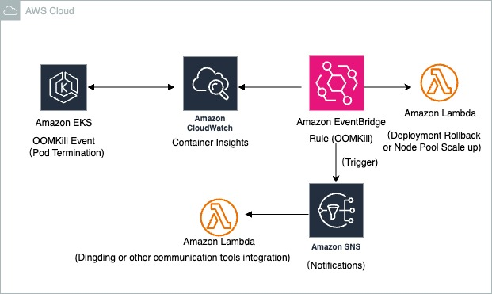

# Kubernetes OOMKill 预防指南实践

## 摘要

本文旨在深入探讨 Kubernetes 环境中内存溢出终止（OOMKill）问题，并提供一套行之有效的预防策略。分析这些策略如何体现并满足架构师在可靠性、成本优化、操作卓越、性能优化及安全性等方面的职责。通过理解和应用这些实践，可以有效提升 Kubernetes 集群的稳定性、资源利用率和运维效率。

## 1. 引言

### 1.1 背景：Kubernetes OOMKill 问题及其影响

在 Kubernetes 容器编排系统中，当 Pod 或容器尝试使用的内存超过其被分配的限制（`limits.memory`）时，Kubernetes 会触发 OOMKill（Out Of Memory Kill）事件，强制终止该容器。这通常会导致服务中断、应用重启、CPU 使用率飙升以及云成本的意外增加。尤其是在大规模或高并发场景下，频繁的 OOMKill 会严重影响系统的稳定性和用户体验。

### 1.2 目的：提供 OOMKill 预防策略，并结合 GCP 解决方案架构师要求进行分析

本文将基于实战经验，详细阐述十项 OOMKill 预防策略，分析这些策略如何与架构师在设计、部署和管理云原生解决方案时的核心要求相契合。

## 2. Kubernetes OOMKill 预防策略

以下是预防 Kubernetes OOMKill 的十项关键策略：

### 2.1 理解内存限制与请求 (Memory Limits and Requests)

*   **策略**：为每个 Pod 或容器明确设置 `resources.requests.memory` 和 `resources.limits.memory`。`requests` 用于调度时保证资源，`limits` 定义了容器可使用的最大内存，超过则触发 OOMKill。
*   **实践**：
    
    ```yaml
    resources:
      requests:
        memory: "512Mi"
      limits:
        memory: "1Gi"
    ```
*   **价值**：防止 Pod 之间相互争抢内存导致节点不稳定，确保资源分配的公平性和可预测性。

### 2.2 实时监控 Pod 内存

*   **策略**：部署 Prometheus、Grafana 等监控工具，实时收集 `container_memory_usage_bytes` 等指标，并设置内存使用率的预警阈值（例如，75% 警告，90% 临界）。
*   **价值**：在内存耗尽前及时发现潜在问题，为干预争取时间，避免突发性 OOMKill。

### 2.3 通过内存分析调整容器大小 (Right-Size Your Containers)

*   **策略**：使用 `kubectl top pod`、heapster、cAdvisor 或语言特定的内存分析工具，在典型和压力负载下分析应用的实际内存使用模式，并据此调整容器的资源限制。同时，优化应用内部的内存消耗（如调整缓存大小）。
*   **价值**：精确匹配资源需求，避免资源浪费（设置过高）或 OOMKill（设置过低），提高资源利用率。

### 2.4 明智使用 Liveness 和 Readiness Probes

*   **策略**：避免过于激进的探针设置。延长 `failureThreshold` 并增加 `initialDelaySeconds`，以应对瞬时内存尖峰（如 Java 应用的 GC 暂停），防止不必要的 Pod 重启。
*   **价值**：提高应用的健壮性，减少因短暂资源波动导致的误判和不必要的服务中断。

### 2.5 为 Init 容器设置独立内存限制

*   **策略**：对于在初始化阶段需要大量内存的工作负载，为 `initContainers` 单独设置资源限制。
*   **实践**：
    ```yaml
    initContainers:
    - name: preprocess
      image: my/preprocessor
      resources:
        requests:
          memory: "1Gi"
        limits:
          memory: "2Gi"
    ```
*   **价值**：确保主容器在启动后仍能在其预设的内存包络中稳定运行，避免初始化阶段的内存峰值影响主服务。

### 2.6 利用 Vertical Pod Autoscaling (VPA)

*   **策略**：部署 Vertical Pod Autoscaler (VPA)，让其根据 Pod 的历史内存使用情况，自动调整 Pod 的 `requests` 和 `limits`。
*   **实践**：
    ```yaml
    apiVersion: autoscaling.k8s.io/v1
    kind: VerticalPodAutoscaler
    metadata:
      name: myapp-vpa
    spec:
      targetRef:
        apiVersion: "apps/v1"
        kind: Deployment
        name: myapp
      updatePolicy:
        updateMode: "Auto"
    ```
*   **价值**：实现资源的动态优化，减少手动调整的复杂性，并有效降低 OOMKill 发生的概率。

### 2.7 为 Java 应用设置 JVM 内存标志

*   **策略**：对于 Java 应用，使用 `-XX:MaxRAMPercentage` 等 JVM 参数来限制 Java 堆内存，确保在容器的内存限制内为原生线程和 GC 开销预留足够的空间。
*   **实践**：
    ```yaml
    env:
    - name: JAVA_TOOL_OPTIONS
      value: "-XX:MaxRAMPercentage=75.0"
    ```
*   **价值**：防止 Java 应用因堆内存无限制增长而触发容器 OOMKill，提高 Java 应用在容器环境中的稳定性。

### 2.8 使用独立 Pod 隔离内存密集型任务

*   **策略**：将**批处理作业、大型数据处理任务或内存消耗巨大的测试等非核心、周期性任务**，部署到独立的 Job Pod 中，并为其设置更高的内存限制。
*   **实践**：
    
    ```yaml
    apiVersion: batch/v1
    kind: Job
    spec:
      template:
        spec:
          containers:
          - name: heavy-task
            image: my/processor
            resources:
              limits:
                memory: "4Gi"
          restartPolicy: Never
    ```
*   **价值**：防止单个内存密集型任务的内存尖峰影响核心服务的稳定性，实现资源隔离。

### 2.9 通过 Memcached Sidecar 实现类 Swap 行为

*   **策略**：在可接受轻微内存溢出的场景下，引入 Memcached 或 Redis Sidecar 容器。当主应用内存接近上限时，将部分数据溢出到 Sidecar 管理的外部缓存中。
*   **价值**：作为一种软性的内存缓冲机制，可以缓解瞬时内存尖峰，为自动扩容争取时间，避免立即触发 OOMKill。

### 2.10 自动化 OOMKill 检测与回滚

* **策略**：集成自动化脚本或工具，实时检测 OOMKill 事件（例如，通过 `kubectl get events --field-selector reason=OOMKilled`），并触发预设的自动化响应，如扩容节点池、回滚最近的部署、通过 Webhook 通知 SRE 团队等。

  - 例如，如果是在AWS云服务上（其他云平台同样可以参考），可以设计的架构图如下所示，该架构通过 **CloudWatch Container Insights** 实时收集 AWS EKS 集群的容器日志和指标，一旦检测到 OOMKill 事件（通过日志模式或特定指标），**CloudWatch**  **Alarms** 会立即触发告警。此告警事件随后被发送至 **Amazon EventBridge**，EventBridge 根据预设规则路由事件，触发相应的 **AWS Lambda** 函数执行自动化响应（如部署回滚或节点池扩容），并通过 **Amazon SNS** 向 SRE 团队发送通知，从而实现 OOMKill 事件的快速检测、自动化处理和及时告警。

    

* **价值**：将 OOMKill 事件的恢复时间从人工干预的数十分钟缩短到自动化响应的数分钟，显著提高系统的韧性。

## 3. 结论

Kubernetes OOMKill 是云原生环境中常见的挑战，但通过本文所述的系统化预防策略，可以有效降低其发生频率和影响。掌握并应用这些策略，不仅是提升技术能力的体现，更是履行其在构建可靠、高效、安全且成本优化的云解决方案方面职责的关键。通过持续的监控、分析和自动化，可以确保 Kubernetes 集群的稳定运行，为业务提供坚实的基础。

