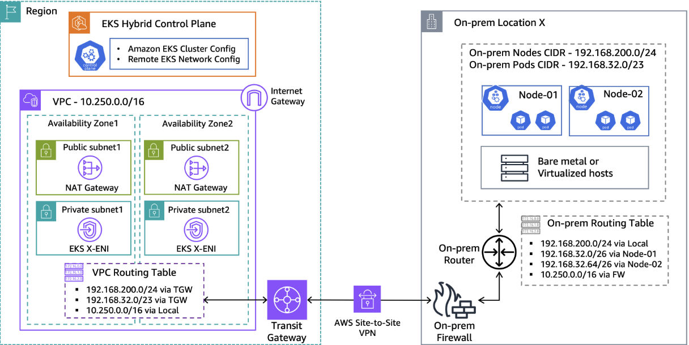

# 构建无边界的混合云原生网络架构的技术方案

## 前言

在当今多云和混合云时代，企业面临着跨越私有数据中心和公有云的复杂IT环境。为了最大化资源利用率、保证业务连续性并满足数据主权等要求，**帮助企业构建一套无边界的混合云原生基础设施管理**平台变得至关重要。这不仅要求计算资源能够无缝调度，更对底层网络架构的连通性、性能和安全性提出了极高的挑战。

本文将首先深入探讨 Amazon EKS Hybrid Nodes 的集群网络实现机制，并以此为基础，对业界主流云厂商（AWS、Azure、Google Cloud、Alibaba Cloud）的混合云原生网络方案进行横向对比分析，为企业在进行技术选型时提供专业的参考。

---

## 第一部分：Amazon EKS 混合云网络深度解析

Amazon EKS (Elastic Kubernetes Service) 通过其混合节点（Hybrid Nodes）功能，允许企业将本地数据中心的服务器注册为EKS集群的工作节点。这种模式对于需要低延迟、满足数据驻留策略或利旧现有硬件的场景极具价值。然而，实现云上控制平面与本地数据平面的高效协同，关键在于解决两大网络难题：**集群内Pod网络（CNI）** 和 **服务暴露（Load Balancing）**。

#### 架构图详解

上图展示了一个典型的EKS混合云网络设置，其核心在于打通云上VPC与本地数据中心（On-Premises DC）之间的网络壁垒，实现统一的资源管理和流量调度。下面对其关键部分进行解读：

**1. 数据流向 (Data Flow)**

架构中存在两种关键的数据流：
*   **南北向流量 (North-South Traffic)**：指从外部进入集群或从集群访问外部的流量。一个典型的例子是公网用户访问部署在本地节点上的应用。流量路径为：
    1.  用户的请求到达Internet。
    2.  流量进入AWS云，首先被 **AWS Load Balancer** (如ALB/NLB) 接收。
    3.  Load Balancer作为流量入口，根据规则将请求通过 **Direct Connect** 或 **VPN** 私有连接，转发到目标Pod的IP地址。
    4.  流量到达本地数据中心的路由器，最终被路由到承载该Pod的物理节点上。
*   **东西向流量 (East-West Traffic)**：指集群内部组件之间的通信。
    *   **本地Pod间通信**：一个本地节点上的Pod访问另一个本地节点上的Pod。流量通过节点宿主机网络，由本地的BGP路由器根据Pod的IP地址，直接路由到目标节点，无需绕行云端。
    *   **本地Pod与云上Pod通信**：一个本地节点上的Pod需要访问部署在AWS云端EKS节点上的Pod。流量从本地Pod发出，经本地路由器，通过Direct Connect/VPN进入AWS VPC，再由VPC内的路由表指向云端的EKS节点。

**2. 路由表解释 (Route Table Explanation)**

为了实现上述数据流，云端和本地的路由表需要协同工作。以下为架构图中具体的路由表示例：

*   **AWS VPC 路由表示例 (VPC Route Table)**

    此路由表关联了云端EKS节点所在的子网（VPC CIDR: `10.250.0.0/16`）。

| 目标网段 (Destination) | 目标 (Target) | 描述 (Description) |
| :--- | :--- | :--- |
| `10.250.0.0/16` | `Local` | VPC内部流量的默认规则 |
| `192.168.200.0/24`| `TGW` | 指向本地**物理节点**网络，通过中转网关(TGW) |
| `192.168.32.0/23` | `TGW` | 指向本地**Pod**网络，通过中转网关(TGW) |

    **说明**：最后两条规则是混合云的关键。它们告诉VPC，任何要去往本地物理节点网络或Pod网络的目标流量，都必须通过中转网关（Transit Gateway）发往本地数据中心。

*   **本地路由器路由表示例 (On-prem Routing Table)**

    此路由表位于本地数据中心的核心网络设备上。

| 目标网段 (Destination) | 下一跳 (Next-Hop) | 描述 (Description) |
| :--- | :--- | :--- |
| `192.168.200.0/24`| `Local` | 本地物理节点网络，本地流量 |
| `192.168.32.0/26` | `Node-01 IP` | 指向Node-01上的Pod网络，由CNI动态通告 |
| `192.168.32.64/26`| `Node-02 IP` | 指向Node-02上的Pod网络，由CNI动态通告 |
| `10.250.0.0/16` | `FW (Firewall)` | 指向AWS VPC网络，经由本地防火墙 |

    **说明**：第二条和第三条路由是BGP动态学习到的，它将整个Pod网络（`192.168.32.0/23`）的子网精确地指向对应的物理节点。最后一条路由确保了本地网络可以访问云上VPC的资源。

**3. CNI插件解释 (CNI Plugin Explanation)**

CNI（容器网络接口）是实现Pod网络通信的基础。
*   **为何不能用默认VPC CNI**：AWS默认的VPC CNI插件通过为Pod分配VPC内的IP地址（通常是ENI的辅助IP）来工作。由于本地节点物理上不在AWS VPC内，因此无法使用这种机制。
*   **Calico/Cilium的作用**：像Calico、Cilium这样的第三方CNI插件，它们创建了一个独立的Pod网络（Overlay或Underlay模式），这个网络的IP地址段独立于VPC和本地物理网络。它们的核心任务是确保分配给Pod的IP地址是可路由的。
*   **与BGP的集成**：在BGP模式下，部署在每个混合节点上的CNI插件本身就是一个小型的BGP路由器。它会将自己所在节点上运行的Pod的IP地址段（如`192.168.32.0/26`）通告给数据中心的物理路由器。这种方式将Kubernetes的虚拟网络无缝地集成到了物理网络中，实现了高效的动态路由。

### 核心网络架构要求

1.  **私有连接**: 本地数据中心与AWS VPC之间必须建立稳定的私有网络连接，通常通过 AWS Direct Connect 或 Site-to-Site VPN 实现。
2.  **CNI兼容性**: 默认的 Amazon VPC CNI 插件与混合节点不兼容。必须选择并部署一个兼容的第三方CNI插件，如 Calico 或 Cilium。

### Pod 网络 (CNI) 解决方案

为了让运行在本地节点上的Pod IP能够被集群内（包括云上节点）和本地网络正确路由，主要有两种推荐方案：

#### 1. BGP 动态路由 (推荐方案)

*   **技术栈**: Cilium CNI + BGP Protocol
*   **原理**: 此方案最具扩展性。通过在本地网络中运行支持BGP（边界网关协议）的路由器（如Cisco、Juniper或开源的FRR），并配置Cilium以BGP模式运行。Cilium会自动将本地节点上Pod的CIDR块通告给BGP路由器。路由器动态学习到这些路由后，会将其传播到整个本地网络。这样，任何访问Pod IP的流量都能被正确导向对应的物理节点。
*   **优势**: 自动化、扩展性强，无需手动管理路由条目，是生产环境的首选。

#### 2. 静态路由

*   **技术栈**: Calico CNI + Static Routes
*   **原理**: 适用于小型部署或本地网络设备不支持BGP的场景。需要为每个本地混合节点手动规划并分配一个独立的Pod IP地址块（CIDR）。然后，在本地网络的核心路由器或网关上，为每个节点的Pod CIDR块配置一条静态路由，将下一跳（Next Hop）指向该节点的物理IP地址。
*   **优势**: 简单直接，不依赖BGP。
*   **劣势**: 扩展性差，节点增减时需要手动更新路由表，运维负担重。

### 服务暴露 (Load Balancing) 解决方案

#### 1. 面向本地网络的服务暴露

*   **技术栈**: MetalLB
*   **原理**: 当需要将服务暴露给本地网络的用户或系统时，可以使用MetalLB。MetalLB以`LoadBalancer`服务类型工作，在Layer 2模式下，它会从本地网络的一个预留IP地址池中，为服务分配一个VIP（虚拟IP）。并通过ARP/NDP协议宣告该VIP的归属，使得本地网络流量可以直达提供服务的Pod。

#### 2. 面向公网的服务暴露

*   **技术栈**: AWS Load Balancer Controller
*   **原理**: 若要将运行在本地节点上的服务安全地暴露到互联网，可以部署AWS Load Balancer Controller。该控制器会监听`LoadBalancer`或`Ingress`类型的服务，并在AWS云上自动配置一个Application Load Balancer (ALB) 或 Network Load Balancer (NLB)。通过将`target-type`设置为`ip`，ALB/NLB会将公网流量通过私有连接（VPN/Direct Connect）直接路由到本地节点上运行的Pod IP，实现了从云到端的端到端流量转发。

---

## 第二部分：主流云厂商混合云网络方案对比

| 特性/厂商 | AWS EKS Anywhere / Hybrid Nodes | Microsoft Azure Arc + AKS Hybrid | Google Distributed Cloud (GDC) / Anthos | Alibaba Cloud ACK One |
| :--- | :--- | :--- | :--- | :--- |
| **核心理念** | **云端控制平面延伸**：将本地节点作为云上EKS集群的数据平面扩展。控制平面100%在云端。 | **统一纳管与控制**：通过Azure Arc将任何地域的Kubernetes集群连接并投射到Azure资源管理器中，实现统一治理。 | **应用现代化平台**：提供一个跨云和本地的一致性平台，重点在于应用管理、服务网格和策略执行。 | **分布式云容器平台**：旨在通过一套统一的控制台和API，管理任意位置的K8s集群，实现云边端一体化。 |
| **网络连接方案** | 依赖 **AWS Direct Connect** 或 **Site-to-Site VPN** 建立底层私有连接。 | 通过部署 **Arc Agents**，建立到Azure控制平面的出向、基于TLS的加密连接。不强制要求VPN/ExpressRoute，但生产环境推荐。 | 依赖 **Google Cloud Interconnect** 或 **VPN**。通过 **Connect Agent** 与Google Cloud控制平面通信。 | 依赖 **阿里云高速通道 (Express Connect)** 或 **VPN网关**。通过部署在本地的 **ACK One Agent** 与云上控制面安全通信。 |
| **Pod网络 (CNI)** | 灵活性高，**推荐Cilium或Calico**。依赖BGP或静态路由与本地网络集成。 | 灵活性高，支持多种CNI。与本地网络的集成方式（BGP等）同样需要客户自行配置。 | **推荐使用Cilium**。**Anthos Service Mesh** (基于Istio) 是其核心网络组件。 | **推荐使用Terway CNI** (阿里云自研)，支持VPC网络模型和弹性网络接口（ENI），可实现Pod与云资源的直接互通。也兼容Calico等。 |
| **服务暴露 (本地)** | **MetalLB** 是社区标准方案，无缝集成。 | 支持 **MetalLB** 或其他本地负载均衡器解决方案。 | **MetalLB** 是捆绑提供的默认解决方案，与GDC/Anthos深度集成。 | 支持 **MetalLB**。同时可通过云原生网关实现本地流量的负载均衡。 |
| **服务暴露 (公网)** | **AWS Load Balancer Controller**，在云端自动创建ALB/NLB，方案成熟、高效。 | 通过 **Azure Arc-enabled services**（如API Management, App Gateway）引导公网流量。 | **Multi-Cluster Ingress (MCI)** 是核心功能，可在Google Cloud上创建全局外部负载均衡器。 | 通过 **ACK One多集群网关** 和 **阿里云SLB** (Server Load Balancer) 集成，将公网流量路由至本地集群。 |
| **方案优势** | - 与AWS生态（IAM, LB, VPC等）深度集成。 - 网络路径清晰，模型易于理解。 | - 强大的统一治理和策略管理能力（Azure Policy）。 - 可纳管K8s之外的多种资源。 | - 业界领先的服务网格和应用管理能力。 - 强大的多集群管理和流量调度（MCI）。 | - 与阿里云生态（SLB, NAS, OSS等）深度集成。 - Terway CNI提供高性能的Pod网络。 - 强大的云边一体化协同能力。 |
| **方案挑战** | - 强依赖底层私有网络连接。 - 本地网络的BGP/静态路由配置有一定要求。 | - Arc Agent与控制平面的连接管理相对黑盒。 - 公网服务暴露的集成方案不如AWS直接。 | - 方案整体较为复杂和庞大，学习曲线陡峭。 - 成本相对较高。 | - 方案相对较新，社区生态和文档不如老牌厂商丰富。 - 国际市场的技术支持和覆盖面有待加强。 |

---

## 结论

选择合适的混合云原生网络方案是一个涉及多方面权衡的决策。

*   **AWS EKS** 的方案更像是一个**纯粹的网络延伸**，它将本地数据中心视为云VPC的一个“远端可用区”，方案直接、网络路径清晰，非常适合深度使用AWS生态的企业。

*   **Azure Arc** 则更侧重于**统一的“治理平面”**，它旨在将任何基础设施都纳入Azure的统一管理视图之下，网络连接是其实现治理的手段之一。

*   **Google GDC/Anthos** 提供的是一个**“应用现代化平台”**，其核心优势在于跨环境的应用一致性、服务网格和多集群管理，网络是支撑其上层应用平台的基础。

*   **Alibaba Cloud ACK One** 则是一个**“分布式云平台”**，它充分利用了阿里云在国内和亚太地区的生态优势，通过自研的Terway CNI和深度集成的云产品，为用户提供了一套高性能、云边端一体化的混合云解决方案。

企业应根据自身的业务需求、技术栈、运维能力和对云厂商的依赖程度，综合评估各个方案的优劣，从而构建出真正无边界、高效、安全的混合云原生基础设施。

### 参考文章

可以参考AWS的技术博客[Deep dive into cluster networking for Amazon EKS Hybrid Nodes](https://aws.amazon.com/cn/blogs/containers/deep-dive-into-cluster-networking-for-amazon-eks-hybrid-nodes/)的实践演示

