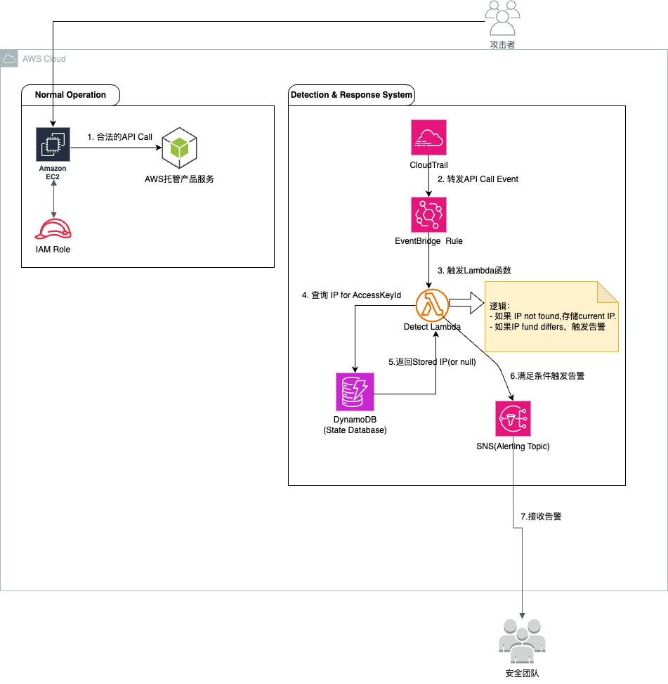

### **基于CloudTrail的AWS临时凭证泄露检测方案**

### 1. 背景与挑战

#### 1.1 背景介绍
在现代云基础架构中，使用AWS IAM角色和其提供的临时安全凭证是保护云资源访问安全的最佳实践。与永久性的Access Key不同，临时凭证具有自动轮换和生命周期有限的特点，极大地降低了凭证意外泄露带来的安全风险。应用程序（例如运行在EC2实例上的服务）通过获取这些临时凭证来安全地调用其他AWS服务（如S3、DynamoDB等）。

#### 1.2 核心挑战
尽管临时凭证增强了安全性，但它们仍然面临着被窃取的风险。一个典型的攻击场景是：攻击者通过应用漏洞或其他手段入侵了一台EC2实例，然后从该实例的元数据服务中窃取了当前IAM角色的临时凭证（Access Key ID, Secret Access Key, 和 Session Token）。

一旦窃取成功，攻击者便可以在**任何地方**（例如他们自己的服务器或其他云厂商的虚拟机）使用这些凭证，在凭证的有效生命周期内冒充该EC2实例的身份，访问您的AWS资源。由于攻击流量来自外部IP地址，传统的安全监控方法很难将其与正常的业务访问区分开来，从而导致检测延迟或失败。

本方案旨在解决这一核心挑战，提供一种近乎实时、可扩展且自动化的方法来检测此类凭证泄露事件。

### 2. 关键AWS服务介绍

解决方案架构图如下：



本解决方案主要依赖以下几个核心AWS服务：

*   **AWS Identity and Access Management (IAM)**
    *   **功能**：IAM是AWS的身份和访问管理服务。主要使用其**IAM角色**功能，为EC2实例等资源提供安全的、临时的访问权限。
    *   **在本方案中的作用**：作为安全凭证的来源，也是我们保护的目标。

*   **Amazon EC2 (Elastic Compute Cloud)**
    *   **功能**：提供可扩展的计算能力，是云中应用的主要运行环境。
    *   **在本方案中的作用**：是临时凭证被使用的合法场所，也是潜在的泄露源头。

*   **AWS CloudTrail**
    *   **功能**：记录您AWS账户中所有API活动的服务。无论是通过控制台、SDK还是命令行工具发起的请求，CloudTrail都会生成详细的日志事件，内容包括谁（身份）、在何时（时间）、从哪个IP地址、发起了什么操作。
    *   **在本方案中的作用**：作为方案的**核心数据源**。所有的检测逻辑都建立在对CloudTrail日志的实时分析之上。

*   **AWS Lambda**
    *   **功能**：一种无服务器计算服务，允许在不管理服务器的情况下运行代码。Lambda函数可以由各种事件自动触发。
    *   **在本方案中的作用**：作为检测逻辑的**执行引擎**，被配置为在新的CloudTrail日志产生时自动触发，执行分析代码。

*   **Amazon DynamoDB**
    *   **功能**：一种快速、灵活的NoSQL数据库服务，提供低延迟的键值存储。
    *   **在本方案中的作用**：作为**状态存储数据库**。用于记录每个临时凭证首次使用时的IP地址，以便后续进行对比。

### 3. 解决方案核心逻辑与示范代码

本方案的核心思想是<u>**信任首次使用 (Trust on First Use)**</u>。假设一个临时凭证在其生命周期内首次被使用的IP地址是合法的。任何后续来自不同IP地址的调用都将被视为可疑活动。

**处理流程如下**：

1.  **启用CloudTrail**：确保CloudTrail已在AWS账户中启用，并持续记录所有API调用事件。
2.  **设置事件触发**：配置一个规则，将CloudTrail中记录的API调用事件实时发送给一个AWS Lambda函数。
3.  **Lambda函数处理**：
    *   Lambda函数被触发后，解析传入的CloudTrail事件，提取关键信息：`accessKeyId` (临时凭证的唯一标识) 和 `sourceIPAddress`。
    *   以 `accessKeyId` 为主键，查询DynamoDB状态表。
    *   **如果未查询到记录 (首次使用)**：将当前的 `accessKeyId` 和 `sourceIPAddress` 作为一条新记录存入DynamoDB。
    *   **如果查询到记录**：将事件中的 `sourceIPAddress` 与DynamoDB中存储的IP地址进行比较。
    *   **如果不匹配**：判定为凭证泄露事件。立即触发警报（例如，发送通知到SNS主题、创建安全事件等）。
    *   **如果匹配**：判定为正常活动，不做任何处理。

#### 3.1 示范代码 (Python with Boto3)

以下是一个AWS Lambda函数的示例代码，用于实现上述检测逻辑。

```python
import json
import boto3
import os
from datetime import datetime, timedelta

# 从环境变量中获取DynamoDB表的名称
DYNAMODB_TABLE_NAME = os.environ.get('DYNAMODB_TABLE_NAME')
# 从环境变量中获取SNS主题的ARN，用于发送警报
SNS_TOPIC_ARN = os.environ.get('SNS_TOPIC_ARN')

# 初始化boto3客户端
dynamodb_client = boto3.resource('dynamodb')
sns_client = boto3.client('sns')
table = dynamodb_client.Table(DYNAMODB_TABLE_NAME)

def lambda_handler(event, context):
    """
    Lambda函数主处理程序
    由CloudTrail事件触发
    """
    
    # 1. 解析CloudTrail事件，提取关键信息
    # 注意：实际的CloudTrail事件结构可能更复杂，这里做了简化
    try:
        access_key_id = event['detail']['userIdentity']['accessKeyId']
        source_ip = event['detail']['sourceIPAddress']
        event_name = event['detail']['eventName']
        aws_region = event['detail']['awsRegion']
        
        # 忽略由AWS服务自身发起的调用
        if 'amazonaws.com' in source_ip:
            print(f"忽略来自AWS内部服务的调用: {source_ip}")
            return {'statusCode': 200}
            
    except KeyError as e:
        print(f"事件格式错误，缺少关键字段: {e}")
        return {'statusCode': 400}

    # 2. 查询DynamoDB，检查Access Key是否已存在记录
    try:
        response = table.get_item(Key={'AccessKeyId': access_key_id})
    except Exception as e:
        print(f"查询DynamoDB时出错: {e}")
        # 在实际生产中，这里可能需要配置重试逻辑
        raise e

    # 3. 根据查询结果进行逻辑判断
    if 'Item' not in response:
        # 3.1 如果是首次使用，将信息存入DynamoDB
        print(f"首次检测到Access Key [{access_key_id}] 从IP [{source_ip}] 使用。")
        
        # 设置TTL (Time to Live)，让DynamoDB在凭证过期后自动清理记录
        # 假设临时凭证有效期为12小时
        ttl_timestamp = int((datetime.now() + timedelta(hours=12)).timestamp())
        
        try:
            table.put_item(
                Item={
                    'AccessKeyId': access_key_id,
                    'FirstSeenIp': source_ip,
                    'FirstSeenTime': datetime.now().isoformat(),
                    'Ttl': ttl_timestamp
                }
            )
        except Exception as e:
            print(f"写入DynamoDB时出错: {e}")
            raise e
    else:
        # 3.2 如果非首次使用，比对IP地址
        stored_ip = response['Item']['FirstSeenIp']
        
        if source_ip != stored_ip:
            # IP地址不匹配，判定为凭证泄露，触发警报
            print(f"!!! 安全警报: 检测到凭证泄露风险 !!!")
            print(f"Access Key [{access_key_id}] 的预期IP为 [{stored_ip}], 但检测到来自 [{source_ip}] 的新调用。")
            
            # 构建警报消息
            alert_message = {
                'alert_type': 'CredentialCompromiseDetected',
                'access_key_id': access_key_id,
                'expected_ip': stored_ip,
                'detected_ip': source_ip,
                'event_name': event_name,
                'aws_region': aws_region,
                'alert_time': datetime.now().isoformat()
            }
            
            # 发送SNS通知
            try:
                sns_client.publish(
                    TopicArn=SNS_TOPIC_ARN,
                    Subject='[安全警报] 检测到AWS凭证泄露风险',
                    Message=json.dumps(alert_message, indent=2)
                )
            except Exception as e:
                print(f"发送SNS警报时出错: {e}")
                raise e

    return {
        'statusCode': 200,
        'body': json.dumps('Detection logic executed successfully.')
    }

```

### 4. 部署实施步骤

要将此解决方案部署到AWS环境中，需要遵循以下分步指南。

#### 4.1 步骤一：创建DynamoDB状态表
此表将用于存储每个临时凭证首次使用的IP地址。

1.  访问 **AWS DynamoDB 控制台**。
2.  点击 **“创建表”**。
3.  **表名称**：输入一个描述性的名称，例如 `CredentialFirstSeenState`。
4.  **分区键**：输入 `AccessKeyId`，并选择类型为 **字符串 (String)**。
5.  其他设置保持默认，点击 **“创建表”**。
6.  **（关键步骤）启用生存时间 (TTL)**：
    *   表创建后，进入表的 **“其他设置”** 选项卡。
    *   在“生存时间(TTL)属性”部分，点击 **“启用”**。
    *   在“TTL属性”字段中输入 `Ttl`。这将告诉DynamoDB使用我们代码中设置的`Ttl`字段来自动删除过期的项目，有效控制成本和数据量。

#### 4.2 步骤二：创建SNS主题用于警报
当检测到潜在的泄露事件时，系统将向此SNS主题发送通知。

1.  访问 **AWS Simple Notification Service (SNS) 控制台**。
2.  点击 **“主题”**，然后点击 **“创建主题”**。
3.  选择 **“标准”** 类型。
4.  **名称**：输入一个描述性的名称，例如 `CredentialCompromiseAlerts`。
5.  点击 **“创建主题”**。
6.  创建后，您需要**创建订阅**来接收通知。最简单的订阅类型是**电子邮件**，您也可以配置它来触发另一个Lambda函数、调用PagerDuty或将消息发送到Slack。

#### 4.3 步骤三：为Lambda函数创建IAM角色
Lambda函数需要权限来访问DynamoDB和SNS。

1.  访问 **AWS IAM 控制台**。
2.  选择 **“角色”**，然后点击 **“创建角色”**。
3.  **受信任的实体类型**：选择 **“AWS服务”**。
4.  **使用案例**：选择 **“Lambda”**。
5.  **添加权限**：
    *   搜索并添加 `AWSLambdaBasicExecutionRole` 策略（允许将日志写入CloudWatch）。
    *   点击 **“创建策略”**，以JSON格式创建一个内联策略，授予访问我们创建的DynamoDB表和SNS主题的权限。

    ```json
    {
        "Version": "2012-10-17",
        "Statement": [
            {
                "Effect": "Allow",
                "Action": [
                    "dynamodb:GetItem",
                    "dynamodb:PutItem"
                ],
                "Resource": "arn:aws:dynamodb:YOUR_REGION:YOUR_ACCOUNT_ID:table/CredentialFirstSeenState"
            },
            {
                "Effect": "Allow",
                "Action": "sns:Publish",
                "Resource": "arn:aws:sns:YOUR_REGION:YOUR_ACCOUNT_ID:CredentialCompromiseAlerts"
            }
        ]
    }
    ```
    **注意**：请将 `YOUR_REGION`、`YOUR_ACCOUNT_ID`、表名和主题名替换为您的实际值。

6.  为角色命名（例如 `CredentialDetectorLambdaRole`）并完成创建。

#### 4.4 步骤四：创建Lambda函数
1.  访问 **AWS Lambda 控制台**。
2.  点击 **“创建函数”**。
3.  选择 **“从头开始创作”**。
4.  **函数名称**：`CredentialCompromiseDetector`。
5.  **运行时**：选择 **Python 3.9** 或更高版本。
6.  **架构**：选择 `x86_64`。
7.  **权限**：展开“更改默认执行角色”，选择 **“使用现有角色”**，然后选择您在上一步创建的 `CredentialDetectorLambdaRole`。
8.  点击 **“创建函数”**。
9.  在 **“代码源”** 部分，将我们之前提供的Python示范代码粘贴进去。
10. 在 **“配置”** -> **“环境变量”** 中，添加以下两个变量：
    *   `DYNAMODB_TABLE_NAME`: `CredentialFirstSeenState`
    *   `SNS_TOPIC_ARN`: 您在步骤二中创建的SNS主题的ARN。
11. 保存函数。

#### 4.5 步骤五：配置CloudTrail事件触发器
这是将所有部分连接在一起的关键步骤。

1.  在您创建的Lambda函数的 **“函数概述”** 页面，点击 **“添加触发器”**。
2.  **选择源**：在下拉菜单中选择 **“EventBridge (CloudWatch Events)”**。
3.  **规则**：选择 **“创建新规则”**。
4.  **规则名称**：`TriggerCredentialDetectorOnApiCall`。
5.  **事件模式**：选择 **“事件模式”**，然后将以下JSON粘贴到文本框中。此模式会匹配所有通过CloudTrail记录的AWS API调用。

    ```json
    {
      "source": ["aws.cloudtrail"],
      "detail-type": ["AWS API Call via CloudTrail"]
    }
    ```
6.  点击 **“添加”** 完成触发器配置。

### 5. 运维与安全考量

*   **误报处理**：在某些情况下，合法的IP地址也可能发生变化（例如，EC2实例重启后获得新的公网IP）。因此，警报应被视为高可信度的**信号**，需要安全团队进行简要的二次确认，而非直接执行封禁等破坏性操作。
*   **成本控制**：本方案完全基于无服务器架构，成本极低。主要成本来自CloudTrail事件记录、Lambda调用和DynamoDB读写。通过为DynamoDB表设置TTL，可以确保状态数据不会无限增长，从而将存储成本降至最低。
*   **性能与扩展性**：该架构具有极高的扩展性。Lambda、DynamoDB和SNS都可以根据负载自动扩展，能够轻松应对大规模云环境中的海量API调用。
*   **增强的响应措施**：在收到SNS警报后，可以进一步自动化响应流程。例如，可以触发另一个Lambda函数，该函数使用 `sts:DecodeAuthorizationMessage` 解析事件详情，并尝试通过调用 `iam:RevokeRoleSession` 来立即撤销被盗用的会ッション。
*   **方案原理：为何通过AccessKeyId能检测泄露？**：AWS的临时凭证并非单一的Token，而是一个包含三部分的凭证集：`AccessKeyId`（公有标识符）、`SecretAccessKey`（私有签名密钥）和`SessionToken`（临时性证明）。CloudTrail作为审计服务，会记录用于识别身份的公有`AccessKeyId`，但出于安全考虑，绝不会记录私有的`SecretAccessKey`和`SessionToken`。本方案正是利用这一点，通过追踪公开的`AccessKeyId`在不同IP地址的使用情况，来推断整个凭证集是否已被盗用，从而实现对泄露事件的有效监控。

### 6. 总结

通过利用AWS CloudTrail提供的丰富审计日志，并结合Lambda和DynamoDB构建的无服务器分析引擎，我们可以实现一套**近乎实时、可扩展且低成本**的AWS临时凭证泄露检测方案。该方案遵循“信任首次使用”原则，巧妙地解决了在动态云环境中难以追踪攻击源IP的挑战，为云上资产提供了一层关键的主动防御能力。
