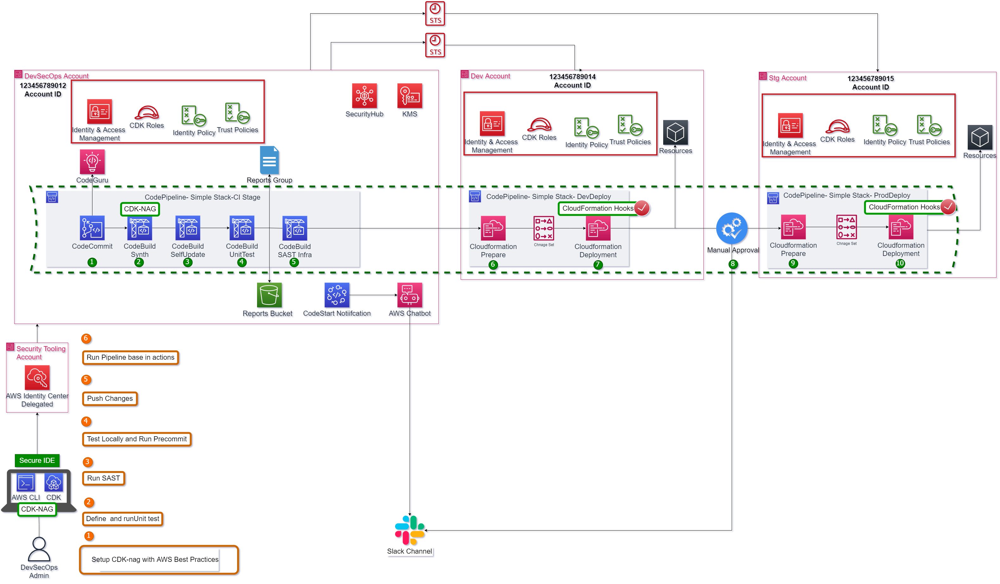

- [CDK 多环境部署管道](#cdk-多环境部署管道)
  - [解决方案概述](#解决方案概述)
  - [解决方案流程各阶段详细说明](#解决方案流程各阶段详细说明)
- [安全加固 - cdk-nag 集成](#安全加固---cdk-nag-集成)
  - [cdk-nag 简介](#cdk-nag-简介)
  - [集成方式](#集成方式)
  - [规则抑制](#规则抑制)
- [多账户架构原则](#多账户架构原则)
  - [为什么需要多账户](#为什么需要多账户)
  - [多账户安全边界](#多账户安全边界)
  - [环境隔离策略](#环境隔离策略)
- [环境晋升流程](#环境晋升流程)
  - [晋升机制](#晋升机制)
  - [审批流程设计](#审批流程设计)
  - [回滚策略](#回滚策略)

# CDK 多环境部署管道

本项目是一个在 AWS 上部署多环境 DevSecOps 流水线的演示项目，使用 Python CDK 进行基础设施即代码（IaC）的部署，展示如何构建安全、自动化的跨账户 CI/CD 管道。

## 解决方案概述



上图展示了完成此任务的步骤流程，以及使用 AWS CodePipeline、AWS CodeCommit、AWS CodeBuild 和 AWS CloudFormation 构建的跨账户管道。如何通过最少的努力构建安全可靠的管道。

## 解决方案流程各阶段详细说明

此管道是一个默认管道，由以下几个关键步骤组成：

### 阶段 1：变更检测与管道触发
- **功能**：检测代码仓库（CodeCommit）中的变更并激活管道
- **输入**：Git 代码提交（master 分支）
- **输出**：触发 CodePipeline 执行
- **实施方式**：CodePipeline 源阶段监听 CodeCommit 仓库的 webhook 或轮询机制
- **关键点**：对于此演示项目，master 分支是默认分支

### 阶段 2：CDK 项目合成与安全验证
- **功能**：对 CDK 项目进行合成（synth），验证是否符合 AWS 安全最佳实践
- **输入**：CDK Python 代码
- **输出**：CloudFormation 模板（JSON/YAML 格式）
- **实施方式**：执行 `cdk synth` 命令，可选择集成 cdk-nag 进行安全规则检查
- **关键点**：此阶段验证代码是否遵循 AWS Solutions Pack 安全规则

### 阶段 3：管道自更新
- **功能**：如果管道定义本身发生变更，自动更新管道结构
- **输入**：修改后的管道定义代码
- **输出**：更新后的 CodePipeline
- **实施方式**：CDK Pipelines 的自变异（self-mutation）特性
- **关键点**：确保管道始终与最新代码定义保持同步

### 阶段 4：单元测试执行与报告生成
- **功能**：运行基础设施代码的单元测试
- **工具**：使用 pytest 框架
- **报告**：测试结果以 JUnit XML 格式发布到 CodeBuild 报告组
- **实施方式**：CodeBuild 运行 `python3 -m pytest --junitxml=unit_test.xml`
- **报告组**：自动创建 Pytest-{project_name}-Report
- **关键点**：测试使用 CDK Template Assertions 验证 CloudFormation 模板属性

### 阶段 5：静态应用安全测试（SAST）
- **功能**：对基础设施即代码进行安全扫描
- **工具**：使用 Checkov 扫描工具
- **覆盖范围**：
  - CloudFormation 框架安全规则
  - Kubernetes 配置检查
  - 密钥泄露检测
  - AWS 安全最佳实践（500+ 条规则）
- **报告**：结果以 JUnit XML 格式发布到 CodeBuild 报告组
- **实施方式**：执行 `checkov -d . -o junitxml --output-file . --soft-fail`
- **报告组**：自动创建 checkov-{project_name}-Report
- **关键点**：扫描 CDK 合成输出（cdk.out/）目录

### 阶段 6：CloudFormation 堆栈准备（开发环境）
- **功能**：为开发环境准备 CloudFormation 堆栈变更集
- **输入**：合成的 CloudFormation 模板
- **输出**：变更集（Change Set）预览
- **实施方式**：CloudFormation CreateChangeSet 操作
- **关键点**：准备好部署计划，展示将进行的具体变更

### 阶段 7：CloudFormation 堆栈部署（开发环境）
- **功能**：执行开发环境的 CloudFormation 堆栈部署
- **前提**：CloudFormation Hooks 验证成功通过
- **资源**：部署 SimpleS3Stack（S3 存储桶）
- **安全控制**：启用服务器端加密（AES256）、阻止公共访问、强制 SSL
- **实施方式**：CloudFormation ExecuteChangeSet 操作
- **关键点**：实际执行 IaC 定义的基础设施创建/更新

### 阶段 8：手动审批与通知
- **功能**：在环境晋升（如 Dev 到 Stg）前添加人工审核环节
- **输入**：开发环境部署成功信号
- **输出**：Slack/Teams 频道的审批通知
- **实施方式**：CodePipeline ManualApproval 步骤
- **通知渠道**：通过 AWS Chatbot 或 Teams webhook 发送通知
- **关键点**：确保关键环境变更需要人工确认

### 阶段 9：CloudFormation 堆栈准备（预发布环境）
- **功能**：为预发布环境准备 CloudFormation 堆栈变更集
- **输入**：相同的 CloudFormation 模板（参数化环境变量）
- **输出**：针对 Staging 环境的变更集
- **实施方式**：CloudFormation CreateChangeSet 操作
- **关键点**：重复使用相同 IaC 定义，确保环境一致性

### 阶段 10：CloudFormation 堆栈部署（预发布环境）
- **功能**：执行预发布环境的 CloudFormation 堆栈部署
- **前提**：手动审批已批准 + CloudFormation Hooks 验证通过
- **资源**：部署 SimpleS3Stack（S3 存储桶，环境变量不同）
- **安全控制**：与开发环境相同的安全策略
- **实施方式**：CloudFormation ExecuteChangeSet 操作
- **关键点**：验证生产环境的变更流程

### 管道控制流总结

```
变更检测（CodeCommit）
    ↓
CDK 合成与验证（cdk synth）
    ↓
管道自更新（Self-Mutation）
    ↓
并行安全检查：
   ├─ 单元测试（Pytest）
   └─ SAST 扫描（Checkov）
    ↓
开发环境部署（Dev）
    ↓
手动审批闸门（Manual Approval）
    ↓
预发布环境部署（Staging）
```

# 安全加固 - cdk-nag 集成

## cdk-nag 简介

[cdk-nag](https://github.com/cdklabs/cdk-nag) 是一个开源工具，用于检查 CDK 应用程序或 CloudFormation 模板是否符合安全最佳实践。它基于 AWS Solutions Pack 和 HIPAA、NIST 800-53 等合规框架构建。cdk-nag 的作用包括：

**核心价值**：
- **左移安全（Shift-Left Security）**：在 CDK 合成阶段发现安全问题，避免问题的持续传播
- **AWS 最佳实践验证**：包含 500+ 条 AWS Solutions Pack 安全规则
- **多层合规框架**：支持 HIPAA、NIST 800-53、PCI DSS 等合规包
- **自动抑制机制**：支持通过代码进行规则抑制，处理合理的例外场景
- **无缝集成**：作为 CDK Aspect 模式集成，无侵入式安全检查

**工作原理**：
- **Aspect 注入**：在 CDK 合成前自动注入安全检查逻辑
- **资源遍历**：遍历所有 CDK 构造（Construct）并应用规则验证
- **失败阻断**：当资源违反规则时，在 `cdk synth` 阶段报告错误并中断流程

**规则类型示例**：
- `AwsSolutions-S1`：S3 存储桶应启用访问日志记录
- `AwsSolutions-S2`：S3 存储桶应阻止公共访问
- `AwsSolutions-S3`：S3 存储桶应启用服务器端加密
- `AwsSolutions-S5`：S3 存储桶应启用版本控制

## 集成方式

### 全局集成（应用程序级别）

在 `app.py` 中启用全局安全验证：

```python
from aws_cdk import Aspects
from cdk_nag import AwsSolutionsChecks

app = cdk.App()
# 在整个应用级别添加 AWS Solutions 检查
Aspects.of(app).add(AwsSolutionsChecks(verbose=True))

# 创建堆栈（所有资源将自动应用安全检查）
pipeline_stack = CdkPipelineMultienvironmentStack(
    app, "CdkPipelineMultienvironmentStack", ...
)

app.synth()
```

### 堆栈级别集成

在特定堆栈级别启用安全检查：

```python
# 在 src/pipeline/stages/deploy_app_stage.py 中

from aws_cdk import Aspects
from cdk_nag import AwsSolutionsChecks, NagSuppressions

class PipelineStageDeployApp(Stage):
    def __init__(self, scope: Construct, id: str, props: dict = None, **kwargs):
        super().__init__(scope, id, **kwargs)

        stack = SimpleS3Stack(self, "SimpleS3Stack", props=props)

        # 在此堆栈级别添加 AWS Solutions 安全检查
        Aspects.of(stack).add(AwsSolutionsChecks(verbose=True))
```

## 规则抑制

### 场景说明

在某些场景下，安全规则可能与业务需求冲突或为误报。此时可以使用抑制机制（Suppressions）临时忽略特定规则。

在 `src/pipeline/stages/deploy_app_stage.py` 中添加抑制规则：

```python
from cdk_nag import AwsSolutionsChecks, NagSuppressions

class PipelineStageDeployApp(Stage):
    def __init__(self, scope: Construct, id: str, props: dict = None, **kwargs):
        super().__init__(scope, id, **kwargs)

        stack = SimpleS3Stack(self, "SimpleS3Stack", props=props)

        # 添加安全检查
        Aspects.of(stack).add(AwsSolutionsChecks(verbose=True))

        # 抑制 S1 规则（S3 访问日志）
        # 原因：演示目的，简化配置
        NagSuppressions.add_stack_suppressions(
            stack=stack,
            suppressions=[
                {
                    "id": "AwsSolutions-S1",
                    "reason": "Demo purpose - S3 server access logging disabled for cost optimization"
                }
            ]
        )
```

### 常见抑制场景

1. **S3 访问日志（S1）**
   ```python
   suppression = {
       "id": "AwsSolutions-S1",
       "reason": "Log bucket itself doesn't need logging to avoid infinite loop"
   }
   ```

2. ** KMS 加密（KMS 相关规则）**
   ```python
   suppression = {
       "id": "AwsSolutions-SNS3",  # SNS 主题应使用 KMS 加密
       "reason": "Non-sensitive data, using default encryption sufficient"
   }
   ```

3. **VPC 流日志（VPC 相关规则）**
   ```python
   suppression = {
       "id": "AwsSolutions-EC23",  # VPC 应启用流日志
       "reason": "Test/dev VPC, not required for compliance"
   }
   ```

### 抑制最佳实践

- **记录原因**：始终提供明确的抑制原因
- **定期审查**：定期审查抑制规则，移除不再需要的例外
- **范围最小化**：在资源级别（add_resource_suppressions）而非堆栈级别抑制，缩小影响范围
- **审批流程**：建立抑制规则审批机制，避免滥用

### cdk-nag 执行示例

```bash
# 单一环境执行 $ cdk synth
[Error at /CdkPipelineMultienvironmentStack/DeployDev/SimpleS3Stack/multi-env-demo/Resource]
AwsSolutions-S1: The S3 Bucket has server access logs disabled. The bucket should have server access logging enabled to provide detailed records for the requests that are made to the bucket.

[Error at /CdkPipelineMultienvironmentStack/DeployDev/SimpleS3Stack/multi-env-demo/Resource]
AwsSolutions-S2: The S3 Bucket does not have public access restricted and blocked. The bucket should have public access restricted and blocked to prevent unauthorized access.

Found errors

# 添加抑制后执行 $ cdk synth
# 输出正常，无错误
```

### cdk-nag 与其他安全工具对比

| 工具 | 检查时机 | 检查对象 | 规则数量 | 主要用途 |
|------|----------|----------|----------|----------|
| **cdk-nag** | CDK 合成前 | CDK 构造 | 500+ | 开发阶段安全合规验证 |
| **Checkov** | 部署前 | CloudFormation 模板 | 750+ | 基础设施即代码安全扫描 |
| **CloudFormation Hooks** | 部署时 | CloudFormation 资源 | 自定义 | 运行时策略强制 |
| **AWS Config** | 部署后 | 运行中资源 | 250+ | 持续合规监控 |

**集成价值**：cdk-nag 作为左移安全的第一道防线，与 Checkov 和 CloudFormation Hooks 形成多层防御体系。


# 多账户架构原则

## 为什么需要多账户

基于 AWS 架构最佳实践和安全性考虑的账户策略：

**安全隔离与故障域分离**
- **高影响环境分离**：DevOps、生产和数据环境需要严格分离
- **故障域隔离**：减少配置错误等资源问题的影响范围（Reducing the blast radius）
- **AWS 账户作为安全边界**：账户是自然的安全隔离单位
- **生产数据隔离**：保护生产数据免受非授权环境的访问

**IAM 资源限制与可扩展性**
- **IAM 配额限制**：每个 AWS 账户有严格的 IAM 资源数量限制（角色、策略等）
- **集中管理优势**：Auth 账户联合 Identity Center 实现跨账户访问
- **可见性与报告**：按账户划分资源便于成本和使用情况追踪
- **API 限制**：独立账户减少 API 限流风险

**DevOps 与环境管理**
- **共享服务集中化**：DevOps 账户集中管理 CI/CD、构建、制品库
- **运营安全性**：DevOps 团队的日常操作需在非生产账户中验证
- **环境创建效率**：为每个新服务或应用快速预置独立账户
- **环境类型扩展**：演示、试点、预生产、生产等多种环境类型

**合规性与变更管理**
- **变更隔离**：生产环境变更需经过正式同意、文档化和时间安排
- **合规边界**：将受合规约束的数据类型放置在独立账户中
- **审计追踪**：账户级别的 CloudTrail 日志便于合规审计
- **策略强制**：不同账户应用不同的 SCP（服务控制策略）

## 多账户安全边界

### 跨账户架构设计

```
┌─────────────────────────────────────────────────────────┐
│                    DevOps 账户（总部）                    │
│  ┌───────────────────────────────────────────────────┐   │
│  │  中央服务                                          │   │
│  │  - CDK Pipeline                                   │   │
│  │  - CodeArtifact 制品库                            │   │
│  │  - 构建服务器/代理                                  │   │
│  │  - 密钥管理（KMS）                                   │   │
│  └───────────────────────────────────────────────────┘   │
│  ┌───────────────────────────────────────────────────┐   │
│  │  开发应用堆栈                                        │   │
│  │  - 测试/开发环境（资源少）                            │   │
│  └───────────────────────────────────────────────────┘   │
└─────────────────────────────────────────────────────────┘
                        │
                        │ 跨账户假定角色访问
                        │ （通过 CodePipeline 角色）
                        │
        ┌───────────────┼───────────────┐
        │               │               │
┌───────▼──────┐  ┌────▼──────┐  ┌─────▼──────┐
│   开发       │  │   预发布   │  │   生产      │
│  沙箱账户    │  │  账户      │  │   账户      │
│              │  │            │  │             │
│ 资源：       │  │ 资源：     │  │  资源配置：  │
│ - VPC        │  │ - VPC      │  │  - VPC      │
│ - EKS        │  │ - EKS      │  │  - EKS      │
│ - RDS        │  │ - RDS      │  │  - RDS      │
│ - Lambda     │  │ - Lambda   │  │  - Lambda   │
│ - S3         │  │ - S3       │  │  - S3       │
│              │  │            │  │             │
│ 隔离：       │  │ 隔离：     │  │  零访问：    │
│ - 生产数据    │  │ - 访问生产 │  │  - 跨账户    │
│ - IAM 角色/策略│  │ - 准备升级  │  │    受限     │
│ - 费用监视    │  │ - 镜像生产  │  │             │
└──────────────┘  └───────────┘  └─────────────┘
```

### 跨账户信任关系

**CodePipeline 跨账户部署所需 IAM 角色配置**：

```json
// 部署账户（Dev/Stg/Prod）中的部署角色
{
  "Version": "2012-10-17",
  "Statement": [
    {
      "Effect": "Allow",
      "Principal": {
        "AWS": "arn:aws:iam::DEVOPS_ACCOUNT_ID:root"
      },
      "Action": "sts:AssumeRole",
      "Condition": {
        "StringEquals": {
          "sts:ExternalId": "CDK_PIPELINE_EXTERNAL_ID"
        }
      }
    }
  ]
}
```

## 环境隔离策略

### 安全原则

1. **零生产访问**：开发和服务工程师日常无生产账户凭证
2. **完整镜像**：预发布环境尽可能镜像生产环境配置
3. **变更准备**：预发布环境用于准备生产部署的变更集
4. **安全圈**：逐步晋升（Dev → Stg → Prod）确保质量
5. **审计追踪**：所有跨账户访问记录到 CloudTrail

### 环境角色与职责

| 环境类型 | 用途 | 访问策略 | 变更频率 | 数据类型 |
|---------|------|---------|---------|---------|
| **DevOps** | 共享服务、管道、构建 | 工程师有完全访问 | 频繁 | 无敏感数据 |
| **开发** | 开发测试、实验 | 团队完全访问 | 非常频繁 | 测试数据、模拟数据 |
| **预发布** | 集成测试、验收 | 只读访问，部署通过管道 | 适中 | 脱敏生产数据 |
| **生产** | 真实业务、用户数据 | 无日常访问，紧急权限 | 谨慎、有计划 | 真实用户数据 |

# 环境晋升流程

## 晋升机制

### 基于 Git 分支的环境晋升

```
┌─────────────────────────────────────────────────────────────────┐
│  Git 仓库（CodeCommit）                                          │
│  ┌─────────────┐  ┌──────────────┐  ┌──────────────┐            │
│  │ 功能分支      │  │ 开发分支      │  │ 主分支        │            │
│  │ feature-*     │  │ develop      │  │ master       │            │
│  └──────┬────────┘  └──────┬───────┘  └──────┬───────┘            │
│         │                  │                 │                    │
│         │ PR/Merge         │ PR/Merge        │                    │
│         └─────────────────►│────────────────►│                    │
│                            │                 │                    │
│                            │                 │                    │
│                            ▼                 ▼                    │
│                    ┌──────────────┐  ┌─────────────┐              │
│                    │ CodePipeline  │  │ CodePipeline│              │
│                    │ PipelineDev  │  │ PipelineStg │              │
│                    └──────┬───────┘  └──────┬──────┘              │
│                           │                 │                    │
│                           ▼                 ▼                    │
│                    ┌──────────────┐  ┌──────────────┐            │
│                    │ 开发环境       │  │ 预发布环境      │            │
│                    │ Dev Account   │  │ Stg Account   │            │
│                    └──────────────┘  └──────────────┘            │
└─────────────────────────────────────────────────────────────────┘
```

**晋升规则**：
- `feature-*` → `develop`：功能开发完成，代码审查通过
- `develop` → `master`：开发环境测试通过，准备发布
- `master` 触发 → Dev Pipeline：自动部署到开发环境
- Dev 成功 + 审批 → Stg Pipeline：手动审批后部署到预发布

### 晋升触发条件

| 源环境 | 目标环境 | 触发方式 | 条件 |
|--------|---------|---------|------|
| 功能分支 | 开发分支 | Pull Request + 代码审查 | 单元测试通过、2+ 审查者批准 |
| 开发分支 | 主分支 | Pull Request | 所有测试通过、安全扫描通过 |
| 代码提交 | 开发环境 | Webhook 自动触发 | master 分支提交 |
| 开发环境 | 预发布环境 | 手动审批 | 开发环境部署成功 + 批准 |
| 预发布环境 | 生产环境 | 手动审批 + 发布窗口 | 预发布测试通过、变更批准 |

## 审批流程设计

### 多层次审批机制

**基于环境的审批策略**：

```
├── 开发环境（Dev）
│   └── 无需审批，自动部署
│       └── 条件：所有自动化测试通过
│
├── 预发布环境（Staging）
│   └── 手动审批
│       ├── 审批者：技术主管 / 架构师
│       ├── 通知渠道：Teams/Slack 通知
│       ├── 审批窗口：4 小时
│       └── 超时操作：自动拒绝
│
└── 生产环境（Production）
    └── 多级审批
        ├── 第一级：技术主管（技术验证）
        ├── 第二级：产品负责人（业务验证）
        ├── 第三级：变更顾问委员会（CAB）（合规验证）
        ├── 通知渠道：邮件 + Teams + SMS
        ├── 审批窗口：48 小时
        └── 部署窗口：仅允许维护窗口期
```

### 代码实现示例

**预发布审批配置**：

```python
# src/pipeline/cdk_pipeline_multienvironment_stack.py

# 创建手动审批步骤
manual_approval = pipelines.ManualApprovalStep(
    "PromoteToStg",
    comment="请审查开发环境部署结果并决定是否晋升到预发布环境",
    notify_emails=[props["partner_review_email"]] if "partner_review_email" in props else None
)

# 添加到开发环境部署后的阶段
deploy_dev_stg.add_post(manual_approval)
```

**生产环境多级审批**（扩展示例）：

```python
# 生产环境多级审批
approval_prod_stage = pipelines.Stage(
    self, "ProductionApproval",
    actions=[
        # 技术审批
        pipelines.ManualApprovalAction(
            action_name="TechnicalApproval",
            run_order=1,
            additional_information="技术主管验证性能和安全性指标"
        ),
        # 业务审批
        pipelines.ManualApprovalAction(
            action_name="BusinessApproval",
            run_order=2,
            additional_information="产品负责人确认业务功能"
        )
    ]
)
```

### 通知集成

**通过 Teams/Slack 发送审批通知**：

```python
# AWS Chatbot 集成
if chat_ops == "enable":
    MicrosoftTeamsChannelConfiguration(
        self, "TeamConfiguration",
        props=props,
        webhook_url=props["webhook_ops_channel"]
    )

# Lambda 通知集成（更灵活）
if enable_notifications == "true":
    LambdaNotification(
        self, "Notifications",
        props=props,
        pipeline=pipeline.pipeline,
        approval_stages='[{"stage_name":"DeployDev", "action_name": "PromoteToStg"}]'
    )
```

通知内容示例：
```json
{
  "text": "Pipeline 执行等待审批",
  "stage": "DeployDev",
  "action": "PromoteToStg",
  "pipeline": "PipelineMultiDev",
  "approve_url": "https://console.aws.amazon.com/codesuite/codepipeline/pipelines/PipelineMultiDev/executions/...",
  "details": {
    "commit_id": "abc123",
    "author": "developer@company.com",
    "message": "Add new API endpoint",
    "tests_passed": "10/10",
    "security_issues": "0 critical, 2 low"
  }
}
```

## 回滚策略

### 自动回滚机制

**CloudFormation 内置回滚**：

```python
# src/stacks/simple_s3_stack.py

bucket = s3.Bucket(self, id=props["bucket_name"],
    # ... 其他配置 ...
)

# 启用 CloudFormation 自动回滚
# 当部署失败时自动恢复到上一个稳定状态
# 默认：CloudFormation 会在失败时自动回滚
```

**健康检查回滚**：

```python
# 可以集成 CloudWatch 告警进行健康检查
# 如果部署后告警触发，自动触发回滚
# 需要结合 CodeDeploy 或自定义 Lambda 实现
```

### 手动回滚流程

**紧急回滚步骤**：

1. **识别问题**：CloudWatch 告警、用户反馈、监控指标异常
2. **立即响应**：
   ```bash
   # 将上一个稳定版本重新部署
   git revert <问题提交>
   git push aws master
   # 触发重新部署上一稳定版本
   ```

3. **评估影响**：
   - 受影响的用户数量
   - 数据完整性检查
   - 服务恢复时间目标（RTO）

4. **事后分析**：
   - 根本原因分析（RCA）
   - 更新测试用例覆盖
   - 修订审批流程

### 蓝绿部署策略（高级）

**低风险环境晋升**：

```python
# 创建蓝绿环境
blue_env = PipelineStageDeployApp(self, "BlueEnv", props=props, env=prod_env)
green_env = PipelineStageDeployApp(self, "GreenEnv", props=props, env=prod_env)

# 流量切换逻辑
# 1. 部署到新环境（Green）
# 2. 健康检查通过
# 3. 切换流量（Route53、ALB 权重）
# 4. 监控指标稳定
# 5. 删除旧环境（Blue）
```

**优势**：
- 零停机时间部署
- 一键回滚（切回 Blue）
- 降低部署风险
- 完整的测试验证窗口

## 总结

DevSecOps 流水线的价值在于自动化、安全性和可观测性的平衡：

- **自动化**：从代码提交到生产部署的全流程自动化
- **安全性**：多层次安全检查（cdk-nag、Checkov、Hooks、审批）
- **可观测性**：测试报告、安全扫描、部署状态、通知集成
- **可控性**：环境隔离、晋升机制、回滚策略

通过多账户架构和严格的晋升流程，实现企业级的安全合规要求。

`cdk.json` 文件告诉 CDK Toolkit 如何执行应用程序。

本项目设置为标准 Python 项目。初始化过程还会在 `.venv` 目录下创建一个虚拟环境。创建虚拟环境时假设系统中存在 `python3`（Windows 则为 `python`）可执行文件，并且可访问 `venv` 包。如果自动创建虚拟环境失败，可以手动创建。

在 macOS 和 Linux 上手动创建虚拟环境：

```bash
$ python3 -m venv .venv
```

初始化过程完成后，虚拟环境创建完毕，可以使用以下步骤激活虚拟环境。

```bash
$ source .venv/bin/activate
```

如果使用 Windows 平台，激活虚拟环境的方式如下：

```bash
% .venv\Scripts\activate.bat
```

虚拟环境激活后，可以安装所需依赖。

```bash
$ pip install -r requirements.txt
```

此时，现在可以为此代码合成 CloudFormation 模板。

```bash
$ cdk synth
```

要添加额外依赖项（例如其他 CDK 库），只需将其添加到 `setup.py` 文件中，然后重新运行 `pip install -r requirements.txt` 命令。

## 项目参数化配置

所有项目定义位于 `project_configs/environment_options/environment_options_template.yaml`

1. 创建一个名为 `environment_options.yaml` 的新文件，并更改账户 ID。

2. 部署主堆栈 `CdkPipelineMultienvironmentStack`

## 代码文件功能说明

### 入口层
- **app.py**: CDK应用程序入口，初始化项目配置并启动主堆栈部署
- **cdk.json**: CDK工具箱配置，指定Python执行环境和特性开关

### 核心管道实现
- **src/pipeline/cdk_pipeline_multienvironment_stack.py**: 主管道堆栈，定义CodePipeline的完整流程，包括源码获取、构建测试、安全扫描、多环境部署和手动审批
- **src/pipeline/stages/deploy_app_stage.py**: 管道部署阶段定义，集成cdk-nag安全检查和跨账户部署能力

### 应用堆栈
- **src/stacks/simple_s3_stack.py**: 示例S3存储桶堆栈，演示环境特定的安全配置（加密、SSL强制、公共访问阻止）

### 配置管理
- **project_configs/environment_options/environment_options_template.yaml**: 多环境配置模板，定义账户、分支、资源等参数
- **project_configs/helpers/project_configs.py**: 配置加载器，将YAML配置转换为CDK环境对象
- **project_configs/helpers/helper.py**: 标签管理和文件加载工具函数

### 通知集成
- **src/lib/aws_chatbot/microsoft_teams_conf.py**: Microsoft Teams Chatbot集成配置，创建SNS主题和Teams频道
- **src/lib/aws_chatbot/iam_chatbot.py**: Chatbot专用的受限IAM角色定义
- **src/lib/notifications/lambda_notifications.py**: 管道事件通知Lambda资源配置，监听管道状态变化
- **src/lib/notifications/lambda_notifications/lambda_function/app.py**: 通知Lambda函数实现，格式化发送Teams消息和审批指令

### 测试覆盖
- **tests/unit/test_cdk_pipeline_multienvironment_stack.py**: 管道单元测试，验证CloudFormation模板结构
- **tests/unit/test_simple_s3_stack.py**: S3堆栈单元测试，验证资源配置和安全策略

### 运行流程层次
```
配置加载层(project_configs/)
    ↓
主堆栈初始化层(app.py + cdk_pipeline_multienvironment_stack.py)
    ↓
管道阶段定义层(deploy_app_stage.py)
    ↓
资源部署层(simple_s3_stack.py)
    ↓
监控通知层(lambda_notifications/)
```

## 常用命令

* `cdk ls` - 列出应用程序中的所有堆栈
* `cdk synth` - 输出合成的 CloudFormation 模板
* `cdk deploy` - 将此堆栈部署到默认 AWS 账户/区域
* `cdk diff` - 比较已部署堆栈与当前状态的差异
* `cdk docs` - 打开 CDK 文档
