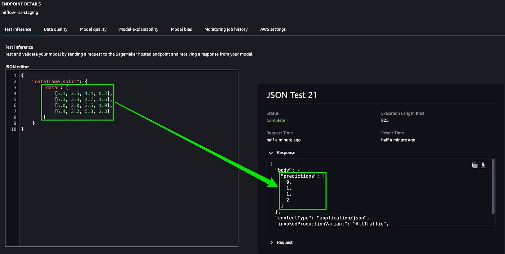

[阅读中文版本](README_zh.md)

# Project: Automated Model Building and CI/CD with MLflow and SageMaker Pipelines

---

## 1. Project Overview and Core Components

### 1.1 Project Goal

This project is a complete, production-grade MLOps (Machine Learning Operations) solution designed to demonstrate how to build an automated, reproducible, and traceable machine learning model building and training CI/CD pipeline using AWS cloud services and the open-source tool MLflow. The core objective is not simply to train a model, but to **build a standardized "model factory"** capable of transforming machine learning from an experimental, manual process into an engineered, reliable, and automated production workflow.

### 1.2 Introduction to Core AWS Products

*   **Amazon SageMaker Pipelines**: The **core ML workflow orchestration engine** of this project. It allows developers to define the entire machine learning process (e.g., data preprocessing, model training, hyperparameter tuning, model evaluation, and registration) as a Directed Acyclic Graph (DAG) using Python code. SageMaker is responsible for reliably scheduling, executing, and tracking each step of this pipeline in the cloud, recording all artifacts and their lineage.

*   **AWS CodeBuild**: The **CI/CD automation engine** for this project. Configured via the `codebuild-buildspec.yml` file in the project root, CodeBuild automatically executes a series of commands in response to code changes, such as installing dependencies, running tests, and ultimately triggering the execution of the SageMaker Pipeline. It serves as the bridge инфекция between code and the ML workflow.

### 1.3 Introduction to MLflow

*   **MLflow**: A leading open-source MLOps platform. In this project, it acts as the **central hub for experiment tracking and model governance**. We have deployed a standalone MLflow Tracking Server to:
    *   **Experiment Tracking**: Record all metadata from each training run, including hyperparameters, performance metrics, and source code versions.
    *   **Model Artifact Storage**: Store the trained model files in a standardized format in an S3 bucket.
    *   **Model Registry**: Manage the lifecycle of trained models through versioning and stage management (e.g., Staging, Production), serving as the single source of truth for model deployment.

---

## 2. Core Architecture: The Synergy of MLflow, SageMaker, and CI/CD

These three components work in concert, each with a distinct role, to form a complete, automated feedback loop:

1.  **CI/CD as the Trigger and Conductor**: When a developer pushes code to the Git repository, the CI/CD process (executed by CodeBuild) is automatically triggered. It handles environment setup, code testing, and invokes the `run_pipeline.py` script, passing runtime configurations مثل as the MLflow server URI to SageMaker.

2.  **SageMaker as the ML Workflow Executor**: Upon receiving the instruction, SageMaker Pipelines begins executing the workflow defined in `pipeline.py`. It manages the underlying compute resources and ensures the proper dependency management and data transfer between steps.

3.  **MLflow as the Single Source of Truth**: Within the SageMaker training job (executed by `train.py`), the script actively connects to the central MLflow server. All critical information generated during the training process—from hyperparameters to the final model file—is systematically logged to MLflow. This makes all experimental results traceable and comparable, and models that meet performance criteria are automatically registered in the Model Registry, ready for downstream deployment processes.

This approach achieves a **strong link between code, models, and experimental results**, as well as **full automation from code change to model generation**.

---

## 3. System Architecture Flowchart

The following flowchart details the end-to-end automated process of this project, from code commit to model registration.

---

## 4. Production Deployment and Inference Validation (Based on the Reference Article)

According to the reference article "MLflow — a modern MLOps tool for data project collaboration," the next step after a model is successfully built and registered in the MLflow Model Registry via the CI/CD pipeline is to deploy it to a production environment and validate it.

### 4.1 Model Endpoint Inference Validation Method

The article demonstrates how a model marked for the "Production" stage in the MLflow Registry can be deployed with a single command as an **AWS SageMaker Endpoint**. Once deployed, this real-time HTTPS API endpoint can be invoked using a standard Python script with the `boto3` library to validate its inference capabilities.

The core logic of the validation script is as follows:

1.  **Create a SageMaker runtime client**: `boto3.client("sagemaker-runtime")`.
2.  **Prepare input data**: Prepare a payload in a format that the model expects, such as JSON or CSV.
3.  **Invoke the endpoint**: Use the `invoke_endpoint` method, specifying the deployed `EndpointName` and the input payload.
4.  **Parse the response**: Read and parse the model's prediction from the returned result.

### 4.2 Validation Results and Visualization

By sending sample data to the deployed endpoint, the article successfully obtains a prediction from the model. The prediction is then compared with the ground truth to visually validate the model's effectiveness.

*   **Returned Result**: The endpoint call successfully returns the predicted class for the given input.
*   **Result Validation Charts**: The following charts show the visual validation of the prediction against the true label.

---

## 5. How to Run This Project

This project is designed to be run in a CI/CD environment integrated with SageMaker and AWS CodePipeline.

The standard procedure to trigger this project is as follows:

1.  Ensure that you have configured an AWS CodeCommit/GitHub repository, a CodePipeline, and the necessary IAM roles as required by the SageMaker Project template.
2.  **Commit** and **push** your code changes to the designated branch of the configured Git repository.
3.  The push action will automatically trigger the AWS CodePipeline, which will then launch the entire automated model build process as defined in the `codebuild-buildspec.yml` file.

You can monitor the execution status of the entire process in real-time from the AWS CodePipeline and SageMaker Pipelines consoles.
