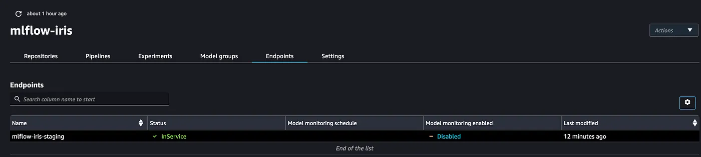
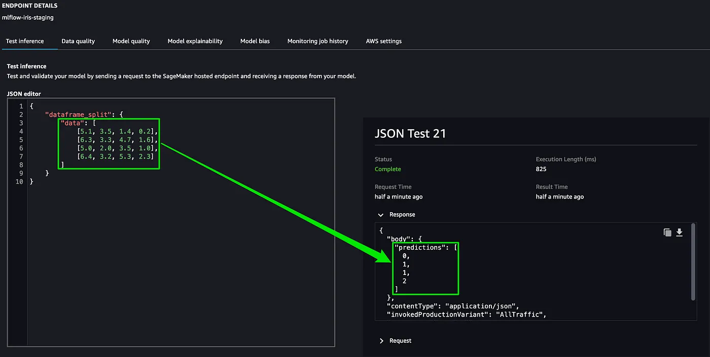

[Read this document in English](README.md)

# 项目名称：基于MLflow与SageMaker Pipelines的自动化模型构建与CI/CD

---

## 1. 项目概述与核心组件介绍

### 1.1 项目目标

本项目是一个完整的、生产级的MLOps（机器学习操作）解决方案，旨在演示如何利用AWS云服务与开源工具MLflow，构建一个自动化、可复现、可追溯的机器学习模型构建与训练CI/CD管道。项目的核心目标并非简单地训练一个模型，而是**构建一个标准化的“模型工厂”**，能够将机器学习从实验性的“手工作坊”模式，转变为工程化的、可靠的自动化生产流程。

### 1.2 AWS核心产品介绍

*   **Amazon SageMaker Pipelines**: 本项目的**核心ML工作流编排引擎**。它允许开发者使用Python代码，将整个机器学习流程（如数据预处理、模型训练、超参数调优、模型评估与注册）定义为一个有向无环图（DAG）。SageMaker负责在云端可靠地调度、执行和追踪这个管道的每一步，并记录所有产物和血缘关系。

*   **AWS CodeBuild**: 本项目的**CI/CD自动化引擎**。通过项目根目录下的`codebuild-buildspec.yml`文件进行配置，CodeBuild负责在代码变更时自动执行一系列指令，如安装依赖、运行测试，并最终触发SageMaker Pipeline的执行，是连接代码与ML工作流的桥梁。

### 1.3 MLflow介绍

*   **MLflow**: 一个业界领先的开源MLOps平台。在本项目中，它扮演着**实验跟踪与模型治理的中央枢纽**角色。我们独立部署了一个MLflow Tracking Server，用于：
    *   **实验跟踪 (Tracking)**: 记录每一次训练运行的超参数、性能指标、源代码版本等所有元数据。
    *   **模型产物存储 (Artifacts)**: 将训练好的模型文件以标准化的格式存储在S3中。
    *   **模型注册中心 (Model Registry)**: 对训练好的模型进行版本化管理，并提供阶段（Staging, Production）管理功能，是模型部署的唯一可信来源。

---

## 2. 架构核心：MLflow、SageMaker与CI/CD的协同工作机制

这三者在本项目的架构中各司其职，紧密协作，形成了一个完整的自动化闭环：

1.  **CI/CD作为触发器与指挥官**: 当开发者向Git仓库推送代码时，CI/CD流程（由CodeBuild执行）被自动触发。它负责环境准备、代码测试，并调用`run_pipeline.py`脚本，向SageMaker发出指令，同时传入MLflow服务器地址等运行时配置。

2.  **SageMaker作为ML工作流的执行者**: SageMaker Pipelines接收到指令后，开始按照`pipeline.py`中定义的流程图，一步步地执行数据处理、模型训练和超参数调优等任务。它负责管理底层的计算资源，并确保步骤间的依赖关系和数据传递。

3.  **MLflow作为“单一事实来源” (Single Source of Truth)**: 在SageMaker的训练任务（`train.py`）内部，脚本会主动连接到中央MLflow服务器。训练过程中产生的所有关键信息——从超参数到最终的模型文件——都会被系统性地记录到MLflow中。这使得所有的实验结果都变得可追溯、可比较，并且性能达标的模型会被自动注册到模型注册中心，等待下游的部署流程使用。

通过这种方式，我们实现了**代码、模型与实验结果的强关联**，以及**从代码变更到模型生成的全自动化**。

---

## 3. 系统架构流程图

以下流程图详细描述了本项目从代码提交到模型注册的端到端自动化流程。

---

## 4. 生产部署与推理验证

当模型通过CI/CD管道成功构建并注册到MLflow Model Registry后，下一步就是将其部署到生产环境并进行验证。

### 4.1 模型端点推理验证方法

本节展示了如何将MLflow注册中心里标记为“Production”阶段的模型，一键式部署为**AWS SageMaker Endpoint**。部署成功后，可以通过一个标准的Python脚本，使用`boto3`库来调用这个实时的HTTPS API端点，以验证其推理能力。

验证脚本的核心逻辑如下：

1.  **创建SageMaker运行时客户端**: `boto3.client("sagemaker-runtime")`。
2.  **准备输入数据**: 准备一个符合模型输入要求的JSON或CSV格式的负载（Payload）。
3.  **调用端点**: 使用`invoke_endpoint`方法，指定部署好的`EndpointName`和输入负载。
4.  **解析响应**: 从返回结果中读取并解析模型的预测值。

### 4.2 验证结果与可视化

通过向部署好的端点发送一个样本数据，成功地获取了模型的预测结果。随后，将预测结果与真实值进行了对比，以可视化的方式验证了模型的有效性。

*   **返回结果**: 调用端点后，成功返回了模型的预测类别。
*   **结果验证图**: 下图展示了将预测结果与真实标签进行对比的可视化验证。

---

## 5. 如何运行本项目

本项目是为在集成了SageMaker和AWS CodePipeline的CI/CD环境中运行而设计的。

要触发本项目，标准的流程是：

1.  确保已按照SageMaker Project模板的要求配置好AWS CodeCommit/GitHub代码仓库、CodePipeline以及相关的IAM角色。
2.  将您的代码变更**提交 (commit)** 并 **推送 (push)** 到配置好的Git仓库的指定分支。
3.  推送操作会自动触发AWS CodePipeline，后者将依照`codebuild-buildspec.yml`的定义，启动整个自动化模型构建流程。

您可以在AWS CodePipeline和SageMaker Pipelines的控制台界面，实时监控整个流程的执行状态。