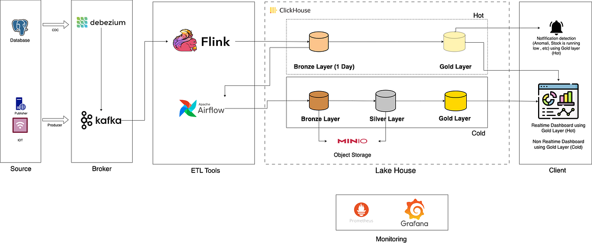

# 实时与离线一体化数据管道项目

本项目旨在演示一个完整的、端到端的数据管道解决方案，它集成了实时（热链路）和离线批处理（冷链路）两种处理模式。整个项目完全基于一个现代、可扩展的开源技术栈构建，并使用 Docker 进行容器化，以便于部署和开发。

项目的核心业务场景围绕一个典型的电子商务平台，追踪数据从交易型 PostgreSQL 数据库到最终分析看板的全过程。

## 架构设计

核心设计思想是将数据分为两个层次：用于即时、实时洞察的 **“热数据层”**，以及用于低成本存储和复杂历史分析的 **“冷数据层”**。这种混合方法确保了系统的高性能和成本效益。



## 项目特性

- **实时数据捕获 (CDC)**: 以无侵入的方式实时捕获源数据库中的每一个数据变更，且不影响其性能。
- **混合热/冷存储**: 利用 ClickHouse 的能力，同时使用高速本地磁盘存储热数据，以及廉价的对象存储（MinIO/S3）存储冷数据。
- **流批一体**: 单一架构即可处理流式和批处理两种ETL工作负载。
- **可扩展设计**: 管道中的每个组件（Kafka, Flink, ClickHouse, Airflow Workers）都可以独立地水平扩展。
- **数据驱动的ETL**: Airflow 中的批处理逻辑是根据 SQL 文件动态生成的，这使得数据分析师和工程师能够非常轻松地添加或修改业务逻辑。
- **完全容器化**: 整个环境由 Docker 和 Docker Compose 管理，确保了环境的一致性并简化了安装部署。

## 技术栈

- **数据库**: **PostgreSQL**
- **CDC**: **Debezium**
- **消息代理**: **Apache Kafka** 与 **Schema Registry** (使用 Avro 格式)
- **流处理**: **Apache Flink** (使用 Scala 语言)
- **OLAP & 湖仓一体**: **ClickHouse**
- **工作流调度**: **Apache Airflow** (使用 Celery 执行器)
- **对象存储**: **MinIO**
- **容器化**: **Docker** & **Docker Compose**

## 项目结构

项目被组织成四个主要目录，每个目录代表管道中的一个核心组件：

```
.
├── airflow-docker/     # Airflow 服务、DAGs、插件以及用于批处理ETL的SQL脚本
├── clickhouse-docker/  # ClickHouse 服务器及冷热存储配置
├── flink-docker/       # Flink 集群、Scala 源代码和作业管理脚本
└── kafka-docker/       # Kafka, Zookeeper, Schema Registry 和 Debezium 连接器配置
```

## 数据流转

### 热链路 (实时处理)

1.  **捕获**: Debezium 监控 PostgreSQL 的预写日志（WAL），捕获行级别的数据变更（INSERT, UPDATE, DELETE）。
2.  **注入**: 变更事件被发布为 Avro 格式的消息到 Kafka 的 Topic 中。
3.  **处理**: Flink 作业从 Kafka 消费消息，执行实时去重以保留每条记录的最新状态，并将结果写入 ClickHouse 的“热”表（存储在本地磁盘上）。
4.  **服务**: 实时看板查询这些热表，以提供秒级到分钟级的实时洞察。

### 冷链路 (批处理)

1.  **调度**: Airflow 中每日调度的 DAG 触发批处理 ETL 流程。
2.  **归档**: 第一个任务将 ClickHouse 热表中的昨日数据迁移到由 MinIO 对象存储支持的“冷”表中。
3.  **转换**: 接着，DAG 根据 SQL 脚本动态生成并运行一系列任务，在 ClickHouse 内部将数据从 Bronze 层 -> Silver 层 -> Gold 层进行转换，创建出结构清晰、可供分析的事实表和维度表。
4.  **分析**: BI 工具和数据分析师查询 Gold 层的表，进行历史报告和深度分析。

## 如何开始

请遵循以下步骤在您的本地机器上运行整个管道。

### 环境要求

- **Docker** & **Docker Compose**
- **Maven** (用于构建 Flink 作业)
- **PostgreSQL 客户端** (例如 `psql` 或 DBeaver) 用于初始化数据库。

### 1. 环境配置

本项目使用 `.env` 文件来管理每个组件的配置。您需要在以下四个主要目录中创建或更新 `.env` 文件：

- `kafka-docker/.env`
- `clickhouse-docker/.env`
- `flink-docker/.env`
- `airflow-docker/.env`

请用您的特定配置（如凭证、主机名）填充它们。您还需要替换一些配置文件中的占位符值，例如：
- `kafka-docker/connectors/postgres-connector.json` (数据库凭证)
- `clickhouse-docker/config/storage.xml` (MinIO 凭证)

### 2. 数据库设置

1.  确保您有一个正在运行且可以从 Docker 访问的 PostgreSQL 服务器。
2.  创建一个数据库 (例如 `ecommerce`)。
3.  执行以下 SQL 脚本来为 Debezium 设置必要的表和权限：
    - `ecommerce Table.sql`
    - `Prepare Query for Debezium Access Postgresql.sql` (请记得在此文件中设置您的密码)
4.  (可选) 使用以下文件填充示例数据：
    - `Populate Postgresql Eccomerce Data.sql`

### 3. 启动所有服务

您可以在分离模式下启动所有服务。建议按顺序启动它们。

```bash
# 1. 启动 Kafka, Zookeeper, 和 Kafka Connect
cd kafka-docker
docker-compose up -d --build

# 2. 启动 ClickHouse
cd ../clickhouse-docker
docker-compose up -d --build

# 3. 启动 Flink 集群
cd ../flink-docker
docker-compose up -d --build

# 4. 初始化并启动 Airflow
cd ../airflow-docker
# 此初始化命令将设置 Airflow 数据库、用户等
docker-compose run airflow-init
# 启动所有 Airflow 服务
docker-compose up -d --build
```

### 4. 部署连接器和作业

1.  **提交 Debezium 连接器**:
    ```bash
    curl -X POST -H "Content-Type: application/json" \
         --data @kafka-docker/connectors/postgres-connector.json \
         http://localhost:8083/connectors
    ```
    现在您可以访问 Kafka UI (`http://localhost:8081`) 来查看 Topic 是否已创建。

2.  **构建并运行 Flink 作业**:
    ```bash
    cd flink-docker
    chmod +x ./initial_run.sh
    ./initial_run.sh
    ```
    此脚本将构建 Scala 项目并将作业提交到 Flink 集群。请在 Flink UI (`http://localhost:8087`) 中检查作业状态。

### 5. 激活 Airflow DAG

1.  访问 Airflow UI `http://localhost:8080` (默认登录: `airflow`/`airflow`)。
2.  找到名为 `ecommerce_pipeline` 的 DAG，并取消暂停它，以启用每日的批处理运行。

至此，您完整的实时与批处理数据管道已经成功运行！
