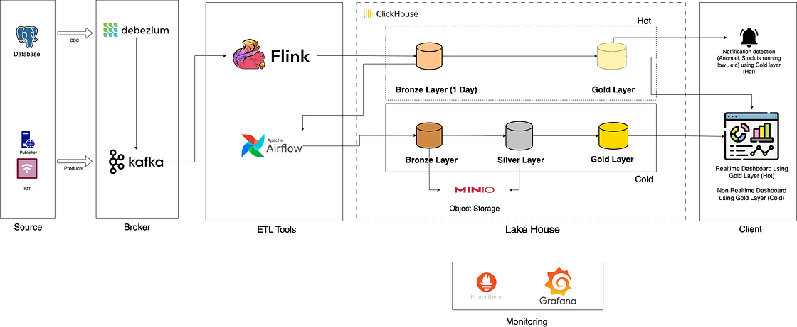
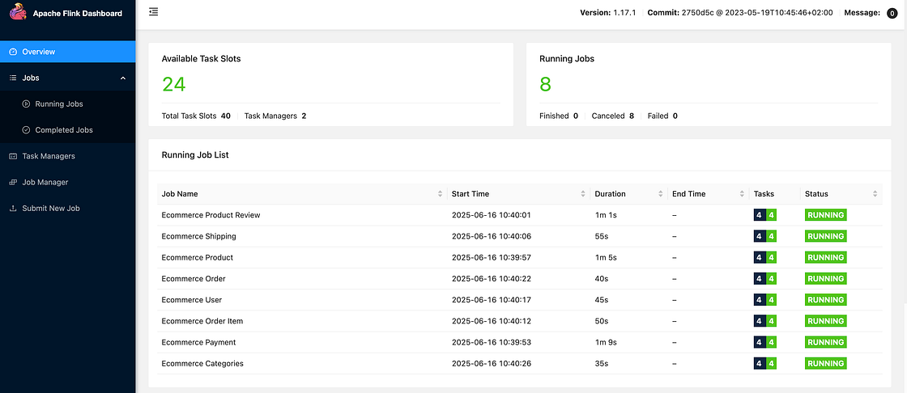

# 实时与离线一体化数据管道架构详解与生产实践

## 1. 摘要

随着AI时代的到来，数据需求正以前所未有的速度增长。企业在拥抱AI之前，构建一个稳定、高效、可扩展的数据管道是其成功的基石。本文将详细阐述如何利用一系列经过生产环境验证的开源技术（Kafka, Debezium, Flink, Airflow, ClickHouse, MinIO），构建一个集实时（Hot）与离线（Cold）数据处理于一体的现代化、高性价比的数据管道架构。我将以电商业务场景为例，从**架构设计**、**技术选型**、**数据流转**、到最终的**生产环境部署考量**进行全面解析。

---

## 2. 整体架构

本架构的核心设计思想是将数据管道分为“热”和“冷”两个层次，以满足不同业务场景对数据时效性的要求。

- **热数据层 (Hot Layer)**: 专注于处理实时数据，提供秒级到分钟级的数据可见性，满足实时监控、实时看板等高时效性需求。
- **冷数据层 (Cold Layer)**: 专注于处理历史数据，进行批量计算和复杂分析，为商业智能（BI）、数据分析和机器学习模型训练提供全面的数据支持。

最初的设计曾考虑使用 Iceberg + Trino + Nessie 的组合，但为了简化系统架构、降低运维复杂度，最终选择以 ClickHouse 为核心，统一处理热、冷数据。ClickHouse 强大的性能及其对远程对象存储（如 MinIO/S3）的良好支持，使其成为构建一体化湖仓（Lakehouse）的理想选择。

---

## 3. 核心技术栈详解

### 3.1 数据源: PostgreSQL

- **角色**: 业务核心数据库，存储电商场景下的原始交易数据，如用户、商品、订单等。
- **选型理由**: 作为一款成熟的开源关系型数据库，PostgreSQL 具备强大的事务处理能力、稳定性和丰富的功能，特别是其**逻辑复制（Logical Replication）功能**，是实现CDC（Change Data Capture）的基础。

### 3.2 数据采集: Debezium + Kafka Connect

- **角色**: 负责以**非侵入式的方式**捕获（CDC）PostgreSQL 中的数据变更（INSERT, UPDATE, DELETE），并将这些变更事件实时推送至 Kafka。
- **工作原理**: Debezium 作为一个 Kafka Connect 的 Connector，通过读取 PostgreSQL 的预写日志（WAL），将数据库的行级别变更转化为结构化的事件流，实现了对源数据库的低延迟、低影响的数据捕获。

### 3.3 消息队列: Apache Kafka

- **角色**: 整个数据管道的中央数据总线（Central Data Broker），负责接收、缓冲和分发来自不同数据源（如 Debezium, 应用服务器, IoT设备）的实时数据流。
- **选型理由**: Kafka 提供了高吞吐、持久化、可扩展的分布式消息传递系统，能够有效地解耦数据生产者和消费者，为实时数据处理提供了一个可靠的缓冲层。

### 3.4 流处理引擎: Apache Flink

- **角色**: 实时数据处理的核心，负责从 Kafka 消费数据，进行实时的转换、聚合、关联等计算，并将处理结果写入 ClickHouse 的热数据层。
- **选型理由**: Flink 是一个为分布式、高性能、高可用的流处理应用而设计的开源流处理框架。其强大的**状态管理**和**精确一次（Exactly-once）处理语义**，确保了实时计算的准确性和一致性。在本方案中，我使用 Scala 语言开发 Flink 作业，以更好地与 ClickHouse 进行集成。

### 3.5 OLAP及数据湖仓: ClickHouse

- **角色**: 统一的数据分析引擎和存储核心，同时承担了数据仓库和数据湖的角色（Lakehouse）。
- **选型理由**:
    - **极致性能**: ClickHouse 是一个面向列的数据库管理系统（DBMS），专为**在线分析处理（OLAP）而设计**，查询速度极快。
    - **存算分离**: 支持将数据存储在远端的对象存储（如 MinIO/S3）上，实现了低成本、高可扩展的“无限”存储。
    - **架构简化**: 无需引入额外的元数据或时间旅行层，其**内置的分区和TTL（Time-To-Live）机制**足以满足大部分数据生命周期管理的需求。

### 3.6 工作流调度: Apache Airflow

- **角色**: 离线数据处理（冷数据层）的调度和编排引擎。
- **工作流程**:
    1.  每日定时将 ClickHouse 热层（Bronze-Hot）的数据迁移至冷层（Bronze-Cold）。
    2.  对冷层数据进行清洗、标准化，加工成 Silver 层。
    3.  基于 Silver 层数据进行多维建模和聚合，生成最终的 Gold 层分析宽表。
- **选型理由**: Airflow 是一个成熟的、可编程的工作流管理平台，允许用户通过 **Python 代码（DAGs）定义、调度和监控复杂的数据工作流**。其动态生成任务的能力，使得数据处理流程更加灵活和易于维护。

---

## 4. 数据流转解析

### 4.1 实时链路 (Hot Path)

1.  **捕获**: Debezium 实时监控 PostgreSQL 的 `wal` 日志，捕获数据变更。
2.  **传输**: Debezium 将变更事件序列化为 JSON 或 Avro 格式，并发送到 Kafka 对应的 Topic 中。
3.  **处理**: Flink 作业消费 Kafka 中的数据，进行实时ETL，例如数据格式转换、字段清洗、简单聚合等。
4.  **入库**: Flink 将处理后的数据实时写入 ClickHouse 的热表（Bronze-Hot），这些表使用本地存储以保证极致的查询性能。
5.  **呈现**: 在 ClickHouse 中通过视图（View）构建热的黄金层（Gold-Hot），直接对接实时仪表盘（Realtime Dashboard），提供近乎实时的数据洞察。

### 4.2 离线链路 (Cold Path)

1.  **调度**: Airflow DAG 每日凌晨触发离线处理任务。
2.  **迁移**: 第一个任务将前一日的数据从 ClickHouse 的 Bronze-Hot 表移动到 Bronze-Cold 表。Bronze-Cold 表的数据存储在 MinIO 上，成本更低。同时，清理 Bronze-Hot 表中的过期分区，使其仅保留当天数据。
3.  **ETL**: 后续的 Airflow 任务使用 ClickHouse 的计算能力，对 Bronze-Cold 数据进行清洗、转换，生成 Silver 层和 Gold-Cold 层的数据。
4.  **呈现**: 历史仪表盘（Historical Dashboard）和BI分析工具连接到 ClickHouse 的 Gold-Cold 表，进行深度的数据分析和报告。

---

## 5. 生产环境部署考量

将此架构部署到生产环境时，必须综合考虑以下五个关键方面，以确保系统的稳定、可靠和高效。

### 5.1 高可用性 (High Availability)

- **Kafka**: 部署 Kafka 集群（至少3个Broker），并为关键 Topic 设置多个副本（Replication Factor >= 3），确保消息队列无单点故障。
- **Flink**: 启用 Flink 的高可用模式（High-Availability Mode），使用 ZooKeeper 来管理 JobManager 的元数据和领导者选举。同时，必须开启 Checkpoint 机制，并配置远程状态后端（如 HDFS 或 S3），以便在 JobManager 或 TaskManager 失败时能快速恢复任务。
- **ClickHouse**: 部署 ClickHouse 集群，并为关键数据表配置副本（Replication）。副本不仅提供了数据冗余，还能分担读请求，提高查询并发能力。
- **Airflow**: 采用高可用部署方案，将 Webserver, Scheduler, Worker 分离，并为 Scheduler 配置主备模式。元数据数据库（PostgreSQL）也需要配置主从复制或高可用集群。

### 5.2 扩展性 (Scalability)

- **Kafka**: 当吞吐量成为瓶颈时，可以通过增加 Topic 的分区数（Partitions）和集群的 Broker 数量来水平扩展。
- **Flink**: 通过调整 Flink 作业的并行度（Parallelism）来伸缩计算资源。在 Kubernetes (K8s) 环境下，可以配置自动扩缩容（Autoscaling）策略，根据CPU或内存使用率动态调整 TaskManager 的数量。
- **ClickHouse**:
    - **读写扩展**: 通过分片（Sharding）将数据分布到多个节点上，实现读写能力的水平扩展。每个分片可以包含多个副本，以同时保证高可用和高性能。
    - **存储扩展**: 利用其存算分离的特性，将历史数据存储在可无限扩展的对象存储（MinIO/S3）上，轻松应对数据量的爆炸式增长。

### 5.3 性能 (Performance)

- **数据源**: 优化 PostgreSQL 的 `postgresql.conf` 配置，如 `wal_keep_size`，确保 Debezium 有足够的时间来读取 WAL 日志，避免因日志被过早清理而导致的数据丢失。
- **数据模型**: 在 ClickHouse 中精心设计分区键（Partition Key）和排序键（Order By Key），这是决定查询性能的关键。对于常用的查询模式，可以创建物化视图（Materialized View）来预聚合数据，用空间换时间。
- **资源隔离**: 在生产环境中，建议使用容器化（Docker）和编排工具（Kubernetes）进行部署，通过资源配额（Resource Quotas）和限制（Limits）来隔离不同组件，避免因某个组件的资源滥用影响整个系统的稳定性。
- **热冷分层**: 将频繁访问的热数据存储在高性能的本地SSD上，而将不经常访问的冷数据存储在成本更低的对象存储上，是平衡性能和成本的最佳实践。

### 5.4 成本 (Cost)

- **存储**: 充分利用 ClickHouse 的 TTL 策略和冷热数据分层存储。例如，热数据层只保留最近7天的数据在本地SSD，超过7天的数据自动迁移到 MinIO。这能极大地降低存储成本。
- **计算**: 对于 Flink 和 Airflow on K8s 的部署，可以考虑使用云厂商的竞价实例（Spot Instances）来运行无状态或可中断的计算任务，能节省大量计算成本。
- **监控与优化**: 建立完善的监控体系（如 Prometheus + Grafana），持续监控各组件的资源使用情况和性能指标，及时发现并优化资源浪费的环节。

### 5.5 安全性 (Security)

- **网络隔离**: 使用虚拟私有云（VPC）和安全组（Security Groups）或 K8s 的网络策略（Network Policies）来严格限制各组件之间的网络访问，确保只有授权的服务可以互相通信。
- **访问控制**:
    - **Kafka**: 启用 SASL/SCRAM 进行认证，并配置 ACLs（Access Control Lists）来对 Topic 进行精细的读写权限控制。
    - **ClickHouse**: 为不同的用户和应用创建专用的数据库用户，并授予最小必要权限。
    - **Airflow**: 启用基于角色的访问控制（RBAC），并集成 LDAP 或 OAuth 等认证系统。
- **数据加密**:
    - **传输中加密 (In-Transit)**: 为 Kafka, ClickHouse, Flink 等组件之间的通信启用 TLS/SSL 加密。
    - **静态加密 (At-Rest)**: 对 MinIO/S3 存储桶启用服务器端加密（Server-Side Encryption），确保静态数据的安全。
- **凭证管理**: 避免在代码或配置文件中硬编码密码、API密钥等敏感信息。应使用专门的密钥管理服务（如 HashiCorp Vault, AWS Secrets Manager）或 K8s 的 Secrets 来统一管理。

---

## 6. 总结

本文提出的实时与离线一体化数据管道架构，通过巧妙地结合 Kafka, Flink, ClickHouse 等强大的开源工具，实现了对数据全生命周期的有效管理。该架构不仅通过热、冷分层设计兼顾了数据处理的实时性和经济性，而且其清晰的模块化设计也为未来的扩展和维护提供了便利。通过深入探讨生产环境中高可用、扩展性、性能、成本和安全性等关键问题，我们为构建一个真正企业级的、稳健可靠的数据平台提供了详尽的实践指南。

