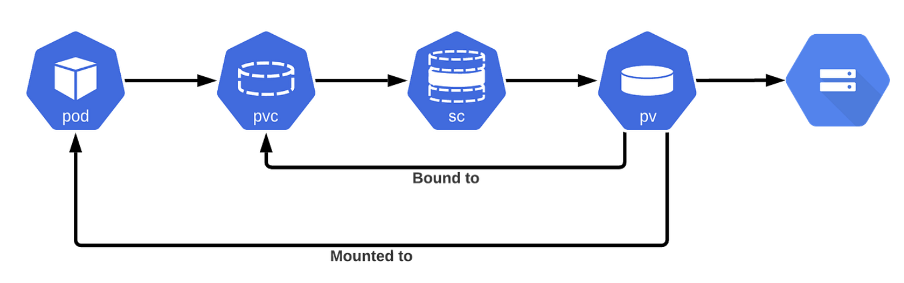

[中文](./README.md)

# Zero-Downtime Resizing of Kubernetes StatefulSet Persistent Volumes (PVCs)

This project demonstrates how to safely and smoothly resize PersistentVolumeClaims (PVCs) for a Kubernetes StatefulSet with zero downtime. This method leverages the `allowVolumeExpansion` feature in Kubernetes.

## Core Principle

Since v1.11, Kubernetes allows online resizing of PVCs, provided that the backing `StorageClass` supports this feature. For StatefulSets, where Pods and PVCs have a tightly coupled lifecycle, we need to adopt a specific strategy to ensure the resizing process does not cause service interruption.



The key points are:

1.  **`StorageClass` Configuration**: The `allowVolumeExpansion` field must be set to `true`.
2.  **StatefulSet Update Strategy**: Utilize the StatefulSet's RollingUpdate strategy, starting from the highest ordinal Pod and proceeding in reverse order to update and resize each one.
3.  **Decoupling PVCs and PVs**: In some cloud provider implementations, setting the PV's `reclaimPolicy` to `Retain` can enhance data safety, but it is not a mandatory requirement for zero-downtime resizing.

## Directory Structure

```
.statefulset-pvc-resize-zero-downtime/
├── k8s/
│   ├── storageclass.yaml   # StorageClass definition that supports resizing
│   └── statefulset.yaml      # Example StatefulSet application (Redis)
├── .gitignore              # Git ignore file
├── README.md               # README in Chinese
└── README.en.md            # README in English
```

## Steps

### Step 1: Deploy the Initial Application

First, ensure your Kubernetes cluster supports dynamic volume provisioning and that your cloud provider's CSI driver supports volume expansion (most major cloud providers do).

1.  **Deploy the `StorageClass`**:

    ```bash
    kubectl apply -f k8s/storageclass.yaml
    ```

    This `StorageClass` is named `resizable-standard` and explicitly enables `allowVolumeExpansion: true`.

2.  **Deploy the `StatefulSet`**:

    ```bash
    kubectl apply -f k8s/statefulset.yaml
    ```

    This command creates a Redis StatefulSet with 3 replicas, each with a 1Gi PVC.

### Step 2: Perform Zero-Downtime Resizing

Suppose we need to resize each PVC from 1Gi to 2Gi.

1.  **Modify the `StatefulSet` Definition**:

    In the `k8s/statefulset.yaml` file, change the `storage` request in the `volumeClaimTemplates` section from `1Gi` to `2Gi`.

    ```yaml
    # ... (partial content)
    volumeClaimTemplates:
    - metadata:
        name: data
      spec:
        accessModes: [ "ReadWriteOnce" ]
        storageClassName: "resizable-standard"
        resources:
          requests:
            storage: 2Gi # <--- Changed from 1Gi to 2Gi
    ```

2.  **Apply the Changes**:

    Apply the modified `statefulset.yaml` file. Kubernetes will not trigger a rolling update automatically because modifying only the `volumeClaimTemplates` is not considered a change to the Pod template.

    ```bash
    kubectl apply -f k8s/statefulset.yaml
    ```

3.  **Manually Trigger a Rolling Update**

    To ensure the changes take effect after the Pods are recreated, you need to manually trigger a rolling update. The safest way is to delete the Pods in reverse order, allowing the StatefulSet controller to recreate them.

    ```bash
    # Start deleting from the last Pod
    kubectl delete pod redis-statefulset-2
    # Wait for redis-statefulset-2 to be recreated and Ready
    kubectl delete pod redis-statefulset-1
    # Wait for redis-statefulset-1 to be recreated and Ready
    kubectl delete pod redis-statefulset-0
    ```

    During the recreation of each Pod, Kubernetes will apply the new PVC size, completing the resize.

### Step 3: Verify the Resizing

1.  **Check the PVC Status**:

    ```bash
    kubectl get pvc
    ```

    You will see that the `CAPACITY` column has been updated to `2Gi`.

2.  **Verify Inside the Pod**:

    You can `exec` into any of the Pods and use the `df -h` command to check the actual size of the mounted volume, confirming that the filesystem has also been successfully resized.

    ```bash
    kubectl exec -it redis-statefulset-0 -- df -h /data
    ```

## Conclusion

By setting `allowVolumeExpansion` to `true` and combining it with the StatefulSet's update strategy, we can achieve zero-downtime resizing of persistent volumes. This process is safe and reliable, avoiding the complex operations of data backup and migration required in traditional methods.