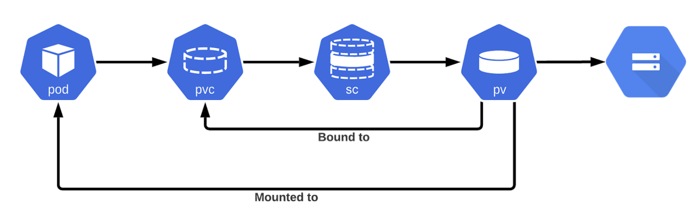

[English](./README.en.md)

# K8s StatefulSet 持久化存储卷（PVC）的零停机扩容实践

本项目旨在演示如何在零停机的情况下，安全、平滑地对 Kubernetes StatefulSet 的持久化存储卷（PersistentVolumeClaim, PVC）进行扩容。该方法利用了 Kubernetes 的 `allowVolumeExpansion` 特性。

## 核心原理

Kubernetes 从 v1.11 版本开始，允许对 PVC 进行在线扩容，前提是后端的 `StorageClass` 支持此项特性。对于 StatefulSet，由于其 Pod 和 PVC 的生命周期是绑定的，我们需要采用特定的策略来确保扩容过程不会导致服务中断。



关键点在于：

1.  **`StorageClass` 配置**：必须将 `allowVolumeExpansion` 设置为 `true`。
2.  **StatefulSet 更新策略**：利用 StatefulSet 的滚动更新（RollingUpdate）策略，从序号最大的 Pod 开始，逆序逐个更新和扩容。
3.  **PVC 与 PV 的解耦**：在某些云厂商的实现中，PV 的 `reclaimPolicy` 设置为 `Retain` 可以增加数据安全性，但这并非零停机扩容的强制要求。

## 目录结构

```
.statefulset-pvc-resize-zero-downtime/
├── k8s/
│   ├── storageclass.yaml   # 支持扩容的 StorageClass 定义
│   └── statefulset.yaml      # 示例 StatefulSet 应用 (Redis)
├── .gitignore              # Git 忽略文件
├── README.md               # 中文说明文档
└── README.en.md            # 英文说明文档
```

## 操作步骤

### 步骤一：部署初始应用

首先，确保你的 Kubernetes 集群支持动态卷分配，并且云服务商的 CSI 驱动支持卷扩容（绝大部分主流云厂商均支持）。

1.  **部署 `StorageClass`**：

    ```bash
    kubectl apply -f k8s/storageclass.yaml
    ```

    这个 `StorageClass` 名为 `resizable-standard`，并明确开启了 `allowVolumeExpansion: true`。

2.  **部署 `StatefulSet`**：

    ```bash
    kubectl apply -f k8s/statefulset.yaml
    ```

    此操作将创建一个包含 3 个副本的 Redis StatefulSet，每个副本都挂载一个 1Gi 大小的 PVC。

### 步骤二：执行零停机扩容

假设我们需要将每个 PVC 的容量从 1Gi 扩容到 2Gi。

1.  **修改 `StatefulSet` 定义**：

    将 `k8s/statefulset.yaml` 文件中的 `volumeClaimTemplates` 部分的 `storage` 请求从 `1Gi` 修改为 `2Gi`。

    ```yaml
    # ... (部分内容)
    volumeClaimTemplates:
    - metadata:
        name: data
      spec:
        accessModes: [ "ReadWriteOnce" ]
        storageClassName: "resizable-standard"
        resources:
          requests:
            storage: 2Gi # <--- 从 1Gi 修改为 2Gi
    ```

2.  **应用变更**：

    直接应用修改后的 `statefulset.yaml` 文件。Kubernetes 不会直接触发滚动更新，因为只修改 `volumeClaimTemplates` 不被视作对 Pod 模板的变更。

    ```bash
    kubectl apply -f k8s/statefulset.yaml
    ```

3.  **手动触发滚动更新**

    为了让变更在 Pod 重建后生效，需要手动触发滚动更新。最安全的方式是逆序删除 Pod，让 StatefulSet 控制器重建它们。

    ```bash
    # 从最后一个 Pod 开始删除
    kubectl delete pod redis-statefulset-2
    # 等待 redis-statefulset-2 重建并 Ready
    kubectl delete pod redis-statefulset-1
    # 等待 redis-statefulset-1 重建并 Ready
    kubectl delete pod redis-statefulset-0
    ```

    在每个 Pod 重建的过程中，Kubernetes 会将新的 PVC 尺寸应用到 Pod，从而完成扩容。

### 步骤三：验证扩容结果

1.  **检查 PVC 状态**：

    ```bash
    kubectl get pvc
    ```

    你会看到 `CAPACITY` 列已经更新为 `2Gi`。

2.  **进入 Pod 内部验证**：

    可以 `exec` 进入任意一个 Pod，使用 `df -h` 命令查看挂载卷的实际大小，确认文件系统也已成功扩容。

    ```bash
    kubectl exec -it redis-statefulset-0 -- df -h /data
    ```

## 总结

通过将 `allowVolumeExpansion` 设置为 `true` 并结合 StatefulSet 的更新策略，我们可以实现持久化卷的零停机扩容。这个过程是安全且可靠的，避免了传统方式中需要备份、迁移数据的复杂操作。