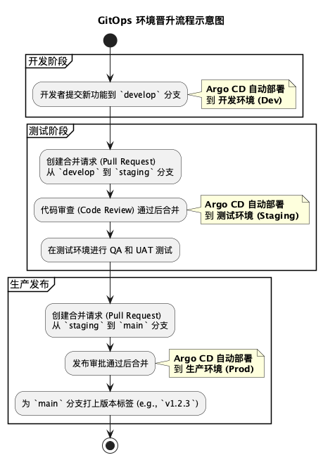

### **Argo CD 最佳实践：构建可扩展、自动化的 GitOps 工作流**

#### 1. 背景与目标

本文是我今年在推进团队转向 GitOps 实践过程中，整理的一份核心技术培训文档。随着工程师越来越多地采用 Argo CD 作为持续交付的核心工具，如何规范、高效地使用它，直接关系到研发效率、系统稳定性和未来的可扩展性。

当前，团队在使用 Argo CD 时可能存在一些困惑，例如：
*   项目和环境增多后，`Application` 清单如何管理？
*   如何实现开发（Dev）到生产（Prod）环境的**安全、可追溯**的变更晋升？
*   仓库结构应该如何设计，才能兼顾团队协作与系统性能？

本文旨在通过深入分析业界公认的最佳实践，为团队建立一套清晰、统一的 Argo CD 使用规范，确保我们的 GitOps 工作流是**自动化、可审计且易于管理**的。

#### **2. 核心术语解析**

在深入探讨之前，我们首先需要对 Argo CD 的几个核心概念达成共识：

*   **Application CRD**: 这是 Argo CD 的基本构建单元。一个 `Application` 自定义资源（CRD）代表了一个需要被部署到 Kubernetes 集群的应用。它定义了应用的来源（如 Git 仓库地址）、目标（目标集群和命名空间）以及追踪的版本（`targetRevision`）。

*   **ApplicationSet**: 这是实现自动化的关键。`ApplicationSet` 是一个更高级别的控制器，它的唯一职责是**自动生成**一系列的 `Application` CRD。它可以根据多种生成器（如 Git 目录、Git 分支、集群列表等）动态创建、更新和删除 `Application`，极大地减少了手动维护大量 `Application` 清单的负担。

* **App-of-Apps 模式**: 这是一种引导和管理模式。其核心思想是使用一个顶层的 Argo CD `Application` 来部署其他的 `Application` 或 `ApplicationSet`。通过这种模式，我们可以实现整个 Argo CD 应用体系的自动化引导和集中管理。 App-of-Apps 模式的核心思想非常简单：**用一个 Argo CD `Application` 来管理和部署所有其他的 Argo CD `Application` 和 `ApplicationSet`**。 这个顶层的 Application 通常被称为“根应用”（Root App）。它的唯一职责就是监控一个特定的 Git 仓库路径，并确保该路径下定义的所有 ApplicationSet 清单都被同步到集群中。一旦ApplicationSet 被创建，它们就会接管后续所有子应用的自动化生成。

  

  

*   **targetRevision**: 这是 `Application` CRD 中的一个关键字段，它告诉 Argo CD 应该追踪并同步 Git 仓库中的哪个具体版本。它可以是一个分支名、一个标签名，或是一个精确的 Git Commit SHA。

*   **HEAD**: 这是 `targetRevision` 的一个特殊值。当设置为 `HEAD` 时，它代表追踪指定分支（通常在 `path` 字段中定义）的**最新一次提交（latest commit）**。这是实现自动化持续部署的核心配置。

#### **3. 核心原则：结构与流程的分离**

要精通 Argo CD，关键在于理解并实践一个核心原则：**将“部署结构的管理”与“代码变更的流程”分离开来**。

*   **部署结构（战略层）**：我们应该如何组织 Git 仓库和 Argo CD 清单，以应对不断增长的应用和环境？—— **答案是使用 `ApplicationSet`**。
*   **变更流程（战术层）**：我们应该如何将一个新功能从开发环境安全地晋升到生产环境？—— **答案是使用标准的 Git 分支策略，并将 `targetRevision` 设为 `HEAD`**。

下文将围绕这两个层面展开详细论述。

#### **4. 战略篇：使用 ApplicationSet 构建清晰的仓库结构**

手动为每个应用、每个环境都创建一个 `Application` 清单文件是一种极易出错且难以扩展的反模式。我们应该拥抱 `ApplicationSet` 带来的自动化。

##### **4.1 必须避免的反模式**

*   **混用不同类型的清单**：严禁将应用的 Kubernetes 清单（Deployment, Service 等）与 Argo CD 的 `Application` 清单放在同一个目录或 Helm Chart 中。
*   **在错误的抽象层级工作**：频繁地通过修改 `Application` 的 `targetRevision` 字段来“晋升”版本，这破坏了 GitOps 的核心——Git 作为唯一的真理来源。
*   **多层模板嵌套**：避免在一个 Helm Chart 中再去调用另一个 Helm Chart 的模板逻辑，这会造成“模板地狱”，使调试变得异常困难。

##### **4.2 推荐的三层结构**

一个健壮的 Argo CD 仓库结构应遵循以下三层模型：

1.  **第一层：应用 Kubernetes 清单**
    这是应用自身的部署配置，通常是一个独立的 Helm Chart 或 Kustomize 目录。它应该做到自包含，可以独立部署。

2.  **第二层：ApplicationSet 清单**
    这是自动化引擎。我们创建一个 `ApplicationSet`，它会扫描第一层的应用清单仓库，并为每个环境或集群自动生成对应的 `Application` 资源。

    **【代码示例：使用 Git 目录生成器】**
    假设我们的应用清单仓库结构如下：
    ```
    ├── apps/
    │   ├── app-one/
    │   │   ├── dev/
    │   │   │   └── values.yaml
    │   │   └── prod/
    │   │       └── values.yaml
    │   └── app-two/
    │       ├── dev/
    │       │   └── values.yaml
    │       └── prod/
    │           └── values.yaml
    ```
    我们可以用以下 `ApplicationSet` 来为所有应用的 `dev` 环境自动创建 `Application`：
    ```yaml
    apiVersion: argoproj.io/v1alpha1
    kind: ApplicationSet
    metadata:
      name: my-apps-dev
    spec:
      generators:
      - git:
          repoURL: https://github.com/my-org/app-manifests.git
          revision: HEAD
          directories:
          - path: apps/*/dev
      template:
        metadata:
          name: '{{path.basename}}-{{path.basename[1]}}'
        spec:
          project: default
          source:
            repoURL: https://github.com/my-org/app-manifests.git
            targetRevision: HEAD # 关键点：追踪分支的最新状态
            path: '{{path}}'
            helm:
              valueFiles:
              - values.yaml
          destination:
            server: https://kubernetes.default.svc
            namespace: '{{path.basename}}'
    ```

##### **4.3 实践核心：App-of-Apps 模式**（可选）

App-of-Apps 模式是实现 Argo CD 完全自动化的“最后一公里”。其核心思想是**用一个 Argo CD `Application` 来管理和部署所有其他的 Argo CD `Application` 和 `ApplicationSet`**。

这个顶层的 `Application` 通常被称为“根应用”（Root App）。它的唯一职责就是监控一个特定的 Git 仓库路径，并确保该路径下定义的所有 `ApplicationSet` 清单都被同步到集群中。一旦 `ApplicationSet` 被创建，它们就会接管后续所有子应用的自动化生成。这实现了**“用 Argo CD 来管理 Argo CD 自己”**的闭环。

###### **场景实践：为应用仓库实现 App-of-Apps 自动化**

假设应用清单仓库 (`app-manifests-repo`) 结构如下：
```
app-manifests-repo/
├── apps/
│   ├── app-one/
│   │   ├── dev/
│   │   │   └── values.yaml
│   │   └── prod/
│   │       └── values.yaml
│   └── app-two/
│       ├── dev/
│       │   └── values.yaml
│       └── prod/
│           └── values.yaml
```

为了实现自动化，我们需要引入一个**第二个 Git 仓库**，专门用于管理 Argo CD 自身的配置。

1.  **创建 Argo CD 管理仓库 (`argocd-management-repo`)**
    创建一个新的 Git 仓库，并按以下结构组织文件：
    ```
    argocd-management-repo/
    ├── bootstrap/
    │   └── root-app.yaml              # 1. 根应用，整个自动化流程的入口
    │
    └── applicationsets/
        ├── dev-environment-set.yaml   # 2. 负责所有 dev 环境的应用集
        └── prod-environment-set.yaml  # 3. 负责所有 prod 环境的应用集
    ```

2.  **编写 `ApplicationSet` 清单**
    我们需要为每个环境（`dev` 和 `prod`）分别创建一个 `ApplicationSet`。

    *   **`dev-environment-set.yaml`**: 负责扫描所有 `apps/*/dev` 格式的目录。
        ```yaml
        # 文件路径: applicationsets/dev-environment-set.yaml
        apiVersion: argoproj.io/v1alpha1
        kind: ApplicationSet
        metadata:
          name: apps-dev
          namespace: argocd
        spec:
          generators:
          - git:
              repoURL: https://github.com/your-org/app-manifests-repo.git
              revision: HEAD
              directories:
              - path: apps/*/dev
          template:
            metadata:
              name: '{{path.elements[1]}}-{{path.elements[2]}}'
            spec:
              project: default
              source:
                repoURL: https://github.com/your-org/app-manifests-repo.git
                targetRevision: HEAD
                path: '{{path}}'
                helm:
                  valueFiles:
                  - values.yaml
              destination:
                server: https://kubernetes.default.svc
                namespace: '{{path.elements[1]}}'
        ```

    *   **`prod-environment-set.yaml`**: 负责扫描所有 `apps/*/prod` 格式的目录。
        ```yaml
        # 文件路径: applicationsets/prod-environment-set.yaml
        apiVersion: argoproj.io/v1alpha1
        kind: ApplicationSet
        metadata:
          name: apps-prod
          namespace: argocd
        spec:
          generators:
          - git:
              repoURL: https://github.com/your-org/app-manifests-repo.git
              revision: HEAD
              directories:
              - path: apps/*/prod
          template:
            # ... 与 dev-environment-set.yaml 的 template 部分相同 ...
        ```

3.  **编写 `root-app.yaml` (根应用)**
    这是整个自动化链条的起点，也是**唯一需要您手动部署一次**的文件。
    ```yaml
    # 文件路径: bootstrap/root-app.yaml
    apiVersion: argoproj.io/v1alpha1
    kind: Application
    metadata:
      name: root-app
      namespace: argocd
    spec:
      project: default
      source:
        repoURL: 'https://github.com/your-org/argocd-management-repo.git'
        path: 'applicationsets'
        targetRevision: HEAD
      destination:
        server: 'https://kubernetes.default.svc'
        namespace: argocd
      syncPolicy:
        automated:
          prune: true
          selfHeal: true
    ```

4.  **启动流程**
    将以上文件推送到 `argocd-management-repo` 后，在终端中手动应用 `root-app.yaml`：
    ```bash
    kubectl apply -f bootstrap/root-app.yaml -n argocd
    ```
    至此，整个系统便实现了自我管理。要增加新应用或新环境，只需在对应的 Git 仓库中添加目录或 `ApplicationSet` 文件即可。

#### **5. 战术篇：以 `HEAD` 为核心的自动化晋升流程**

`targetRevision` 字段是 Argo CD 中最容易被滥用的字段之一。错误的用法会彻底破坏 GitOps 的可审计性和简洁性。

##### **5.1 核心推荐：`targetRevision: HEAD`**

对于绝大多数应用（特别是开发、测试等非生产环境），我们**强烈推荐**将 `targetRevision` 设置为 `HEAD`。

**这样做的好处是：**
* **Git 即历史**：Git 仓库的提交历史（`git log`）就是应用的部署历史，清晰、可追溯。

* **简化流程**：开发者只需关心向正确的分支合并代码，部署会自动发生。

* **易于回滚**：回滚一个变更，只需在 Git 中执行 `git revert` 操作，Argo CD 会自动同步到上一个状态。

  

##### **5.2 必须避免的滥用方式**

*   **禁止使用环境名作为 `targetRevision`**：例如 `targetRevision: qa`。这种做法使得无法追踪一个环境到底部署了哪个具体的代码版本。
*   **禁止使用版本范围**：例如 `targetRevision: '>1.0.0'`。这使得部署变得不确定，且无法回滚。
*   **避免使用具体的 Git Commit SHA**：这种方式过于僵化，剥夺了开发者的自助服务能力，并使自动化流程变得复杂。

##### **5.3 正确的晋升流程：使用 Git 分支策略**

环境间的代码晋升，应该通过标准的 Git 工作流来完成，而不是通过修改 Argo CD 的配置。

**【流程示例：GitFlow】**
1.  **开发**：开发者向 `develop` 分支提交代码。Argo CD 追踪 `develop` 分支（`targetRevision: HEAD`），自动将变更部署到开发环境。
2.  **晋升到测试**：当功能稳定后，从 `develop` 分支创建一个到 `release/v1.1.0` 或 `staging` 分支的合并请求（Pull Request）。一旦合并，Argo CD 会自动将此变更部署到测试环境。
3.  **晋升到生产**：测试通过后，从 `staging` 分支创建一个到 `main` 分支的合并请求。合并后，变更即被部署到生产环境。

   

##### **5.4 `targetRevision` 的合理例外**

在以下两种特定场景下，固定 `targetRevision` 是合理的：

1.  **锁定生产环境**：对于稳定性要求极高的生产环境，可以将其 `targetRevision` 固定到一个不可变的 Git 标签（如 `v1.2.3`），以防止未经审核的变更进入生产。
2.  **固定基础设施组件**：对于像 Prometheus、cert-manager 这样的第三方基础设施组件，推荐将其 `targetRevision` 固定到一个明确的 Helm Chart 版本（如 `chart: prometheus`, `version: 15.4.0`），以确保基础设施的稳定性。

### **6. 总结与行动指南**

为了构建一个健壮、可扩展的 GitOps 工作流，我们必须将 Argo CD 的使用规范化。

**核心行动指南如下：**

1.  **拥抱 `ApplicationSet`**：所有新应用都应通过 `ApplicationSet` 进行管理，逐步淘汰手动维护的 `Application` 清单。
2.  **坚持 `targetRevision: HEAD`**：对于所有业务应用，默认使用 `targetRevision: HEAD`，让 Git 成为变更的唯一入口和真理来源（True of Source)。
3.  **流程在 Git，配置在 Argo CD**：应用的环境晋升通过标准的 Git 分支和合并请求流程完成，Argo CD 只负责忠实地同步 Git 的状态。
4.  **分离基础设施与应用**：将基础设施组件（如监控、中间件）与业务应用的清单分离开来，使用不同的仓库和 `ApplicationSet` 进行管理，并为其固定版本。
5.  **从现在开始实践**：在新的项目中立即采用这些最佳实践，并逐步改造现有项目，以统一团队的工作模式。

通过遵循以上原则，我们可以充分发挥 GitOps 的潜力，显著提升团队的交付效率和系统的可靠性。

---

### 7. 云架构师视角 — 将技术优势转化为客户价值

曾经我也多年作为云解决方案架构师帮助客户基于云产品进行技术和业务的创新和发展，因此也从云解决方案架构师的视角来说明技术方案的价值。**在向客户推荐或为团队设计技术方案时，我们不仅要阐述其技术层面的优越性，更需要清晰地将其与客户的 IT 价值和业务价值进行关联**。本章旨在从双重价值角度，解读采纳上述 Argo CD 最佳实践将为客户带来的实际收益。

#### **7.1 对 IT 部门的核心价值 (IT Value)**

采纳以 `ApplicationSet` 和 `App-of-Apps` 为核心的 GitOps 流程，将直接优化 IT 部门的**运维效率**、**稳定性**和**安全性**。

1.  **降低运维成本 (Reduced Operational Overhead)**
    *   **价值体现**：通过 `ApplicationSet` 实现新应用和新环境的“零接触”式自动化部署，将运维团队从大量重复、易错的手动配置工作中解放出来。IT 团队无需再为每个新项目手动创建和管理数十个 Argo CD `Application` 清单。
    *   **客户收益**：显著降低人力成本，减少因手动操作导致的服务中断风险，让运维团队能更专注于高价值的平台工程和稳定性保障工作。

2.  **提升系统可观测性与可审计性 (Enhanced Observability & Auditability)**
    *   **价值体现**：将 `targetRevision` 设为 `HEAD` 并依赖 Git 作为变更的唯一入口，意味着每一次对生产环境的变更都对应着一次有记录、有审批的 Git 合并操作。`git log` 成为了一个不可篡改的、天然的审计日志。
    *   **客户收益**：轻松满足合规性审计要求（如 SOX、ISO 27001）。当出现生产问题时，能够秒级定位到导致问题的具体代码提交，极大地缩短了故障恢复时间（MTTR）。

3.  **增强架构的可扩展性与一致性 (Improved Scalability & Consistency)**
    *   **价值体现**：App-of-Apps 模式提供了一个标准化的、可无限扩展的顶层设计。无论未来应用数量增长到几百甚至上千个，其管理模式和仓库结构都保持一致，避免了“野蛮生长”带来的技术债和管理混乱。
    *   **客户收益**：为业务的快速扩张提供了坚实的技术底座。IT 资产（应用、环境）的管理变得清晰、有序，新成员能够快速理解并融入现有体系，降低了团队扩张带来的管理复杂度。

#### **7.2 对业务部门的核心价值 (Business Value)**

IT 效率的提升最终会转化为业务的敏捷性和市场竞争力。

1.  **加速产品迭代与上市时间 (Faster Time-to-Market)**
    *   **价值体现**：自动化的 GitOps 流程打通了从代码提交到生产部署的“最后一公里”。开发者只需完成代码合并，后续的部署流程完全自动化，无需等待运维团队的排期和手动操作。
    *   **客户收益**：新功能、新产品的上线速度从数天、数周缩短到数小时甚至数分钟，使业务部门能够更快地响应市场变化、验证商业想法，从而在激烈的市场竞争中抢占先机。

2.  **提升业务连续性与可靠性 (Increased Business Continuity & Reliability)**
    *   **价值体现**：标准化的 Git `revert` 操作提供了“一键式”的安全回滚能力。当线上新版本出现问题时，业务方无需恐慌，IT 团队可以立即将生产环境恢复到上一个稳定状态，将业务影响降至最低。
    *   **客户收益**：保障了核心业务的 7x24 小时稳定运行，提升了最终用户体验和客户满意度。对于电商、金融等对稳定性要求极高的行业，这意味着直接减少了因服务中断造成的收入损失和品牌声誉损害。

3.  **赋能业务创新与探索 (Empowering Business Innovation)**
    *   **价值体现**：一个高效、低风险的自动化部署平台，极大地降低了业务部门进行 A/B 测试、灰度发布（金丝雀发布）等创新性探索的技术门槛和试错成本。
    *   **客户收益**：市场、产品和运营团队可以更频繁、更大胆地进行小范围的创新实验，通过数据驱动来验证新的业务策略，最终找到驱动业务增长的“第二曲线”。

**总结而言，向客户推荐这套 Argo CD 最佳实践，我们传递的核心信息是：** 这不仅仅是一次技术工具的升级，更是一场对研发模式的深刻变革。它将帮助客户构建一个**敏捷、可靠且合规**的现代化软件交付体系，使其 IT 能力真正成为驱动业务高速发展的核心引擎。


