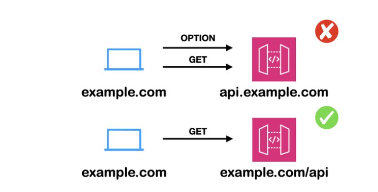

### **云原生架构中CORS跨域请求的成本优化策略**

#### 1. 背景与痛点



在现代Web应用架构中，前后端分离已成为主流模式。通常，前端应用（如React, Vue, Angular）被部署在主域名（例如 `www.example.com`）下，而后端API服务则部署在一个独立的子域名（例如 `api.example.com`）上。这种模式虽然在职责分离、独立扩展方面具有优势，但也引入了一个普遍存在的技术挑战：**浏览器同源策略（Same-Origin Policy）**。

为了安全地突破同源策略的限制，Web应用广泛采用 **CORS（Cross-Origin Resource Sharing）** 机制。然而，这在云原生环境中，尤其是在使用按请求计费的API网关服务（如 AWS API Gateway）时，会带来一个不容忽视的成本问题。

**核心痛点**：对于任何非简单跨域请求（如 `PUT`, `POST`, `DELETE` 或带有自定义头部的请求），浏览器会先发送一个HTTP `OPTIONS` 方法的**预检请求（Preflight Request）**，以确认目标服务器是否允许实际的跨域请求。这意味着，前端应用发起的一次业务调用，实际上会转化为对API网关的**两次**独立请求：一次`OPTIONS`预检请求和一次实际的业务请求（如`POST`）。由于API网关对每次请求都进行计费，这导致API的调用成本**凭空翻倍**，在高流量场景下，这部分额外开销将变得非常可观。如下所示


本篇文档旨在深入分析此问题，并提供系统性的解决方案，以在不牺牲架构灵活性的前提下，显著降低由CORS预检请求带来的额外云服务成本。

#### 2. CORS 技术原理回顾

CORS是一种W3C标准，它允许服务器声明哪些源站（domain, scheme, or port）有权限访问其资源。其核心机制依赖于一系列HTTP头部字段。

*   **简单请求 (Simple Requests)**：不会触发CORS预检。需同时满足以下条件：
    *   请求方法是 `GET`, `HEAD`, `POST` 之一。
    *   HTTP头部信息不超出 `Accept`, `Accept-Language`, `Content-Language`, `Content-Type` 等有限字段。
    *   `Content-Type` 的值仅限于 `application/x-www-form-urlencoded`, `multipart/form-data`, `text/plain`。

*   **预检请求 (Preflight Requests)**：不满足上述条件的即为“非简单请求”。浏览器必须首先使用 `OPTIONS` 方法发起一个预检请求到目标服务器，以获知服务器是否允许该实际请求。预检请求的头部会包含以下关键字段：
    *   `Access-Control-Request-Method`: 实际请求将使用的方法。
    *   `Access-Control-Request-Headers`: 实际请求将携带的自定义头部。

服务器收到预检请求后，若允许该跨域操作，则其响应需包含以下头部：
*   `Access-Control-Allow-Origin`: 允许访问的源。
*   `Access-Control-Allow-Methods`: 允许的请求方法。
*   `Access-Control-Allow-Headers`: 允许的请求头部。
*   `Access-Control-Max-Age`: 预检请求结果的缓存时间（秒）。在此时间内，浏览器无需为相同的请求再次发送预检。

正是这个 `OPTIONS` 预检请求，构成了我们成本优化的核心目标。

#### 3. 成本优化方案选型与对比

针对CORS预检请求带来的成本问题，主要存在两种主流的优化策略。

| 方案 | 原理 | 优点 | 缺点 | 适用场景 |
| :--- | :--- | :--- | :--- | :--- |
| **方案一：同源部署** | 通过反向代理（如Nginx, AWS ALB）将前后端部署在同一域名下，仅通过路径区分（如`/`和`/api`），从根本上避免跨域。 | 1. **零成本**：彻底消除CORS预检请求及相关费用。<br>2. 架构简化，无需处理CORS头部。 | 1. 路由耦合度高，前后端发布可能相互影响。<br>2. 不利于微服务架构下清晰的域名划分。 | 单体应用、中小型项目、前后端由同一团队维护的场景。 |
| **方案二：CDN边缘处理** | 将CDN（如Amazon CloudFront）置于API网关之前，利用其边缘节点直接响应或缓存`OPTIONS`预检请求。 | 1. **成本极低**：CDN处理请求的费用远低于API网关。<br>2. 保持了子域名架构的清晰与独立性。<br>3. 提升响应速度，因为预检请求在边缘节点即被处理。 | 1. 增加了CDN这一层配置和管理的复杂性。<br>2. 若CORS策略变更，需注意CDN缓存的更新。 | 微服务架构、大型企业应用、希望兼顾架构解耦与成本效益的场景。 |

#### 4. 核心方法落地实践：基于CDN的预检请求优化

本节以**方案二**为例，阐述如何通过 **Amazon CloudFront** 与 **CloudFront Functions**（或Lambda@Edge）实现对`OPTIONS`请求的高效、低成本处理。

**核心思路**：配置CloudFront，使其能够识别`OPTIONS`预检请求。然后使用轻量级的边缘计算服务（CloudFront Functions）来拦截这些请求，并直接在边缘节点生成合法的CORS响应，从而避免将请求透传到后端的API网关。

**实践伪代码 (CloudFront Function)**：

此函数应绑定到CloudFront分发的 **“查看器请求 (Viewer Request)”** 事件上。

```javascript
/**
 * CloudFront Function: handle_cors_preflight
 * 
 * 拦截OPTIONS预检请求，并在边缘直接返回CORS响应头，
 * 避免将请求传递给源站（API Gateway），从而降低成本。
 */
function handler(event) {
    var request = event.request;
    var headers = request.headers;

    // 仅处理OPTIONS方法的预检请求
    if (request.method === 'OPTIONS') {
        
        // 构造一个成功的响应（204 No Content是惯例）
        var response = {
            statusCode: 204,
            statusDescription: 'No Content',
            headers: {
                // 允许所有来源，生产环境建议替换为具体的域名
                'access-control-allow-origin': { value: '*' }, 
                
                // 允许的HTTP方法
                'access-control-allow-methods': { value: 'GET, POST, PUT, DELETE, OPTIONS' },
                
                // 允许的自定义请求头，根据API实际情况定义
                'access-control-allow-headers': { value: 'Content-Type, Authorization, X-Api-Key' },
                
                // 预检结果的浏览器缓存时间（单位：秒），例如24小时
                'access-control-max-age': { value: '86400' }
            }
        };
        
        // 直接返回该响应，请求处理流程结束
        return response;
    }

    // 对于非OPTIONS请求，不进行任何处理，继续传递给源站
    return request;
}
```

**配置要点**：

1.  **创建CloudFront Function**：在CloudFront控制台创建上述函数。
2.  **关联分发行为**：将此函数关联到指向API网关的那个CloudFront分发行为（Cache Behavior）的“查看器请求”事件上。
3.  **缓存配置**：在该分发行为中，确保 `OPTIONS` 方法被允许，但不一定需要缓存，因为CloudFront Function会在缓存层之前执行。

通过此实践，所有CORS预检请求都将在全球分布的CloudFront边缘节点上以极低的延迟和成本被处理，API网关将只接收和处理实际的业务请求，从而实现成本的大幅优化。
