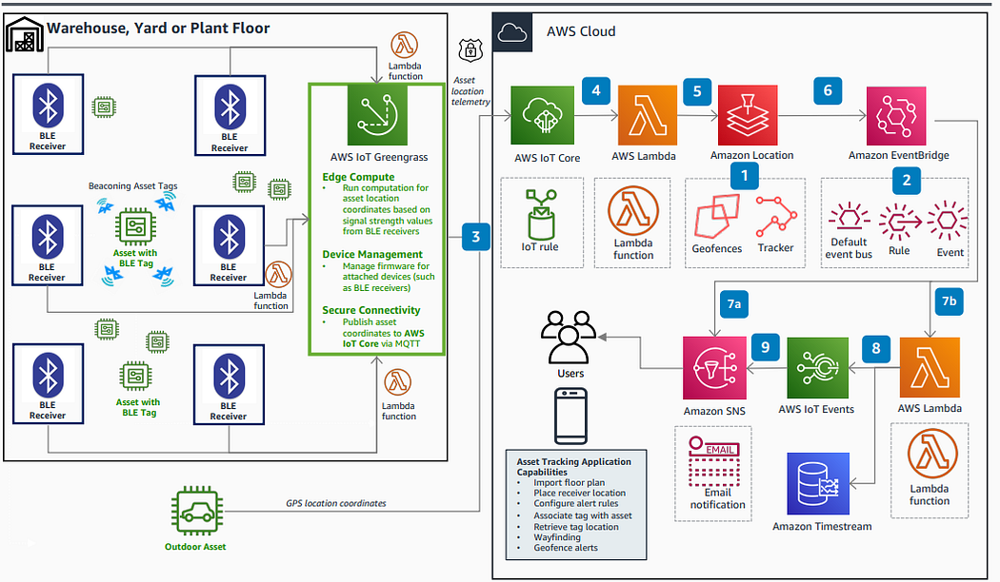

# 基于 AWS IoT 与 Amazon Location 的高价值资产实时追踪与地理围栏解决方案

## 摘要

本文档旨在详细阐述一个基于 AWS 云服务的实时资产追踪与地理围栏（Geofencing）解决方案。该架构专为监控仓库、工厂、物流园区等场景下的高价值设备而设计，通过整合 AWS IoT Core、Amazon Location Service、Amazon EventBridge 及无服务器计算（AWS Lambda），实现对资产位置的实时可见性、自动化事件响应和安全告警，从而解决传统手动追踪系统扩展性差、响应延迟和安全性不足等痛点。

---

## 1. 应用场景

该解决方案适用于多种需要对物理资产进行精细化管理的行业：

-   **智慧物流与仓储**：实时追踪叉车、货盘、高价值包裹的位置，优化路径规划，并在货物进入或离开指定区域（如装卸区、安检区）时自动触发库存更新或安全警报。
-   **医疗设备管理**：监控医院内移动医疗设备（如呼吸机、输液泵）的位置，确保设备在需要时能被快速找到，并在设备离开特定楼层或区域时通知管理人员。
-   **制造业与工业**：追踪生产线上的关键工具、模具或半成品，确保生产流程顺畅，防止资产丢失。
-   **园区与校园安全**：监控车辆、安保人员或访客的动态，当其进入限制区域或离开安全区域时，触发安防系统的联动响应。

## 2. 架构概览



### 架构流程详解

1.  **位置数据采集（室内/室外）**：
    *   **室内 (BLE)**：资产上绑定的低功耗蓝牙（BLE）标签持续广播信号。部署在室内的多个 BLE 接收器捕捉信号并测量其强度（RSSI）。边缘计算设备（如 AWS IoT Greengrass）通过三角测量或指纹算法，计算出资产的近似 `(x, y)` 坐标。
    *   **室外 (GPS)**：当资产移动到室外，设备切换到 GPS 模块获取经纬度坐标。

2.  **数据发布至 AWS IoT Core**：
    *   边缘设备或资产上的追踪器使用轻量级的 MQTT 协议，将计算出的坐标数据（包含设备ID、时间戳、坐标等）安全地发布到 AWS IoT Core 的指定主题（Topic）上。

3.  **数据转发至 Amazon Location Service**：
    *   AWS IoT Core 中的一条**物联网规则 (IoT Rule)** 被触发。该规则调用一个 AWS Lambda 函数。
    *   此 Lambda 函数负责将从 MQTT 消息中解析出的设备位置数据，通过调用 `BatchUpdateDevicePosition` API，批量更新到 Amazon Location Service 的**追踪器 (Tracker)** 资源中。

4.  **地理围栏事件生成**：
    *   Amazon Location Service 中的**追踪器**与一个**地理围栏集合 (Geofence Collection)** 相关联。该集合中预先定义了多个虚拟边界（例如，“仓库A区”、“出口大门”）。
    *   当追踪器接收到的设备新位置与某个地理围ano栏发生交叉（进入或退出）时，Amazon Location Service 会自动生成一个**地理围栏事件**。

5.  **事件路由至 Amazon EventBridge**：
    *   所有由 Amazon Location Service 生成的地理围栏事件，都会被自动发送到 Amazon EventBridge 的**默认事件总线**上。

6.  **基于规则的事件处理**：
    *   在 EventBridge 中，可以定义**规则 (Rule)**，通过设置**事件模式 (Event Pattern)** 来匹配特定的事件（例如，某设备 `EXIT` 了 “安全区域”）。
    *   匹配成功的事件可以被路由到一个或多个**目标 (Target)**。

7.  **执行自定义逻辑与发送通知**：
    *   **自定义处理 (AWS Lambda)**：EventBridge 规则可以调用一个 Lambda 函数，用于执行复杂的业务逻辑，如将事件记录到 Amazon Timestream 时间序列数据库、调用企业内部 API 或进行事件富化。
    *   **发送通知 (Amazon SNS)**：规则也可以将事件直接或通过 Lambda 发送到 Amazon Simple Notification Service (SNS) 的**主题 (Topic)**。订阅了该主题的终端（如邮件、短信、移动应用推送）即可收到实时通知。

## 3. 架构实施步骤

1.  **配置 Amazon Location Service**：
    *   创建一个**地理围栏集合**，并在其中使用绘图工具或 GeoJSON 定义您的虚拟边界（例如 `warehouse-zone`, `exit-gate`）。
    *   创建一个**追踪器**资源，并将其与上述地理围栏集合关联。

2.  **配置 AWS IoT Core**：
    *   为您的追踪设备创建一个**物联网事物 (Thing)**。
    *   创建并附加相应的**策略 (Policy)** 和 **X.509 证书**，确保设备有权限发布数据到指定 MQTT 主题。
    *   创建一条**物联网规则**，其 SQL 语句为 `SELECT * FROM 'iot/asset/location/+'`，动作为调用一个 Lambda 函数。

3.  **开发数据转发 Lambda 函数**：
    *   创建一个 Lambda 函数，授予其 `location:BatchUpdateDevicePosition` 的 IAM 权限。
    *   编写代码，使其能够解析来自 IoT 规则的事件负载，并调用 Amazon Location Service API 更新设备位置。

4.  **配置 Amazon EventBridge**：
    *   在 EventBridge 的默认事件总线上，创建一个新**规则**。
    *   为此规则配置一个**事件模式**，以精确匹配您关心的地理围栏事件。

5.  **配置通知目标**：
    *   创建一个 **SNS 主题**（例如 `asset-alerts-topic`）。
    *   为该主题添加一个或多个**订阅**，例如您的电子邮箱地址。
    *   将 EventBridge 规则的**目标**设置为此 SNS 主题，并可选择配置**输入转换器 (Input Transformer)** 来自定义通知消息的格式。

## 4. 核心伪代码与配置示例

### 1. IoT 设备上报数据 (MQTT Payload)

设备应发布结构化的 JSON 数据到 MQTT 主题 `iot/asset/location/device-001`。

```json
{
  "deviceId": "device-001",
  "timestamp": 1678886400000, // Unix 毫秒时间戳
  "coordinates": [-122.4194, 37.7749], // [经度, 纬度]
  "accuracy": 5.0 // 位置精度（米）
}
```

### 2. IoT Core 规则 (IoT Rule SQL)

```sql
-- 从所有设备的位置主题中选择所有数据
SELECT * FROM 'iot/asset/location/+'
```
**动作**: 调用名为 `Forward-To-Location-Service` 的 Lambda 函数。

### 3. Lambda 函数伪代码 (转发至 Amazon Location)

```python
# Forward-To-Location-Service Lambda 函数
import boto3
import json
from datetime import datetime

location_client = boto3.client('location')
TRACKER_NAME = 'MyAssetTracker'

def handler(event, context):
    # 从 IoT Rule 传入的 event 中解析设备数据
    device_id = event['deviceId']
    longitude, latitude = event['coordinates']
    timestamp_iso = datetime.utcfromtimestamp(event['timestamp'] / 1000).isoformat() + 'Z'

    try:
        # 调用 Amazon Location Service API 更新设备位置
        response = location_client.batch_update_device_position(
            TrackerName=TRACKER_NAME,
            Updates=[
                {
                    'DeviceId': device_id,
                    'Position': [longitude, latitude],
                    'SampleTime': timestamp_iso
                }
            ]
        )
        print(f"Successfully updated position for {device_id}")
        return {"status": "SUCCESS"}
    except Exception as e:
        print(f"Error updating position: {e}")
        raise e
```

### 4. EventBridge 事件模式 (Event Pattern)

此模式用于捕获 `device-001` 离开 `exit-gate` 围栏的事件。

```json
{
  "source": ["aws.location"],
  "detail-type": ["Location Geofence Event"],
  "detail": {
    "EventType": ["EXIT"],
    "GeofenceId": ["exit-gate"],
    "DeviceId": ["device-001"]
  }
}
```

### 5. EventBridge 输入转换器 (Input Transformer)

此配置可以将原始的、复杂的 JSON 事件转换为一条简洁、易读的通知消息。

**输入路径 (Input Path):**
```json
{
  "deviceId": "$.detail.DeviceId",
  "geofenceId": "$.detail.GeofenceId",
  "eventType": "$.detail.EventType",
  "time": "$.time"
}
```

**输入模板 (Input Template):**
```json
"警告：高价值资产 <deviceId> 在 <time> 时刻已【<eventType>】了 <geofenceId> 区域。请立即核实。"
```
**输出**: `警告：高价值资产 device-001 在 2023-03-15T12:00:00Z 时刻已【EXIT】了 exit-gate 区域。请立即核实。`

## 5. 生产环境落地考量与最佳实践

1.  **设备安全与管理**：
    *   **强认证**：为每台设备使用唯一的 X.509 客户端证书，并附加最小权限的 IoT 策略。
    *   **固件更新 (OTA)**：使用 AWS IoT Device Management 实现安全的空中固件更新，以修复漏洞或推送新功能。
    *   **设备状态管理**：使用 AWS IoT Device Shadow 来同步和报告设备的最新状态，即使设备暂时离线。

2.  **成本优化**：
    *   **数据采样率**：并非所有资产都需要秒级更新。根据资产的重要性和移动速度，动态调整数据上报频率。
    *   **API 调用**：`BatchUpdateDevicePosition` API 支持一次更新最多10台设备，应在边缘或 Lambda 中聚合数据，以降低 API 调用成本。
    *   **数据归档**：将 Amazon Timestream 或 DynamoDB 中的历史轨迹数据，通过生命周期策略定期归档到成本更低的 Amazon S3 Glacier 中。

3.  **数据准确性与处理**：
    *   **信号降噪**：GPS 或 BLE 信号会产生漂移。在边缘或云端 Lambda 中，可以引入简单的移动平均或更复杂的卡尔曼滤波器（Kalman Filter）算法，对坐标进行平滑处理。
    *   **处理离线数据**：设备可能因网络问题离线。在设备端缓存数据，并在重连后批量补报。在云端需注意处理这些乱序到达的数据。

4.  **可扩展性与韧性**：
    *   **服务配额**：了解并监控 AWS IoT Core、Lambda 和 Amazon Location Service 的服务配额（如 MQTT 连接数、API 调用速率等），必要时申请提升。
    *   **死信队列 (DLQ)**：为 IoT 规则的动作和 EventBridge 规则的目标配置死信队列。任何处理失败的消息都将被发送到 DLQ (一个 SQS 队列) 中，便于后续排查和重试，避免数据丢失。

## 6. 专业问答 (Q&A)

**Q1: 室内定位除了 BLE，还有哪些备选方案？**

> **A:** 除了 BLE，常见的室内定位技术还包括 Wi-Fi 指纹、超宽带（UWB）和 RFID。**UWB** 定位精度最高（可达厘米级），但成本也最高，适用于对精度要求极高的场景。**Wi-Fi 指纹**利用现有的 Wi-Fi AP 信号，成本较低，但精度一般。选择哪种技术取决于您对成本、精度和部署复杂度的综合考量。

**Q2: 如何处理设备离线和数据补报的场景？**

> **A:** 这是一个关键的生产问题。最佳实践是：1) **设备端缓存**：在设备检测到网络断开时，将位置数据缓存在本地存储中（如闪存）。2) **重连后补报**：一旦网络恢复，设备将缓存的数据按照时间顺序批量上报。3) **云端处理**：云端的 Lambda 函数需要能够处理带有历史时间戳的数据，并正确地更新到 Amazon Location Service。`BatchUpdateDevicePosition` API 支持为每个点位提供独立的 `SampleTime`，正是为此场景设计的。

**Q3: 这个架构的端到端延迟大概是多少？**

> **A:** 端到端延迟由多个环节构成：设备计算与上报 -> IoT Core -> Lambda 调用 -> Location Service 处理 -> EventBridge 路由 -> 目标执行。在正常情况下，从设备上报到 EventBridge 触发目标，延迟通常在 **1-3秒** 范围内。主要延迟可能来自设备本地计算、网络传输以及 Lambda 的冷启动。对于延迟敏感的应用，可以为 Lambda 配置预置并发（Provisioned Concurrency）。

**Q4: 为什么架构中需要一个 Lambda 函数作为 IoT Core 和 Amazon Location 之间的桥梁？**

> **A:** 截至目前，AWS IoT Core 的规则引擎没有提供将数据直接发送到 Amazon Location Service 的原生动作（Action）。因此，Lambda 函数扮演了一个必要的“胶水”角色，它接收来自 IoT 规则的数据，将其转换为 Amazon Location Service API 所需的格式，然后调用相应的 API。这种模式虽然增加了一个环节，但也提供了极大的灵活性，允许在数据转发前进行额外的处理、验证或富化。

**Q5: 如何高效地存储和分析海量的历史轨迹数据？**

> **A:** 对于历史轨迹数据，推荐两种模式：
> 1.  **热数据与时间序列分析**：使用 **Amazon Timestream**。它是一个专为时间序列数据设计的数据库，非常适合存储和查询带有时间戳的位置数据，例如“查询 device-001 在过去24小时内的轨迹”。
> 2.  **冷数据与批量分析**：将原始位置数据通过 Amazon Kinesis Data Firehose 批量写入 **Amazon S3**。然后可以使用 **Amazon Athena** 对 S3 上的数据进行标准 SQL 查询，或使用 Amazon QuickSight 进行可视化分析，成本极低。

## 7. 参考文档

-   [AWS IoT Core 官方文档](https://aws.amazon.com/iot-core/)
-   [Amazon Location Service 开发者指南](https://docs.aws.amazon.com/location/latest/developerguide/welcome.html)
-   [Amazon EventBridge 用户指南](https://docs.aws.amazon.com/eventbridge/latest/userguide/eb-what-is.html)
-   [AWS 官方参考架构：使用 Amazon Location 和 AWS IoT 的地理围栏](https://d1.awsstatic.com/architecture-diagrams/ArchitectureDiagrams/amazon-location-service-ra.pdf)
