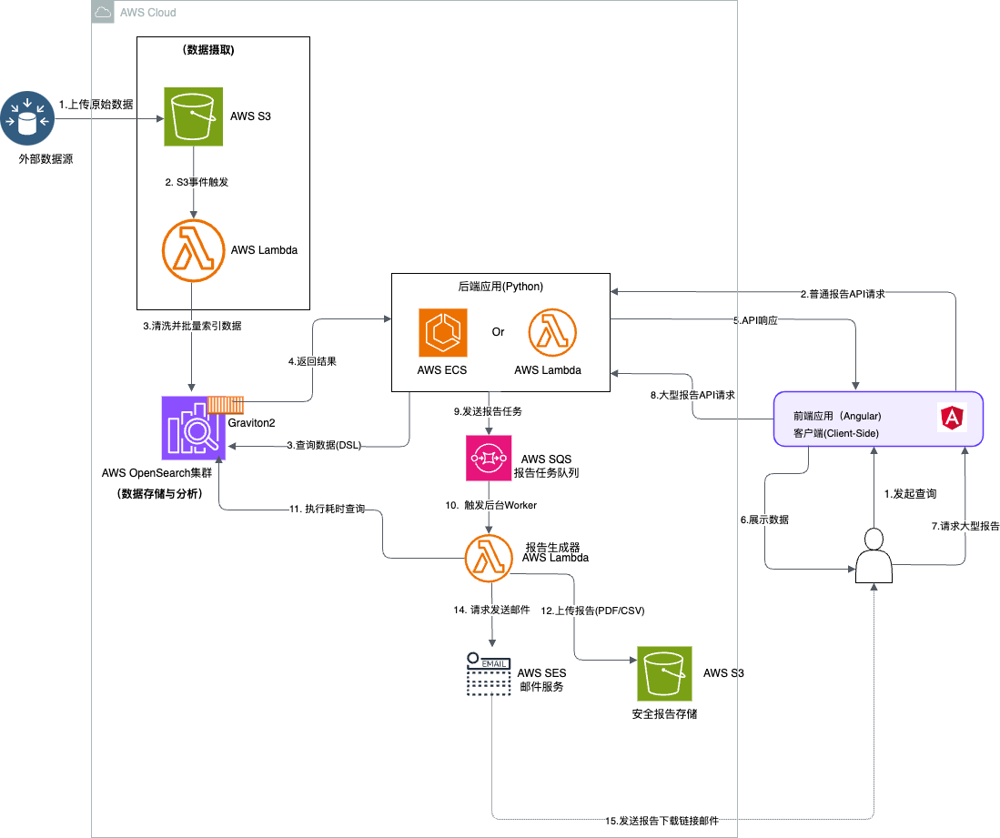

# 模拟架构实践营(二)-某全球商品进出口交易数据服务平台的全球贸易数据BI平台架构设计
---
## 前言与免责声明

本文档旨在为某全球商品进出口交易数据服务平台设计一套现代化的、基于云原生技术的商业智能（BI）与数据分析平台架构方案。**此架构的设计灵感来源于AWS官方发布的成功案例（This Is My Architecture: Noventiq：借助 Amazon OpenSearch 的事件驱动型架构进行搜索和分析），并在此基础上进行了深化探讨说明。**

**免责声明**: 本文档中描述的所有内容，包括以下提及的业务场景、痛点，以及后续的架构、组件和伪代码，均作为技术探讨和概念验证的参考。它旨在展示如何利用AWS云服务解决海量数据实时分析的业务问题，并不完全代表任何特定公司的业务场景、痛点和实际生产环境部署。

### 模拟业务背景与核心挑战

某全球商品进出口交易数据服务平台通过网页和移动端应用，向全球订阅用户提供实时的商品进出口交易数据。随着业务的快速发展，数据量已激增至50亿条记录，并仍在持续增长。原有的数据处理和分析系统面临以下严峻挑战：

*   **数据分析的实时性差**：传统的分析流程响应时间过长（最长可达48小时），无法满足用户对于实时决策支持的需求。
*   **海量数据处理性能瓶颈**：在50亿级别的数据规模下，数据查询、聚合和报表生成变得异常缓慢，严重影响用户体验。
*   **高昂的运营成本**：管理和维护大规模数据处理集群需要巨大的硬件和人力投入，成本控制压力巨大。
*   **异步任务交付不友好**：对于耗时较长的复杂报告任务，缺乏一个既能保证用户体验又能确保数据安全的异步交付机制。

为了应对这些挑战，我们需要设计一套全新的、基于云原生技术的现代化数据平台架构。

---

## 1. 现代化数据平台解决方案

我们设计的解决方案是一个事件驱动的、分层清晰的云原生架构。它将数据处理流程明确划分为 **数据摄取（Data Ingestion）** 和 **数据检索（Data Retrieval）** 两个核心部分，确保了架构的灵活性和可扩展性。

### 1.1 最终架构图



### 1.2 架构核心组件详解

#### 1.2.1 数据摄取层 (Data Ingestion Layer)

此层负责将原始数据高效、可靠地转化并加载到核心分析引擎中。

*   **Amazon S3 (源数据存储)**: 作为数据湖的基石，用于存储从各种来源获取的原始数据文件（如CSV、JSON等格式）。S3提供了高持久性和低成本的存储解决方案。
*   **AWS Lambda (数据处理与加载)**: 这是数据摄取流程的核心处理单元。通过配置S3事件通知，每当有新的原始数据文件上传到指定的S3桶时，会自动触发一个Lambda函数。该函数执行以下操作：
    1.  **读取数据**：从S3下载并解析数据文件。
    2.  **数据转换**：进行数据清洗、格式转换和结构化处理，使其符合OpenSearch的索引要求。
    3.  **批量加载**：将处理后的数据以批量（Bulk）方式高效地索引到Amazon OpenSearch集群中，最大化写入性能。

##### **伪代码: S3触发的Lambda数据处理函数**
```python
# 导入所需的AWS SDK库
import boto3
import csv
from opensearchpy import OpenSearch, RequestsHttpConnection, AWSV4SignerAuth

# 初始化客户端 (具体配置根据实际情况填写)
s3_client = boto3.client('s3')
# 示例：opensearch_client = OpenSearch(...)

# Lambda函数入口
def lambda_handler(event, context):
    # 1. 从S3事件中解析存储桶名称和文件Key
    bucket_name = event['Records'][0]['s3']['bucket']['name']
    file_key = event['Records'][0]['s3']['object']['key']

    # 2. 从S3下载CSV文件
    response = s3_client.get_object(Bucket=bucket_name, Key=file_key)
    lines = response['Body'].read().decode('utf-8').splitlines()
    reader = csv.reader(lines)

    # 3. 准备批量导入OpenSearch的数据
    bulk_data = []
    for row in reader:
        # 假设CSV列顺序: trade_id, product_name, origin, destination, value, date
        trade_document = {
            "trade_id": row[0],
            "product_name": row[1],
            "origin_country": row[2],
            "destination_country": row[3],
            "trade_value_usd": float(row[4]),
            "timestamp": row[5]
        }
        # 添加OpenSearch批量操作元数据
        bulk_data.append({"index": {"_index": "trade-data", "_id": trade_document["trade_id"]}})
        bulk_data.append(trade_document)

    # 4. 执行批量写入操作
    if bulk_data:
        # response = opensearch_client.bulk(body=bulk_data)
        # print(f"成功索引 {len(response['items'])} 条记录。")
        pass # 此处为示例，实际执行写入

    return {"status": "Success"}
```

#### 1.2.2 数据存储与分析层 (Data Storage & Analytics Layer)

这是平台的大脑，负责数据的存储、索引、搜索和分析。

*   **Amazon OpenSearch Service (核心引擎)**: 我们选择OpenSearch作为核心的数据存储和分析引擎，原因如下：
    *   **强大的搜索与分析能力**：提供全文搜索、结构化查询、数据聚合以及日志分析等多种功能。
    *   **水平扩展性**：能够轻松扩展以应对PB级别的数据量。
    *   **成本与性能优化 (关键点)**:
        *   **采用 AWS Graviton2 实例**: 我们为OpenSearch集群节点选择了基于ARM架构的Graviton2实例（例如 `M6g`, `R6g` 系列）。根据AWS的基准测试，与同等的x86实例相比，Graviton2实例可提供高达 **30% 的性价比提升** 和 **44% 的性能提升**。在处理50亿条记录的庞大数据集时，这意味着显著的成本节约和更快的查询响应。

##### **记录假设示范：一条贸易记录的JSON结构**
```json
{
  "trade_id": "TRADE-2025-0820-1058",
  "product_name": "智能手机型号X",
  "product_category": "电子产品",
  "hs_code": "85171200",
  "origin_country": "中国",
  "destination_country": "美国",
  "transport_mode": "空运",
  "quantity": 5000,
  "unit": "件",
  "trade_value_usd": 1500000.00,
  "importer_name": "示例进口商公司",
  "exporter_name": "示例出口商公司",
  "timestamp": "2025-08-20T10:58:00Z"
}
```

##### **伪代码: OpenSearch查询DSL示例**
```json
// 业务场景: 查找从中国出口到美国的所有关于“手机”的交易，并按交易额降序排序
{
  "size": 10, // 返回前10条结果
  "query": {
    "bool": {
      "must": [
        { "match": { "product_name": "手机" } },
        { "term": { "origin_country.keyword": "中国" } },
        { "term": { "destination_country.keyword": "美国" } }
      ],
      "filter": [
        { "range": { "timestamp": { "gte": "2025-01-01" } } }
      ]
    }
  },
  "sort": [
    { "trade_value_usd": { "order": "desc" } }
  ]
}
```

#### 1.2.3 数据检索与应用层 (Data Retrieval & Application Layer)

此层负责响应来自前端应用的查询请求，并提供安全、高效的数据访问。

*   **前端应用 (Web/Mobile)**: 用户通过基于Angular框架的Web应用或原生移动应用与平台交互，发起数据查询和报告请求。
*   **后端应用程序 (Python)**: 作为业务逻辑的核心，后端应用（可部署在Amazon ECS或AWS Lambda上）负责：
    1.  接收并验证来自前端的API请求。
    2.  将业务请求转换为标准的OpenSearch查询DSL (Domain Specific Language)。
    3.  向Amazon OpenSearch集群发送查询请求。
    4.  对返回的结果进行处理和格式化，然后响应给前端应用。
    这个清晰的 **前端 -> 后端 -> 数据层** 的调用链确保了业务逻辑的集中管理和数据访问的安全性。

##### **伪代码: 后端应用(Python-Flask)的API端点**
```python
from flask import Flask, request, jsonify

# 假设已配置好opensearch_client
# from my_app import opensearch_client

app = Flask(__name__)

@app.route('/api/trade-search', methods=['POST'])
def trade_search():
    # 1. 从前端请求中获取查询参数
    query_params = request.get_json()
    product_keyword = query_params.get('product', '')
    origin = query_params.get('origin', '')

    # 2. 构建OpenSearch查询DSL
    # (这是一个简化的例子，实际场景会更复杂)
    search_body = {
        "query": {
            "bool": {
                "must": [
                    { "match": { "product_name": product_keyword } },
                    { "term": { "origin_country.keyword": origin } }
                ]
            }
        }
    }

    # 3. 执行查询
    try:
        # search_response = opensearch_client.search(
        #     index="trade-data",
        #     body=search_body
        # )
        # 4. 格式化结果并返回给前端
        # results = [hit['_source'] for hit in search_response['hits']['hits']]
        # return jsonify({
        #     "success": True,
        #     "data": results,
        #     "total": search_response['hits']['total']['value']
        # })
        pass # 此处为示例，实际执行查询和返回
    except Exception as e:
        # 错误处理
        return jsonify({"success": False, "message": str(e)}), 500

if __name__ == '__main__':
    app.run(debug=True)
```

#### 1.2.4 异步报告与交付机制 (Asynchronous Reporting & Delivery)

为了解决耗时较长的报告生成任务（例如，包含上万条记录的复杂报告）对用户体验的影响，我们设计了一套优雅的异步处理机制。

*   **处理流程**:
    1.  当用户请求一个大型报告时，后端应用不再同步等待结果，而是立即返回一个“任务已提交”的响应。
    2.  后端应用将报告生成任务（包含查询参数和用户信息）放入一个消息队列（如 Amazon SQS）或直接触发一个独立的后台进程（如另一个Lambda函数或Fargate任务）。
    3.  后台进程执行耗时的OpenSearch查询，生成报告文件（如PDF或CSV）。
    4.  报告生成后，被上传到一个安全的Amazon S3桶中。
    5.  系统使用 **Amazon S3 Pre-signed URL** 功能为该报告文件生成一个有时效性（例如，15分钟内有效）的下载链接。
    6.  最后，通过 **Amazon SES (Simple Email Service)** 将这个安全的、临时的下载链接发送到用户的注册邮箱。

*   **核心优势**:
    *   **提升用户体验**: 前端无需长时间等待，应用保持响应。
    *   **增强安全性**: 预签名URL提供了对私有S3内容的临时、安全访问，避免了公开存储桶或复杂的身份验证传递。
    *   **解耦与健壮性**: 将耗时任务与主应用解耦，提高了系统的整体稳定性和可靠性。

##### **伪代码: 异步报告生成与交付**
```python
# 导入所需的AWS SDK库
import boto3
import json

# 初始化客户端
sqs_client = boto3.client('sqs')
s3_client = boto3.client('s3')
ses_client = boto3.client('ses')
# opensearch_client = ...

# --- 1. 在主应用中触发异步任务 ---
def request_large_report(user_email, query_params):
    """由API端点调用，发送任务消息到SQS"""
    task_payload = {
        "user_email": user_email,
        "query": query_params
    }
    # sqs_client.send_message(
    #     QueueUrl="https://sqs.us-east-1.amazonaws.com/ACCOUNT_ID/ReportQueue",
    #     MessageBody=json.dumps(task_payload)
    # )
    print("报告任务已成功提交。")
    return {"status": "accepted"}

# --- 2. 后台Worker (可以是另一个Lambda) 处理任务 ---
def report_worker_handler(event, context):
    """由SQS触发，执行报告生成任务"""
    for record in event['Records']:
        task = json.loads(record['body'])
        user_email = task['user_email']
        query = task['query']

        # a. 执行耗时的OpenSearch查询
        # report_data = generate_report_from_opensearch(query) # 这是一个耗时函数

        # b. 将报告内容上传到S3
        report_key = f"reports/{user_email}/{context.aws_request_id}.csv"
        # s3_client.put_object(
        #     Bucket="secure-reports-bucket",
        #     Key=report_key,
        #     Body=report_data.to_csv() # 假设报告数据是pandas DataFrame
        # )

        # c. 为S3对象生成预签名URL
        # presigned_url = s3_client.generate_presigned_url(
        #     'get_object',
        #     Params={'Bucket': "secure-reports-bucket", 'Key': report_key},
        #     ExpiresIn=3600  # URL有效期1小时
        # )

        # d. 通过SES发送邮件通知
        # send_email_notification(user_email, presigned_url)
        pass # 此处为示例，实际执行以上逻辑

def send_email_notification(recipient_email, download_url):
    """使用SES发送邮件"""
    # ses_client.send_email(
    #     Source='no-reply@cybex.com',
    #     Destination={'ToAddresses': [recipient_email]},
    #     Message={
    #         'Subject': {'Data': '您的数据报告已准备就绪'},
    #         'Body': {
    #             'Text': {'Data': f"您好，请通过以下链接下载您的报告（链接1小时内有效）：\n{download_url}"}
    #         }
    #     }
    # )
    print(f"已向 {recipient_email} 发送报告链接。")
```

---

## 2. 架构优势总结

该现代化数据平台架构为Cybex带来了革命性的提升：

*   **极致的性能与实时性**：用户的查询响应时间从过去的 **长达48小时** 缩短至 **仅需2-4秒**，实现了真正的数据实时访问和分析。
*   **显著的成本效益**：通过采用 **AWS Graviton2** 实例，在获得更高性能的同时，大幅降低了OpenSearch集群的运营成本，为处理海量数据提供了经济高效的解决方案。
*   **高度自动化与可扩展**：整个数据摄取流程由事件驱动，完全自动化，无需人工干预。基于云原生服务的架构可以根据业务负载无缝扩展。
*   **卓越的用户体验**：无论是即时查询还是大型报告的异步交付，都充分考虑了用户的交互体验，确保了平台的流畅和友好。
*   **端到端的安全性**：从API网关的访问控制，到后端应用的逻辑处理，再到使用预签名URL进行的安全数据交付，整个平台在设计的每个环节都融入了安全最佳实践。

---


## 3. 架构落地：代码工程结构推荐

为了确保后端Python应用程序的可维护性、可测试性和长期可扩展性，我们推荐采用**整洁架构（Clean Architecture）** 的思想来组织代码工程。这种架构的核心是分离关注点，使业务逻辑独立于任何外部框架或工具。

### 3.1 推荐目录结构

```shell
cybex_backend/
├── src/
│   ├── domain/                     # 领域层: 核心业务逻辑和实体
│   │   ├── __init__.py
│   │   └── trade.py                # 定义如“交易(Trade)”这样的核心业务实体
│   │
│   ├── application/                # 应用层: 应用特有的业务规则和用例
│   │   ├── __init__.py
│   │   ├── use_cases/
│   │   │   ├── __init__.py
│   │   │   ├── search_trades_use_case.py  # 搜索交易记录的用例
│   │   │   └── generate_report_use_case.py # 生成报告的用例
│   │   │
│   │   └── ports/                  # 端口 (Interfaces): 定义与外部交互的抽象接口
│   │       ├── __init__.py
│   │       ├── search_provider.py    # 搜索服务的抽象接口 (如 OpenSearch)
│   │       ├── storage_provider.py   # 对象存储的抽象接口 (如 S3)
│   │       └── notification_provider.py # 通知服务的抽象接口 (如 SES)
│   │
│   ├── infrastructure/
│   │   ├── __init__.py
│   │   ├── adapters/               # 适配器: 实现应用层定义的端口
│   │   │   ├── __init__.py
│   │   │   ├── opensearch_adapter.py # OpenSearch搜索接口的具体实现
│   │   │   ├── s3_adapter.py         # S3存储接口的具体实现
│   │   │   └── ses_adapter.py        # SES通知接口的具体实现
│   │   │
│   │   └── web/                    # Web框架相关 (API入口)
│   │       ├── __init__.py
│   │       ├── api_routes.py         # 定义所有的API路由/端点
│   │       └── request_models.py     # 定义API请求的数据模型
│   │
│   └── main.py                     # 应用主入口: 负责依赖注入和启动Web服务
│
├── tests/                          # 测试目录
...
```

### 3.2 云架构与代码工程的映射关系

云端架构中的各个服务组件与上述代码工程目录结构有清晰的对应关系：

*   **AWS Lambda (数据摄取)**:
    *   **触发**：由S3事件触发。
    *   **代码位置**：其核心逻辑应调用 `application/use_cases/` 中的某个用例（例如 `ingest_data_use_case.py`）。这个用例会通过 `StorageProvider` 端口读取数据，并通过 `SearchProvider` 端口写入OpenSearch。

*   **Amazon OpenSearch Service**:
    *   **代码位置**：其所有交互逻辑（如连接、查询、批量写入）被封装在 `infrastructure/adapters/opensearch_adapter.py` 中。这个文件是对 `application/ports/search_provider.py` 接口的具体实现。

*   **后端应用程序 (API)**:
    *   **触发**：由 **API Gateway** 接收HTTP请求。
    *   **代码位置**：
        *   `infrastructure/web/api_routes.py` 定义了API端点（如 `/api/trade-search`）。
        *   这些端点会调用 `application/use_cases/` 中对应的用例（如 `search_trades_use_case.py`）。
        *   用例执行时，会通过 `SearchProvider` 端口与OpenSearch交互，而依赖注入机制会确保实际调用的是 `opensearch_adapter.py` 中的实现。

*   **异步报告机制 (S3, SES)**:
    *   **触发**：用户请求大型报告，API端点调用 `generate_report_use_case.py`。
    *   **代码位置**：
        *   `generate_report_use_case.py` 会通过 `StorageProvider` 端口（由 `s3_adapter.py` 实现）将生成的报告上传到 **S3** 并创建预签名URL。
        *   随后，它会通过 `NotificationProvider` 端口（由 `ses_adapter.py` 实现）来调用 **Amazon SES** 发送邮件。

通过这种方式，核心业务逻辑（用例）与具体的云服务实现（适配器）完全解耦，使得代码未来可以轻松地更换云服务（例如，将OpenSearch换成Elasticsearch，或将SES换成SendGrid）而无需改动核心业务代码。

---

## 4. API设计与技术选型考量

为了确保架构的清晰、可扩展和高效，我们对API设计、后端计算平台的选择以及关键业务逻辑进行了深入考量。

### 4.1 API 设计规约 (伪代码)

我们设计了两类核心API来满足不同的用户场景：实时交互式查询和大型异步报告下载。

#### 4.1.1 普通查询API (同步)

此API用于前端的即时搜索和数据分页展示，要求快速响应。

*   **端点**: `POST /api/v1/trades/search`
*   **描述**: 执行同步搜索，立即返回匹配的结果集（通常是分页后的第一页）。
*   **请求体 (Request Body)**:
    ```json
    {
      "filters": {
        "product_name": "手机",
        "origin_country": ["中国", "越南"],
        "trade_date": {
          "start": "2025-01-01",
          "end": "2025-03-31"
        }
      },
      "pagination": {
        "page": 1,
        "size": 20
      },
      "sort": {
        "field": "trade_value_usd",
        "order": "desc"
      }
    }
    ```
*   **成功响应 (Success Response - 200 OK)**:
    ```json
    {
      "metadata": {
        "total_hits": 1250,
        "page": 1,
        "size": 20
      },
      "data": [
        {
          "trade_id": "TRADE-2025-0315-...",
          "product_name": "智能手机型号Y",
          "origin_country": "越南",
          "trade_value_usd": 250000.00,
          "timestamp": "2025-03-15T11:30:00Z"
        }
      ]
    }
    ```

#### 4.1.2 大报告查询API (异步)

此API用于触发一个耗时的后台任务来生成完整的报告，并以邮件形式交付。

*   **端点**: `POST /api/v1/trades/reports`
*   **描述**: 提交一个异步的报告生成任务。API会立即返回一个任务ID，而不会等待报告生成。
*   **请求体 (Request Body)**:
    ```json
    {
      "report_name": "2025年第一季度手机出口报告",
      "format": "csv",
      "recipient_email": "user@example.com",
      "filters": {
        "product_name": "手机",
        "origin_country": ["中国", "越南"],
        "trade_date": {
          "start": "2025-01-01",
          "end": "2025-03-31"
        }
      },
      "sort": {
        "field": "trade_value_usd",
        "order": "desc"
      }
    }
    ```
*   **成功响应 (Success Response - 202 Accepted)**:
    ```json
    {
      "task_id": "report-task-uuid-abcdef123456",
      "status": "SUBMITTED",
      "message": "报告生成任务已成功提交，完成后将通过邮件发送下载链接。"
    }
    ```

### 4.2 后端计算层选型说明 (ECS vs. Lambda)

对于后端Python服务的部署，我们可以根据场景在AWS Lambda和Amazon ECS (配合Fargate) 之间进行选择。

| **场景** | **推荐计算服务** | **原因与考量** |
| :--- | :--- | :--- |
| **实时API后端** (如: `/trades/search`) | **AWS Lambda** | **优点**: 极致的弹性伸缩，按毫秒付费，免运维。对于大量、突发的API请求能瞬时扩展，且在无请求时成本为零。非常适合无状态、短时运行的API。 <br> **缺点**: 有冷启动延迟（可通过预置并发缓解），执行时间限制（最长15分钟），部署包大小限制。 |
| **异步报告生成Worker** | **Amazon ECS (Fargate)** | **优点**: 无执行时间限制，非常适合可能超过15分钟的超大型报告。支持更大的容器镜像，可以打包复杂的依赖库（如大型PDF生成库、数据分析库）。资源（vCPU/内存）配置更灵活。 <br> **缺点**: 成本模型为“容器运行期间”付费，即使在空闲时也有少量费用（相较于Lambda）。启动速度比Lambda慢。 |

**结论**:
采用混合模式是最佳实践。使用 **Lambda** 作为API网关的后端，处理所有实时、短时的API请求。当需要处理耗时的“大报告”任务时，由API的Lambda函数将任务信息发送到SQS队列，然后由一个长期运行的、基于 **ECS/Fargate** 的Worker服务来消费队列并执行任务。

### 4.3 “大报告”区分策略

系统需要一个明确的机制来判断何时应使用同步API，何时应触发异步的大报告流程。以下是三种推荐的策略，可以组合使用：

1.  **前端用户明确选择**:
    *   **实现**: 在UI上提供两个不同的按钮，例如“**查看预览**”（调用同步API）和“**下载完整报告**”（调用异步API）。
    *   **优点**: 最简单直接，用户对期望的结果有明确的预期。

2.  **基于查询条件的启发式估算**:
    *   **实现**: 在后端API中，分析请求的`filters`参数。如果查询覆盖的时间范围非常长（如超过一年）、或者查询的品类/国家等范围过大（如未指定任何过滤条件），则自动将该请求路由到异步报告流程。
    *   **优点**: 对用户透明，能自动处理明显的大查询。
    *   **缺点**: 规则可能不精确，需要不断调整。

3.  **执行预查询 (Pre-flight Query)**:
    *   **实现**: 这是最精确的方法。当收到一个查询请求时，后端首先向OpenSearch发送一个轻量级的 `_count` API请求，而不是`_search`。这个请求几乎瞬时返回匹配的总文档数。
    *   **逻辑**:
        ```
        count = opensearch.count(body=query_filters)
        IF count > 1000: // 阈值可配置，例如1000条
            // 结果集过大，转到异步流程
            trigger_async_report_job(query_params)
            return "任务已提交"
        ELSE:
            // 结果集较小，执行同步搜索
            results = opensearch.search(body=full_query)
            return results
        ```
    *   **优点**: 决策非常精确，能有效防止因意外的大查询导致API超时。
    *   **缺点**: 增加了一次到OpenSearch的网络往返，会给同步查询增加几十毫秒的延迟。

**推荐组合**: 将 **策略1** 和 **策略3** 结合使用。让用户可以在前端明确选择，同时在后端对所有“预览”请求执行**预查询**，如果用户试图预览一个超大的结果集，API可以友好地提示“结果集过大，请使用下载报告功能”，从而防止API超时，提升系统健壮性。

---
## 5. 附录：参考资料

**AWS 官方参考案例**: [This Is My Architecture: noventiq-harnessing-search-and-analytics](https://aws.amazon.com/cn/architecture/this-is-my-architecture/noventiq-harnessing-search-and-analytics/)
