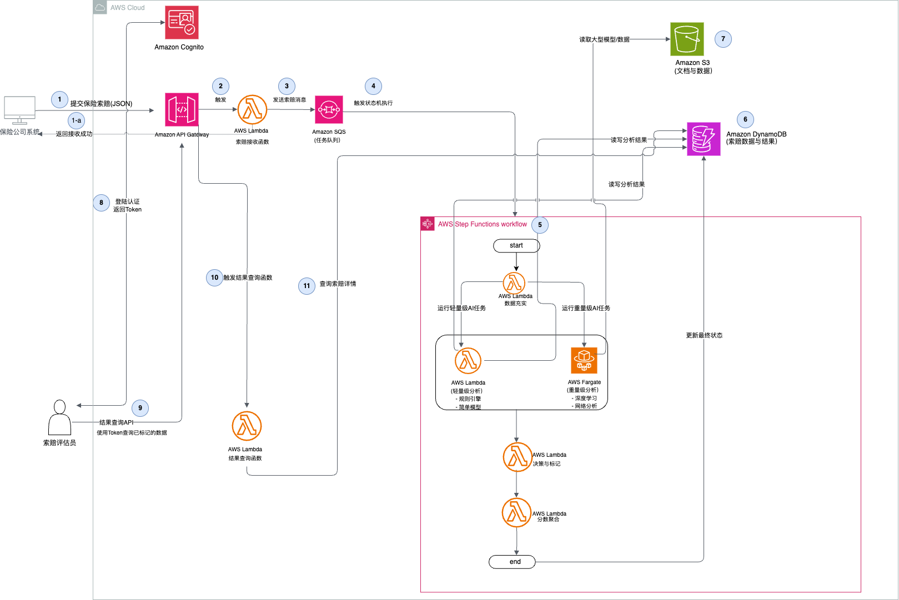

# 模拟架构实践营（一) - 某保险金融公司 AI 欺诈检测平台架构设计

---

## 前言与免责声明

本文档旨在提供一个现代化的、基于云原生技术的AI欺诈检测平台架构设计方案。**此架构的设计灵感来源于AWS官方发布的优秀实践案例 (This Is My Architecture: AiDA Technologies)，并在此基础上进行了深化探讨说明。**

**免责声明**: 本文档中描述的所有内容，包括以下提及的业务场景、痛点，以及后续的架构、组件和伪代码，均作为技术探讨和概念验证的参考。它旨在展示如何利用AWS云服务解决复杂的业务问题，并不完全代表任何特定公司的业务场景、痛点和实际生产环境部署。

### 模拟业务背景与核心痛痛

为了更好地理解架构设计，我们虚构了以下业务场景：

某保险金融公司作为行业领导者，其核心业务之一是处理海量的医疗保险索赔请求。随着业务量的快速增长和欺诈手段的日益复杂化，公司现有的欺诈检测系统面临着一系列严峻挑战：

*   **处理能力与弹性不足**: 传统的、基于服务器的系统难以应对索赔请求的高峰期（如月末、季末），导致处理延迟，影响客户体验和资金周转效率。
*   **AI模型集成困难且运行效率低下**: 现有的欺诈检测大多依赖于固定的业务规则和简单的统计模型。对于需要大量计算资源（如GPU）、运行时间较长（超过15分钟）的先进AI/ML模型（如深度学习、复杂网络分析），现有架构无法有效支持，导致模型无法在生产环境中发挥最大价值。
*   **运维成本高昂**: 管理和维护庞大的服务器集群、处理操作系统补丁、保障系统高可用性等工作，耗费了大量的IT人力和物力资源。
*   **处理流程僵化**: 索赔处理流程是固化在代码中的，任何业务逻辑的调整都需要经历漫长的开发、测试和发布周期，无法快速响应市场变化。

为了解决以上痛点，该公司寻求构建一个高度自动化、可扩展、灵活且成本效益高的新一代AI欺诈检测平台。

---

## 1. 混合型无服务器解决方案

针对上述挑战，我们设计了一套基于 **AWS Lambda** 和 **AWS Fargate** 的混合型无服务器架构。该架构充分利用事件驱动和按需计算的优势，为平台提供了无与伦比的灵活性和强大的计算能力。

它使用Lambda处理高并发、事件驱动的“胶水逻辑”，同时利用Fargate来攻克长时间、计算密集的AI分析难题，并通过Step Functions将两者无缝地编排在一起。

### 1.1 最终架构图



### 1.2 架构组件详解

#### 1.2.1 索赔接收与入口层 (Ingestion Layer)

*   **Amazon API Gateway**: 作为平台的统一服务入口，提供高可用的、安全的RESTful API端点，供客户（保险公司系统）以编程方式提交保险索赔数据。
*   **AWS Lambda (索赔接收函数)**: 由 API Gateway 直接触发。此函数职责单一：接收传入的索赔数据，进行初步格式校验，生成唯一索赔ID，然后将包含索赔核心信息的消息放入 **Amazon SQS** 队列。完成后，立即向API调用方返回“接收成功”的响应，实现前端的快速响应和后端处理的异步解耦。
*   **Amazon SQS (Simple Queue Service)**: 一个高吞吐、可靠的消息队列，用作核心处理流程的缓冲区，确保即使在流量高峰期，系统也不会丢失任何索赔请求。

#### 1.2.2 AI分析编排与混合计算层 (Orchestration & Hybrid Compute)

这是整个架构的核心，它将工作流编排与两种不同的计算服务无缝结合。

*   **AWS Step Functions**: 作为欺诈检测工作流的核心编排器，它监听SQS队列。每当有新索赔消息进入时，便自动触发一个预定义的状态机（State Machine）执行。这使得复杂的处理流程变得可视化、易于管理和修改。
*   **AWS Lambda (轻量级计算)**: 在Step Functions工作流中，Lambda被用于执行快速、短时的事件驱动任务，例如：
    *   **数据充实**: 根据索赔信息从数据库中获取相关的历史数据。
    *   **规则引擎**: 执行轻量级的业务规则检查。
    *   **分数聚合**: 收集所有并行分析的结果，并计算最终的综合欺诈风险分数。
    *   **决策与标记**: 根据综合分数做出最终决策。
*   **AWS Fargate (重量级计算)**: 对于计算密集或需要长时间运行的复杂AI模型（如深度学习、网络分析），Step Functions会启动一个 **AWS Fargate 任务**来处理。
    *   **集成方式**: Step Functions与Amazon ECS/EKS具有原生集成能力。工作流可以直接调用 `ecs:runTask` API，在Fargate上启动一个容器任务，并配置为**同步等待**该任务完成。
    *   **任务流程**: Fargate容器任务启动后，会从数据存储层拉取所需数据，执行重量级的AI推理，然后将结果写回。这解决了Lambda 15分钟执行时长和内存的限制。

#### 1.2.3 数据存储与持久化层 (Data Storage Layer)

*   **Amazon DynamoDB**: 一个完全托管、高性能的NoSQL数据库，用于存储所有保险索赔的核心数据、处理状态、中间结果以及最终的欺诈风险分数。
*   **Amazon S3 (Simple Storage Service)**: 用于存储与索赔相关的非结构化数据或大对象，如客户上传的医疗发票扫描件、PDF报告、大型模型文件等。

#### 1.2.4 结果呈现与分析层 (Presentation & Analysis Layer)

*   **Amazon API Gateway + AWS Lambda (查询函数)**: 提供另一组安全的API端点，供内部的索赔评估员（Claims Assessor）前端应用调用，以查询被标记的索赔详情。
*   **Amazon Cognito**: 为索赔评估员提供身份认证和访问控制，确保只有授权用户才能访问敏感的索赔数据。

---

## 2. 核心计算引擎选型考量

在这个混合架构中，两种计算服务的职责分工明确，做到了“为正确的任务选择正确的工具”：

| **计算引擎** | **在本架构中的适用场景** | **核心优势** |
| :--- | :--- | :--- |
| **AWS Lambda** | 快速、短时的事件驱动任务（如：API后端、数据校验、规则引擎、工作流粘合逻辑）。 | 极致的事件驱动、毫秒级计费、启动速度快、运维负担最小。 |
| **AWS Fargate** | 长时间运行、计算密集型或需要特殊硬件的任务（如：复杂AI模型推理、批量数据处理）。 | 无执行时间上限、支持大型容器镜像（最大10GB）、可选GPU、与现有容器生态完全兼容。 |

---

## 3. 架构总结

这套**混合型无服务器架构**，通过将 **AWS Lambda** 和 **AWS Fargate** 的优势相结合，为该保险金融公司的“AI欺诈检测平台”提供了无与伦比的灵活性和强大的计算能力。

*   **解决了性能瓶颈**: 通过事件驱动和异步处理，轻松应对业务洪峰。
*   **实现了复杂AI应用**: Fargate的引入打破了传统Serverless的计算限制，使得重量级AI模型得以应用。
*   **提升了敏捷性**: Step Functions将业务流程可视化，大大降低了修改和迭代的难度。
*   **优化了成本**: 按需付费的模式避免了资源浪费，显著降低了TCO（总拥有成本）。

该方案不仅保留了无服务器架构的弹性伸缩、按需付费和低运维负担的核心优势，还突破了单一计算服务的局限性，是构建复杂、高性能AI应用的现代化最佳实践。

---

## 4. 核心组件伪代码设计

### 4.1 API Gateway 端点设计

```pseudocode
// 端点 1: 接收保险索赔 (POST /claims)
Function HandleClaimSubmission(request):
  // 1. 从请求体中提取索赔数据
  claimData = request.body

  // 2. 调用 Lambda_ReceiveClaim 函数处理
  response = Lambda_ReceiveClaim.invoke(claimData)

  // 3. 返回接收确认
  Return { statusCode: 202, message: "索赔已接收，正在处理中" }
End Function

// 端点 2: 查询索赔状态 (GET /claims/{claimId})
Function GetClaimStatus(request):
  // 1. 从URL路径中获取 claimId
  claimId = request.pathParameters.claimId

  // 2. 从请求头中获取 Cognito Token
  cognitoToken = request.headers.Authorization

  // 3. 调用 Lambda_QueryClaim 函数处理
  response = Lambda_QueryClaim.invoke({
    claimId: claimId,
    token: cognitoToken
  })

  // 4. 返回查询结果
  Return { statusCode: 200, body: response }
End Function
```

### 4.2 索赔员与 Cognito 认证伪代码

```pseudocode
// 角色: 索赔员 (Claims Assessor)
// 流程: 登录并获取Token，然后使用Token访问受保护的API

Function AssessorLogin(username, password):
  // 1. 使用Cognito用户池进行身份认证
  cognitoAuth = Cognito.initiateAuth({
    AuthFlow: 'USER_PASSWORD_AUTH',
    AuthParameters: {
      USERNAME: username,
      PASSWORD: password
    }
  })

  // 2. 认证成功，获取ID Token
  idToken = cognitoAuth.AuthenticationResult.IdToken

  // 3. 返回Token给前端应用
  Return idToken
End Function

Function CallProtectedApi(claimId, token):
  // 1. 前端应用将获取到的Token放在请求的Authorization头中
  headers = { 'Authorization': `Bearer ${token}` }

  // 2. 调用API Gateway的查询端点
  response = API_Gateway.get(`/claims/${claimId}`, { headers: headers })

  // 3. API Gateway会配置一个Cognito Authorizer，自动验证Token的有效性
  //    如果Token无效或过期，请求将被拒绝 (401 Unauthorized)
  //    如果Token有效，请求将被转发到后端的Lambda_QueryClaim函数
  Return response.data
End Function
```

### 4.3 Step Functions 工作流伪代码

```pseudocode
// 工作流: FraudDetectionStateMachine
StartAt: EnrichData

States:
  EnrichData:
    // 1. 数据充实
    Type: Task
    Resource: Lambda_EnrichData.arn
    Next: ParallelAIAnalysis

  ParallelAIAnalysis:
    // 2. 并行执行多个AI分析任务
    Type: Parallel
    Branches:
      - StartAt: RuleEngineAnalysis
        States:
          RuleEngineAnalysis:
            Type: Task
            Resource: Lambda_RuleEngine.arn
            End: true
      - StartAt: AnomalyDetectionAnalysis
        States:
          AnomalyDetectionAnalysis:
            Type: Task
            Resource: Lambda_AnomalyDetection.arn
            End: true
      - StartAt: ComplexModelAnalysis
        States:
          ComplexModelAnalysis:
            // 对于复杂模型，调用Fargate任务
            Type: Task
            Resource: "arn:aws:states:::ecs:runTask.sync"
            Parameters:
              LaunchType: "FARGATE"
              TaskDefinition: "arn:of:your:fargate:task"
              Input: "$.claimData"
            End: true
    Next: AggregateScores

  AggregateScores:
    // 3. 聚合所有分析结果
    Type: Task
    Resource: Lambda_AggregateScores.arn
    Next: MakeDecision

  MakeDecision:
    // 4. 根据最终分数做出决策
    Type: Task
    Resource: Lambda_MakeDecision.arn
    End: true
```

### 4.4 DynamoDB 表结构伪代码

```pseudocode
// 表名: ClaimsTable
TableName: "ClaimsTable"

// 主键设计
KeySchema:
  - AttributeName: "claimId"  // 分区键 (Partition Key)
    KeyType: "HASH"

// 属性定义
AttributeDefinitions:
  - AttributeName: "claimId"
    AttributeType: "S" // 字符串
  - AttributeName: "status"
    AttributeType: "S" // 字符串 (e.g., "RECEIVED", "PROCESSING", "COMPLETED")
  - AttributeName: "fraudScore"
    AttributeType: "N" // 数字

// 示例数据结构
Item:
  claimId: "claim-uuid-12345"
  patientId: "patient-abcde"
  claimAmount: 1500.75
  submissionTimestamp: "2025-08-19T12:00:00Z"
  status: "COMPLETED"
  fraudScore: 85
  analysisResults: {
    ruleEngine: { score: 70, flags: ["high_cost_procedure"] },
    anomalyDetection: { score: 80, reason: "unusual_frequency" },
    complexModel: { score: 95, contributing_factors: [...] }
  }
  relatedDocuments: "s3://bucket-name/claims/claim-uuid-12345/"
```

### 4.5 核心 Lambda 函数伪代码

```pseudocode
// 函数: Lambda_ReceiveClaim
// 触发器: API Gateway (POST /claims)
Function Lambda_ReceiveClaim(event):
  // 1. 从API Gateway事件中获取索赔数据
  claimData = JSON.parse(event.body)

  // 2. 生成唯一的索赔ID
  claimId = generateUUID()
  claimData.claimId = claimId

  // 3. 将索赔数据放入SQS队列，以触发后续处理
  SQS.sendMessage({
    QueueUrl: "your-sqs-queue-url",
    MessageBody: JSON.stringify(claimData)
  })

  // 4. (可选) 在DynamoDB中创建一个初始记录
  DynamoDB.putItem({
    TableName: "ClaimsTable",
    Item: {
      claimId: claimId,
      status: "RECEIVED",
      submissionTimestamp: now()
    }
  })

  // 5. 返回成功响应给API Gateway
  Return { success: true, claimId: claimId }
End Function


// 函数: Lambda_EnrichData
// 触发器: Step Functions
Function Lambda_EnrichData(event):
  // 1. 从Step Functions输入中获取claimId
  claimId = event.claimId

  // 2. 从其他数据库或数据源查询历史数据、客户信息等
  historicalData = queryPatientHistory(event.patientId)

  // 3. 将充实后的数据返回给Step Functions
  event.enrichedData = historicalData
  Return event
End Function


// 函数: Lambda_AggregateScores
// 触发器: Step Functions
Function Lambda_AggregateScores(event):
  // 1. 从Step Functions输入中获取并行的分析结果
  // event会是一个包含所有并行分支输出的数组
  results = event

  // 2. 定义加权平均等聚合逻辑
  finalScore = (results[0].score * 0.3) + (results[1].score * 0.4) + (results[2].score * 0.3)

  // 3. 将聚合后的分数返回
  Return { finalScore: finalScore, originalResults: results }
End Function


// 函数: Lambda_MakeDecision
// 触发器: Step Functions
Function Lambda_MakeDecision(event):
  // 1. 获取聚合后的分数
  finalScore = event.finalScore

  // 2. 根据业务规则决定风险等级
  If finalScore > 90:
    decision = "HIGH_RISK"
  Else If finalScore > 60:
    decision = "MEDIUM_RISK"
  Else:
    decision = "LOW_RISK"
  End If

  // 3. 更新DynamoDB中的最终状态和分数
  DynamoDB.updateItem({
    TableName: "ClaimsTable",
    Key: { "claimId": event.claimId },
    UpdateExpression: "SET #status = :s, fraudScore = :fs, decision = :d",
    ExpressionAttributeNames: { "#status": "status" },
    ExpressionAttributeValues: {
      ":s": "COMPLETED",
      ":fs": finalScore,
      ":d": decision
    }
  })

  // 4. (可选) 发送通知给相关人员
  SNS.publish({ TopicArn: "your-sns-topic", Message: `Claim ${event.claimId} processed with decision: ${decision}` })

  Return { status: "SUCCESS" }
End Function
```

### 4.6 Lambda 触发事件伪代码

```pseudocode
// 事件源: SQS (触发Step Functions)
// 当有消息进入SQS队列时，触发工作流
EventSourceMapping:
  // 1. 配置SQS队列作为Step Functions状态机的事件源
  Target: "arn:aws:states:region:account-id:stateMachine:FraudDetectionStateMachine"
  EventSourceArn: "arn:aws:sqs:region:account-id:your-sqs-queue"
  // 2. 当SQS接收到来自Lambda_ReceiveClaim的消息时，自动启动一个新的状态机执行
  //    消息内容将作为状态机的初始输入


// 事件源: API Gateway (触发Lambda)
// API Gateway配置，将HTTP请求路由到Lambda
APIGatewayIntegration:
  // 1. 定义 /claims 路径上的 POST 方法
  "/claims":
    POST:
      // 2. 配置集成类型为 AWS_PROXY (Lambda代理集成)
      IntegrationType: "AWS_PROXY"
      // 3. 指定后端的Lambda函数
      IntegrationTarget: Lambda_ReceiveClaim.arn
      // 4. (可选) 添加Cognito Authorizer进行安全验证
      AuthorizationType: "COGNITO_USER_POOLS"
```

### 4.7 Lambda 触发事件具体伪代码 (Event Payloads)

```pseudocode
// 事件 1: API Gateway 触发 Lambda_ReceiveClaim 的事件负载 (event object)
// 描述: 当客户端向 /claims 端点发送POST请求时，API Gateway (配置为Lambda代理集成) 会生成类似以下的事件对象并发送给Lambda。
{
  "resource": "/claims",
  "path": "/claims",
  "httpMethod": "POST",
  "headers": {
    "Content-Type": "application/json",
    "User-Agent": "PostmanRuntime/7.29.2"
  },
  "requestContext": {
    "accountId": "123456789012",
    "apiId": "api123abcde",
    "stage": "prod"
  },
  // body 字段是一个JSON字符串，需要被解析
  "body": "{\"patientId\": \"patient-xyz-789\",\"providerId\": \"hospital-abc-123\",\"claimAmount\": 450.00,\"claimDate\": \"2025-08-20\",\"services\": [\"Consultation\", \"X-Ray\"]}",
  "isBase64Encoded": false
}
// Lambda函数代码需要: JSON.parse(event.body) 来获取实际的索赔数据。
```

```pseudocode
// 事件 2: SQS 触发 Step Functions 工作流的事件负载
// 描述: 当 Lambda_ReceiveClaim 成功向SQS队列发送消息后，SQS服务会持有该消息。
//       当Step Functions (通过事件源映射) 从队列中拉取该消息时，会构建一个事件对象来启动工作流。
//       这个事件对象的核心部分是SQS消息本身。
{
  "Records": [
    {
      "messageId": "msg-uuid-abc-123",
      "receiptHandle": "a-long-receipt-handle",
      "awsRegion": "us-east-1",
      "eventSource": "aws:sqs",
      "eventSourceARN": "arn:aws:sqs:us-east-1:123456789012:your-sqs-queue",

      // body 字段是 Lambda_ReceiveClaim 发送的JSON字符串
      // Step Functions可以直接处理这个字符串或将其解析为JSON对象
      "body": "{\"claimId\":\"claim-uuid-12345\",\"patientId\":\"patient-xyz-789\",\"claimAmount\":450.00}"
    }
  ]
}
// 工作流的第一个状态 (Lambda_EnrichData) 会接收到这个 "body" 的内容作为其输入。
```

---

## 5. 附录：参考资料

*   **AWS 官方参考案例**: [This Is My Architecture: AiDA Technologies](https://aws.amazon.com/cn/architecture/this-is-my-architecture/aida-technologies/)

---

